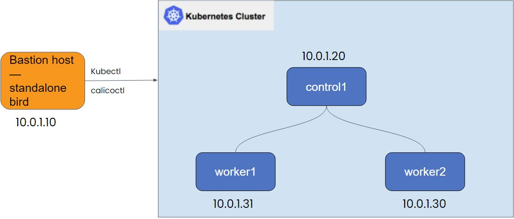

# Calico-Security-Observability-Troubleshooting-Training
This is the the hands-on lab guide for Calico Security, Observability, and Troubleshooting Training.

  
## Lab setup

The following diagram depicts the lab setup used for the entire training.

Followings is a short description of each node in the lab.

* **Control1** is Kubernetes master node and runs Kubernetes control plane pods.
* **Worker1** is a Kubernetes worker node.
* **Worker2** is a Kubernetes worker node.
* **Bastion** is a node outside the Kubernetes cluster and is used to run kubectl/calicoctl commands. This node also runs a standalone instance of bird and is used for bgppeering in the relevant lab modules fucntioning as an upstream router. Finally, since this node is outside the cluster, it is used to simulate external connectivity when needed.

Followings are the CIDRs used to build the training lab environment.

* 10.0.1.0/24 host CIDR
* 10.48.0.0/16 Kubernetes Pod Network (via kubeadm --pod-network-cidr)
* 10.49.0.0/16 Kubernetes Service CIDR (via kubeadm --service-cidr)

## SSH access to the nodes

To ssh into the lab instances, type the following commands. The associated IP addresses are included in the lab setup diagram.

* ssh control1 
* ssh worker1
* ssh worker2

## Lab modules (to be updated)

[1. Install Calico Enterprise](https://github.com/tigera-cs/Calico-Security-Observability-Troubleshooting-Training/tree/main/modules/1.%20Install%20Calico%20Enterprise)

[2.Secure Pod Traffic Using Calico Security Policy](https://github.com/tigera-cs/Calico-Security-Observability-Troubleshooting-Training/blob/main/modules/2.Secure%20Pod%20Traffic%20Using%20Calico%20Security%20Policy/README.md)

[3.Secure Cluster Node Traffic Using Calico Auto HEP](https://github.com/tigera-cs/Calico-Security-Observability-Troubleshooting-Training/blob/main/modules/3.Secure%20Cluster%20Node%20Traffic%20Using%20Calico%20Auto%20HEP/README.md)

[4.Secure Workload Egress Access Using Calico DNS Policy](https://github.com/tigera-cs/Calico-Security-Observability-Troubleshooting-Training/blob/main/modules/4.Secure%20Workload%20Egress%20Access%20Using%20Calico%20DNS%20Policy/README.md)

[5.Secure Kubernetes Network Using Wireguard Encryption](https://github.com/tigera-cs/Calico-Security-Observability-Troubleshooting-Training/blob/main/modules/5.Secure%20Kubernetes%20Network%20Using%20Wireguard%20Encryption/README.md)

[6.Use Calico Observability to troubleshoot connectivity issues](https://github.com/tigera-cs/Calico-Security-Observability-Troubleshooting-Training/blob/main/modules/6.Use%20Calico%20Observability%20to%20troubleshoot%20connectivity%20issues/README.md)

[7. Configure Calico Compliance Reporting](https://github.com/tigera-cs/Calico-Security-Observability-Troubleshooting-Training/blob/main/modules/7.%20Configure%20Calico%20Compliance%20Reporting/README.md)
