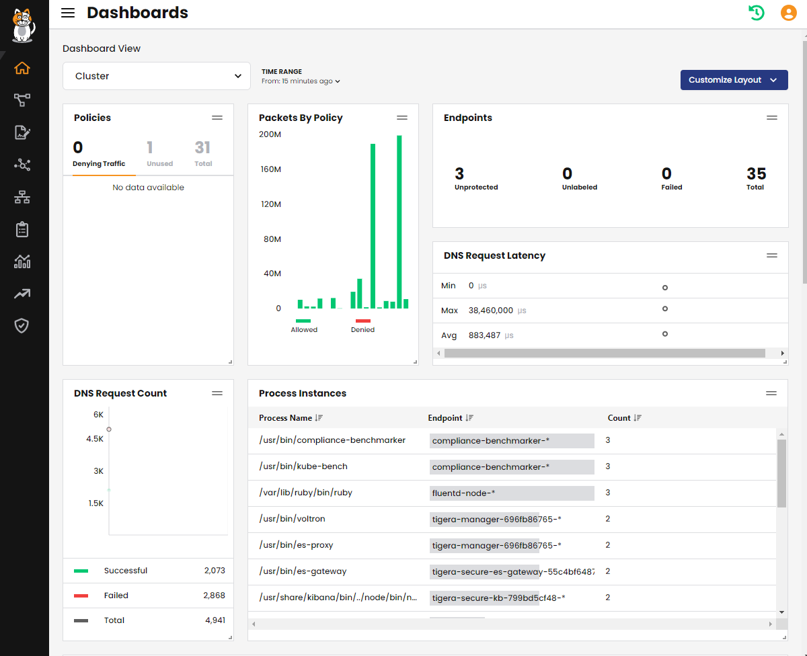
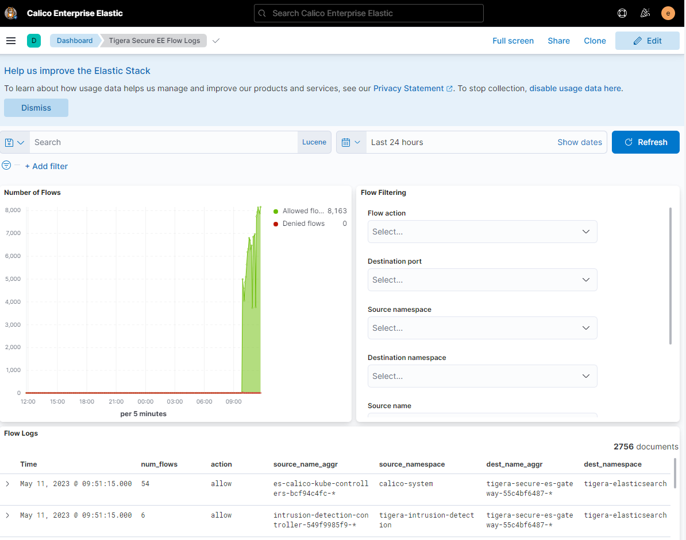

# In this lab

This lab provides the instructions to:

* [Overview](https://github.com/tigera-cs/Calico-Security-Observability-Troubleshooting-Training/tree/main/modules/1.%20Install%20Calico%20Enterprise#overview)
* [Install Calico Enterprise](https://github.com/tigera-cs/Calico-Security-Observability-Troubleshooting-Training/tree/main/modules/1.%20Install%20Calico%20Enterprise#install-calico-enterprise)
* [Install Calico Enterprise command line utility "calicoctl"](https://github.com/tigera-cs/Calico-Security-Observability-Troubleshooting-Training/tree/main/modules/1.%20Install%20Calico%20Enterprise#install-calico-enterprise-command-line-utility-calicoctl)
* [Access CE Manager UI using Ingress](https://github.com/tigera-cs/Calico-Security-Observability-Troubleshooting-Training/tree/main/modules/1.%20Install%20Calico%20Enterprise#access-ce-manager-ui-using-ingress)


### Overview

Container Network Interface is an initiative from the Cloud-Native Computing Foundation. It is a set of interface standards that define how the container runtime engine (docker, cri-o, containerd, others) and the cni plugin work together to dynamically connect a pod to the network. Kubernetes defines the specification of the network model, but the actual implementation of the network model is abstracted from Kubernetes and Kubernetes uses the CNI for that. Upstream Kubernetes by default does not provide a network interface plugin. In this lab, we will walk through the process of installing Calico Enterprise as the CNI and security policy provider.

#### Documentation

- https://docs.tigera.io/calico-enterprise/latest/getting-started/
- https://docs.tigera.io/calico-enterprise/latest/getting-started/install-on-clusters/kubernetes/generic-install


_____________________________________________________________________________________________________________________________________________________________________________________


### Install Calico Enterprise

 In this lab environment, Kubernetes has been preinstalled, but since your network plugin is not installed yet your nodes will appear as NotReady. This section walks you through the required steps to install Calico Enteprise as both the CNI provider and network policy engine provider.

1. Before getting started, let's enable bash autocomplete for kubectl so that we can easier interact with kubectl.

```bash
sudo apt-get install bash-completion
source /usr/share/bash-completion/bash_completion
echo 'source <(kubectl completion bash)' >>~/.bashrc
source ~/.bashrc

```

2. To validate that the CNI plugin is not installed in this cluster, run the following command. All the cluster nodes' STATUS should appear as NotReady.

```bash
kubectl get nodes

```
```bash
NAME                                      STATUS     ROLES                  AGE     VERSION
ip-10-0-1-20.eu-west-1.compute.internal   NotReady   control-plane,master   8m31s   v1.23.17
ip-10-0-1-30.eu-west-1.compute.internal   NotReady   worker                 8m4s    v1.23.17
ip-10-0-1-31.eu-west-1.compute.internal   NotReady   worker                 8m4s    v1.23.17
```

3. Calico Enterprise uses ElasticSearch to store various logs such as flowlogs, DNS logs, and all others that it collects over the network. ElasticSearch requires persistent storage to store the data. This lab uses host path storage provisioner, which is not suitable for production enviroment and can result in scalability issues, instability, and data loss. 

```yaml
kubectl apply -f - <<EOF
apiVersion: storage.k8s.io/v1
kind: StorageClass
metadata:
  name: tigera-elasticsearch
provisioner: kubernetes.io/no-provisioner
volumeBindingMode: WaitForFirstConsumer
---
apiVersion: v1
kind: PersistentVolume
metadata:
  name: tigera-elasticsearch
spec:
  capacity:
    storage: 10Gi
  accessModes:
    - ReadWriteOnce
  hostPath:
    path: /var/tigera/elastic-data/1
  persistentVolumeReclaimPolicy: Recycle
  storageClassName: tigera-elasticsearch
EOF

```

4. Make sure the StorageClass has been created successfully.

```bash
kubectl get storageclass

```
```bash
NAME                   PROVISIONER                    RECLAIMPOLICY   VOLUMEBINDINGMODE      ALLOWVOLUMEEXPANSION   AGE
tigera-elasticsearch   kubernetes.io/no-provisioner   Delete          WaitForFirstConsumer   false                  25s
```

5. The Tigera Operator is a Kubernetes operator and provides a well-defined API for how you install, configure, and run Calico Enterprise. Tigera operator also automates and controls the the lifecycle of a Calico Enterprise deployment. Tigera operator manifest configures the necessary resources such as custom resource definitions, namespaces, services accounts, clusterroles, etc so that cluster is ready to deploy other calico Enterprise components. Get yourself familiar with the content of the manifest and create it in the cluster.

```bash
kubectl create -f https://downloads.tigera.io/ee/v3.16.1/manifests/tigera-operator.yaml

```

6. Validate that the tigera-operator is running in the cluster. Note that the tigera-operator is running even though there is no CNI plugin deployed in the cluster. This is because tigera-operator is host networked meaning that it uses the host IP address to communicate over the network.

```bash
kubectl get pods -n tigera-operator -o wide
```

```bash

NAME                               READY   STATUS    RESTARTS   AGE   IP          NODE                                      NOMINATED NODE   READINESS GATES
tigera-operator-54f8b4545c-bffkc   1/1     Running   0          10s   10.0.1.31   ip-10-0-1-31.eu-west-1.compute.internal   <none>           <none>
```

7. Calico Enterprise Manager UI uses Prometheus to provide out-of-the-box metrics in the various sections of CE Manager UI such as the dashboard page, security policies, and others. Calico Enterprise uses Prometheus operator to deploy Prometheus server and Alertmanager. Apply the following manifest to deploy the Prometheus operator.

  **Note:** Prometheus operator that ships with Calico Enterprise is an optional component and can be replaced with the customer's Prometheus operator if needed.   However, a Prometheus operator must be deployed in the cluster and watch the "tigera-prometheus" namespace to deploy the required Prometheus and Alertmanager   resources. Customer's instance of Prometheus operator can be deployed in any namesapce.


```bash
kubectl create -f https://downloads.tigera.io/ee/v3.16.1/manifests/tigera-prometheus-operator.yaml

```

8. Check the tigera-prometheus pod status. 

```bash
kubectl get pods -n tigera-prometheus
```
```bash
NAME                                          READY   STATUS    RESTARTS   AGE
calico-prometheus-operator-6d4f9b7bbb-z689r   0/1     Pending   0          23s
```

9. tigera-prometheus operator should be in the Pending STATUS. Let's run the following command and check the `Events:` section of the pod. As indicated in the Warning message, the pod is not running because two nodes have the taint "node.kubernetes.io/not-ready". The reason for this taint is because the CNI plugin is not running in this cluster yet.

```bash
kubectl describe pods -n tigera-prometheus
```

```bash
Events:
  Type     Reason            Age   From               Message
  ----     ------            ----  ----               -------
  Warning  FailedScheduling  18s   default-scheduler  0/3 nodes are available: 1 node(s) had taint {node-role.kubernetes.io/master: }, that the pod didn't tolerate, 2 node(s) had taint {node.kubernetes.io/not-ready: }, that the pod didn't tolerate.
```

10. This lab directly downloads the images from quay.io/tigera, which requires authentication. Run the following command to create the secret necessary to pull the images.

```bash
kubectl create secret generic tigera-pull-secret \
    --from-file=.dockerconfigjson=/home/tigera/config.json \
    --type=kubernetes.io/dockerconfigjson -n tigera-operator
```

11. We also need to create the pull secret in the tigera-prometheus namespace and patch the prometheus operator deployment to pull the images. For all the other Calico Enterprise components such as calico-node, typha, and others to pull the images, tigera-operator copies "tigera-pull-secret" secret to the relevant namespaces.

```bash
kubectl create secret generic tigera-pull-secret \
    --type=kubernetes.io/dockerconfigjson -n tigera-prometheus \
    --from-file=.dockerconfigjson=/home/tigera/config.json
```
```bash
kubectl patch deployment -n tigera-prometheus calico-prometheus-operator \
    -p '{"spec":{"template":{"spec":{"imagePullSecrets":[{"name": "tigera-pull-secret"}]}}}}'
```

12. tigera-operator uses custom resouces to deploy the required resources for Calico Enterprise. For example, tigera-operator creates all the the pods in the calico-system namesapce and a number of other resources when it sees the Installation resource in the cluster.

Run the following command to see if there is any resources in the calico-system namesapce. You should see none.

```bash
kubectl get all -n calico-system

```

Installation resouce is also responsible for certain install time configuration parameters such as IPPOOL configuration, MTU, and etc. For complete info on the Installation resource configurations, please visit the following link.

https://docs.tigera.io/reference/installation/api#operator.tigera.io/v1.Installation

We have customized the installation resource for this lab. We have defined an IPPOOL with the CIDR 10.48.0.0/24. This must be within the range of the pod network CIDR when Kubernetes is bootstrapped. Here we are defining a smaller subnet within the available range as we will be creating additional pools for other purposes in subsequent labs.

13. Run the following command to find the cluster-cidr (pod-network-cidr) that was used to bootstrap the cluster. You should have a similar output provided below.

```bash
kubectl cluster-info dump | grep -m 2 -E "service-cluster-ip-range|cluster-cidr"

```
```bash
                            "--service-cluster-ip-range=10.49.0.0/16",
                            "--cluster-cidr=10.48.0.0/16"
```

14. Now apply the following manifest, which will create the the Installation custom resource and enables the CNI functionality in the cluster.

```yaml
kubectl apply -f -<<EOF
# This section includes base Calico installation configuration.
# For more information, see: https://docs.projectcalico.org/v3.21/reference/installation/api#operator.tigera.io/v1.Installation
apiVersion: operator.tigera.io/v1
kind: Installation
metadata:
  name: default
spec:
  # Install Calico Enterprise
  variant: TigeraSecureEnterprise
  # List of image pull secrets to use when installing images from a container registry.
  # If specified, secrets must be created in the tigera-operator namespace.
  imagePullSecrets:
    - name: tigera-pull-secret
  calicoNetwork:
    # Note: The ipPools section cannot be modified post-install.
    ipPools:
    - blockSize: 26
      cidr: 10.48.0.0/24
      encapsulation: None
      natOutgoing: Enabled
      nodeSelector: all()
EOF

```


15.  Get yourself familiar with the resources in the following manifest and then install the Calico Enterprise custom resources.

  **Note:** We have already customized and deployed the Installation custom resource, which is also available in the following manifest. However, since there is no customization in the following manifest, there is no change in the Installation resource configuration. We will just receive a message that the resource already exist.

```bash
kubectl create -f https://docs.tigera.io/manifests/custom-resources.yaml

```

16. Watch the status of various components progressing. We need to wait for at least one of the tigera-apiserver pods in the tigera-system namespace to be running before applying the tigera licensekey in the next step. The reasons is that the LicenseKey resource uses "projectcalico.org/v3" api, which is managed by the tigera apiserver.

```bash
watch kubectl get pods -A

```
```bash
NAMESPACE              NAME                                                              READY   STATUS    RESTARTS   AGE
calico-system          calico-kube-controllers-7b4fd8c4dc-smcrl                          1/1     Running   0          2m14s
calico-system          calico-node-fh6mk                                                 1/1     Running   0          2m9s
calico-system          calico-node-slj56                                                 1/1     Running   0          2m2s
calico-system          calico-node-t26dd                                                 1/1     Running   0          2m7s
calico-system          calico-typha-6b4d56986f-48f4s                                     1/1     Running   0          2m9s
calico-system          calico-typha-6b4d56986f-ndtv2                                     1/1     Running   0          2m15s
calico-system          csi-node-driver-5gh77                                             2/2     Running   0          104s
calico-system          csi-node-driver-98jfd                                             2/2     Running   0          100s
calico-system          csi-node-driver-wpzsh                                             2/2     Running   0          100s
kube-system            coredns-64897985d-89vz2                                           1/1     Running   0          165m
kube-system            coredns-64897985d-cctns                                           1/1     Running   0          165m
kube-system            etcd-ip-10-0-1-20.us-west-1.compute.internal                      1/1     Running   0          166m
kube-system            kube-apiserver-ip-10-0-1-20.us-west-1.compute.internal            1/1     Running   0          166m
kube-system            kube-controller-manager-ip-10-0-1-20.us-west-1.compute.internal   1/1     Running   0          166m
kube-system            kube-proxy-5ktgw                                                  1/1     Running   0          165m
kube-system            kube-proxy-6pldx                                                  1/1     Running   0          165m
kube-system            kube-proxy-djrv5                                                  1/1     Running   0          165m
kube-system            kube-scheduler-ip-10-0-1-20.us-west-1.compute.internal            1/1     Running   0          166m
tigera-operator        tigera-operator-74575475cc-95b2b                                  1/1     Running   0          9m18s
tigera-packetcapture   tigera-packetcapture-89666fc9d-t6bf2                              1/1     Running   0          83s
tigera-prometheus      alertmanager-calico-node-alertmanager-0                           2/2     Running   0          37s
tigera-prometheus      alertmanager-calico-node-alertmanager-1                           2/2     Running   0          37s
tigera-prometheus      alertmanager-calico-node-alertmanager-2                           2/2     Running   0          36s
tigera-prometheus      calico-prometheus-operator-5798884f64-qflkx                       1/1     Running   0          8m45s
tigera-prometheus      prometheus-calico-node-prometheus-0                               2/3     Running   0          36s
tigera-system          tigera-apiserver-69b9886985-cg6lv                                 2/2     Running   0          83s
tigera-system          tigera-apiserver-69b9886985-sg9ht                                 2/2     Running   0          83s
```
Alternatively, you could use the following command to watch the status of various Calico Enteprise components progress.

```bash
watch kubectl get tigerastatus
```
```bash
NAME                  AVAILABLE   PROGRESSING   DEGRADED   SINCE
apiserver             True        False         False      7m48s
calico                True        False         False      8m43s
compliance                                      True
intrusion-detection                             True
log-collector                                   True
log-storage                                     True
manager                                         True
monitor               True        False         False      7m53s
```

17. Once the apiserver and calico resources are True, apply the LicenseKey to unblock enterprise features of Calico Enterprise.

```bash
kubectl create -f /home/tigera/license.yaml

```

18. Watch the status of various components progressing. Ensure that all the components are AVAILABLE and there is no components in PROGRESSING or DEGRADED status before moving forward. This can take few minutes.

```bash
watch kubectl get tigerastatus

```

You should see an output similar to the following, which denotes Calico Enterprise is fully deployed in the cluster.

```bash
NAME                  AVAILABLE   PROGRESSING   DEGRADED   SINCE
apiserver             True        False         False      53m
calico                True        False         False      54m
compliance            True        False         False      46s
intrusion-detection   True        False         False      56s
log-collector         True        False         False      86s
log-storage           True        False         False      51s
manager               True        False         False      11s
monitor               True        False         False      53m
```

_______________________________________________________________________________________________________________________________________________________________________


### Install Calico Enterprise command line utility "calicoctl"

calicoctl is the Calico Enterprise specific command line utility that allows you to create, read, update, and delete Calico Enterprise objects from the command line. 
1. Follow the the instruction on the link below to **Install calicoctl as a binary on a single host** for Linux operating system. 

https://docs.tigera.io/calico-enterprise/latest/operations/clis/calicoctl/install#install-calicoctl-as-a-binary-on-a-single-host

2. Once you set the file to be exacutable, make sure you move it into your path.

```bash
sudo mv calicoctl /usr/local/bin

```

3.  We also need to make sure the `Cluster Calico Enterprise Version` matches the calicoctl version in `Client Version`. Otherwise please raise this to your instructor.

```bash
calicoctl version

```
```
tigera@bastion:~$ calicoctl version
Client Version:    v3.17.2
Release:           Calico Enterprise
Git commit:        b95c95d112
Cluster Calico Version:               v3.25.1
Cluster Calico Enterprise Version:    v3.17.1
Cluster Type:                         typha,kdd,k8s,operator,bgp,kubeadm
```

_______________________________________________________________________________________________________________________________________________________________________


### Access CE Manager UI using Ingress

In this section of the lab, we will configure the necessary resources to access the Calico Enterprise Manager UI.

1. nginx ingress controller is already configured in the lab for you. Let's expose Calico Enterprise Manager UI service by creating the following Ingress resource. Before applying the following manifest, make sure to update the `host` name by replacing `<LABNAME>` with the name of your lab instance in the following Ingress resource.

```yaml
kubectl apply -f -<<EOF
apiVersion: networking.k8s.io/v1
kind: Ingress
metadata:
  name: manager
  namespace: tigera-manager
  annotations:
    nginx.ingress.kubernetes.io/backend-protocol: HTTPS
    kubernetes.io/ingress.class: "nginx"
spec:
  rules:
  - host: "manager.<LABNAME>.training.tigera.ca"
    http:
      paths:
      - path: /
        pathType: Prefix
        backend:
          service:
            name: tigera-manager
            port:
              number: 9443
EOF

```

2. Check your access to the yaobank application and CE Manager UI using the following URLs. Make sure to replace `<LABNAME>` with the name of your lab instance.

```bash
https://manager.<LABNAME>.training.tigera.ca
```

3. Calico Enterprise Manager UI by default supports token-based auth. Let's create a serviceaccount so that we can use the associated token to log into the Manager UI. 

```bash
kubectl create sa tigercub

```

4. We already created the serviceaccount, but the serviceaccount does not yet have the required permissions to log into the Manager UI. When CE is deployed, it creates a clusterrole called `tigera-network-admin`, which has full permissions to CE resources including the Manager UI. Let's bind our serviceaccount `tigercub` to the clusterrole `tigera-network-admin` using a clusterrolebinding.

```bash
kubectl create clusterrolebinding tigercub-bind --clusterrole tigera-network-admin --serviceaccount default:tigercub

```
5. Run the following command to retrieve the token for the serviceaccount we just created.

```bash
kubectl create token tigercub --duration=24h
```

6. Copy the token where you can easily retrieve it later. 
7. Access the Manager UI by browsing to the following URL and paste your token into token field.

**Note:** Do not foroget to replace `<LABNAME>` with your lab instance name.

```
https://manager.<LABNAME>.training.tigera.ca
```
You shouls see a page similar to the following.



8. Calico Enterprise by default installs Kibana, which provides visualization for the data stored in ElasticSearch. To access Kibana, you will use the default `elastic` username. In order to retrieve the password, execute the following command.

```bash
kubectl -n tigera-elasticsearch get secret tigera-secure-es-elastic-user -o go-template='{{.data.elastic | base64decode}}' && echo

```
9. Store the passsword where you can retrieve it later for subsequent labs.

10. Open Kibana login page by clicking on the Kibana icon on the Manager UI navigation bar on the left side of your browser page. You should a page similar to the following. Insert your username and password.




> ## You have completed `1. Install Calico Enterprise` lab. Next lab: [ 2.Secure Pod Traffic Using Calico Security Policy](https://github.com/tigera-cs/Calico-Security-Observability-Troubleshooting-Training/blob/main/modules/2.Secure%20Pod%20Traffic%20Using%20Calico%20Security%20Policy/README.md) 
