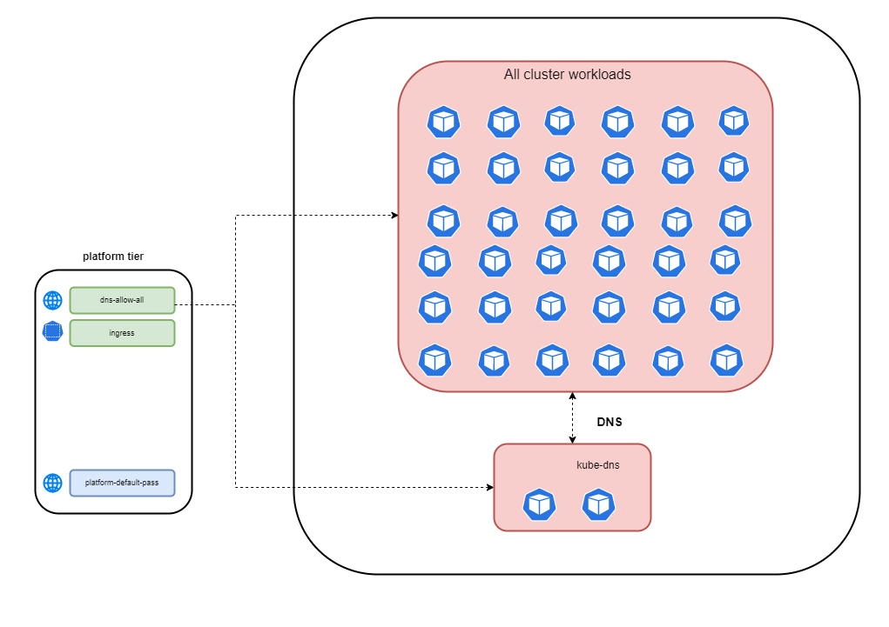
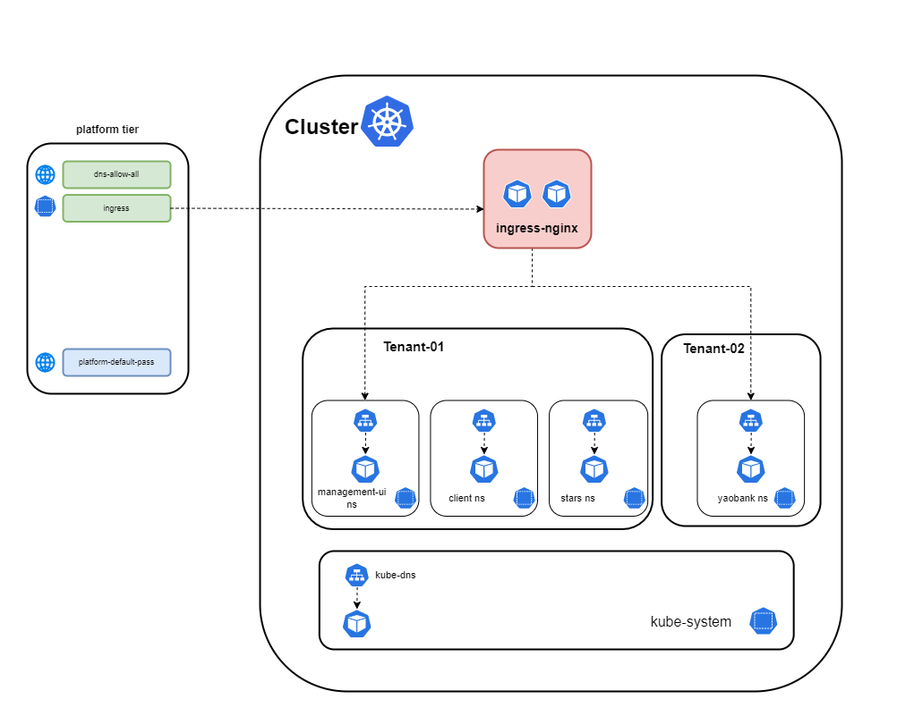
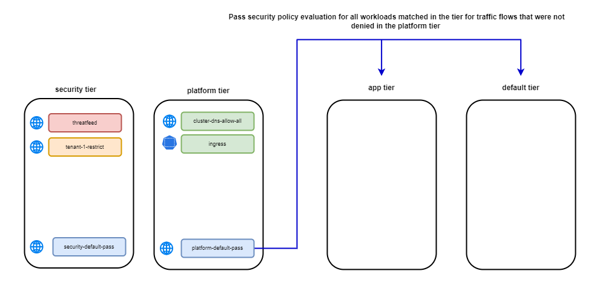

# In this lab

This lab provides the instructions to:

* [Overview](https://github.com/tigera-cs/Calico-Security-Observability-Troubleshooting-Training/blob/main/modules/2.%20Secure%20Pod%20Traffic%20Using%20Calico%20Security%20Policy/README.md#overview)
* [Cluster applications and connectivity](https://github.com/tigera-cs/Calico-Security-Observability-Troubleshooting-Training/blob/main/modules/2.%20Secure%20Pod%20Traffic%20Using%20Calico%20Security%20Policy/README.md#cluster-applications-and-connectivity)
* [Deploy Sample Microservices](https://github.com/tigera-cs/Calico-Security-Observability-Troubleshooting-Training/blob/main/modules/2.%20Secure%20Pod%20Traffic%20Using%20Calico%20Security%20Policy/README.md#deploy-sample-microservices)
* [Deploy Ingress Resources]()


### Overview

Kubernetes' network model is both flexible and dynamic, enabling applications to be deployed anywhere in the cluster without being tied to the underlying network infrastructure. However, this can present challenges for legacy network firewalls that struggle to keep up with Kubernetes' constantly changing workloads. Calico provides a robust security policy framework that defines and enforces policies, ensuring that only authorized traffic flows between pods and services. Calico's powerful policy engine enhances the security of microservices architectures without compromising the flexibility and agility of Kubernetes. In this lab, we'll demonstrate how to use Calico's policy engine to secure some example microservices that blong to different tenants. We will also use Calico `Tiers` along with Kubernetes RBAC to enable priority based policy processing and control various team's access to Calico security policies.

### Cluster applications and connectivity

This lab uses two applications that run across 4 namespaces and belong to two tenants, Tenant-1 and Tenant-2. Star app pods run in three namespaces (management-ui, client, stars) and belong to Tenant-1. Yaobank pods runs in a single and belong to Tenant-2. The ingress-nginx namespace hosts an ingress controller, which will be used to connect to the applications through the respective frontend microservice for each application. The ingress-nginx and kube-system namespaces are owned by the platform and are managed independent of the tenant namespaces.

#### `Tenant-1`
  - Star app
    -  management-ui namesapce
    -  client namesapce
    -  stars namesapce
  
#### `Tenant-2`
  - Yaobank app
    -  yaobank namespace


<p align="center">

</p>


### Deploy Sample Microservices

#### Deploy `Star` App

To deploy the Star app, deploy the following manifest in the cluster.

```yaml
kubectl apply -f -<<EOF
kind: Namespace
apiVersion: v1
metadata:
  name: stars
---
apiVersion: v1
kind: Namespace
metadata:
  name: management-ui
  labels:
    role: management-ui
---
kind: Namespace
apiVersion: v1
metadata:
  name: client
  labels:
    role: client
---
apiVersion: v1
kind: Service
metadata:
  name: backend
  namespace: stars
spec:
  ports:
    - port: 6379
      targetPort: 6379
  selector:
    role: backend
---
apiVersion: apps/v1
kind: Deployment
metadata:
  name: backend
  namespace: stars
  labels:
    role: backend
spec:
  replicas: 1
  selector:
    matchLabels:
      role: backend
  template:
    metadata:
      labels:
        role: backend
    spec:
      containers:
        - name: backend
          image: calico/star-probe:multiarch
          imagePullPolicy: Always
          command:
            - probe
            - --http-port=6379
            - --urls=http://frontend.stars:80/status,http://backend.stars:6379/status,http://client.client:9000/status
          ports:
            - containerPort: 6379
---
apiVersion: v1
kind: Service
metadata:
  name: backend
  namespace: stars
spec:
  ports:
    - port: 6379
      targetPort: 6379
  selector:
    role: backend
---
apiVersion: apps/v1
kind: Deployment
metadata:
  name: backend
  namespace: stars
  labels:
    role: backend
spec:
  replicas: 1
  selector:
    matchLabels:
      role: backend
  template:
    metadata:
      labels:
        role: backend
    spec:
      containers:
        - name: backend
          image: calico/star-probe:multiarch
          imagePullPolicy: Always
          command:
            - probe
            - --http-port=6379
            - --urls=http://frontend.stars:80/status,http://backend.stars:6379/status,http://client.client:9000/status
          ports:
            - containerPort: 6379
---
apiVersion: v1
kind: Service
metadata:
  name: frontend
  namespace: stars
spec:
  ports:
    - port: 80
      targetPort: 80
  selector:
    role: frontend
---
apiVersion: apps/v1
kind: Deployment
metadata:
  name: frontend
  namespace: stars
  labels:
    role: frontend
spec:
  replicas: 1
  selector:
    matchLabels:
      role: frontend
  template:
    metadata:
      labels:
        role: frontend
    spec:
      containers:
        - name: frontend
          image: calico/star-probe:multiarch
          imagePullPolicy: Always
          command:
            - probe
            - --http-port=80
            - --urls=http://frontend.stars:80/status,http://backend.stars:6379/status,http://client.client:9000/status
          ports:
            - containerPort: 80
---
apiVersion: v1
kind: Service
metadata:
  name: management-ui
  namespace: management-ui
spec:
  ports:
    - port: 9001
      targetPort: 9001
  selector:
    role: management-ui
---
apiVersion: apps/v1
kind: Deployment
metadata:
  name: management-ui
  namespace: management-ui
  labels:
    role: management-ui
spec:
  replicas: 1
  selector:
    matchLabels:
      role: management-ui
  template:
    metadata:
      labels:
        role: management-ui
    spec:
      containers:
        - name: management-ui
          image: calico/star-collect:multiarch
          imagePullPolicy: Always
          ports:
            - containerPort: 9001
---
apiVersion: apps/v1
kind: Deployment
metadata:
  name: client
  namespace: client
  labels:
    role: client
spec:
  replicas: 1
  selector:
    matchLabels:
      role: client
  template:
    metadata:
      labels:
        role: client
    spec:
      containers:
        - name: client
          image: calico/star-probe:multiarch
          imagePullPolicy: Always
          command:
            - probe
            - --urls=http://frontend.stars:80/status,http://backend.stars:6379/status
          ports:
            - containerPort: 9000
---
apiVersion: v1
kind: Service
metadata:
  name: client
  namespace: client
spec:
  ports:
    - port: 9000
      targetPort: 9000
  selector:
    role: client
EOF

```

You should see an output similar to the following for each one of the Star app namesapces.

```bash
kubectl get pods -n management-ui

```
```bash
NAME                             READY   STATUS    RESTARTS        AGE
management-ui-6c47d46679-xs4h5   1/1     Running   1 (5h56m ago)   27h          -------> to be replaced
```

```bash
kubectl get pods -n client

```
```bash
NAME                      READY   STATUS    RESTARTS     AGE
client-66b456486c-dcxg7   1/1     Running   1 (6h ago)   27h          -------> to be replaced
```

```bash
kubectl get pods -n stars

```
```bash
NAME                       READY   STATUS    RESTARTS       AGE
backend-799bfd69f7-sll9x   1/1     Running   1 (6h1m ago)   27h
frontend-db76f566f-sgm8v   1/1     Running   1 (6h1m ago)   27h         -------> to be replaced
```


```yaml
kubectl apply -f -<<EOF
apiVersion: v1
kind: Namespace
metadata:
  name: yaobank
  labels:
    istio-injection: disabled
---
apiVersion: v1
kind: Service
metadata:
  name: database
  namespace: yaobank
  labels:
    app: database
spec:
  ports:
  - port: 2379
    name: http
  selector:
    app: database
---
apiVersion: v1
kind: ServiceAccount
metadata:
  name: database
  namespace: yaobank
  labels:
    app: yaobank
---
apiVersion: apps/v1
kind: Deployment
metadata:
  name: database
  namespace: yaobank
spec:
  selector:
    matchLabels:
      app: database
      version: v1
  replicas: 1
  template:
    metadata:
      labels:
        app: database
        version: v1
    spec:
      serviceAccountName: database
      containers:
      - name: database
        image: calico/yaobank-database:certification
        imagePullPolicy: IfNotPresent
        ports:
        - containerPort: 2379
        command: ["etcd"]
        args:
          - "-advertise-client-urls"
          - "http://database:2379"
          - "-listen-client-urls"
          - "http://0.0.0.0:2379"
---
apiVersion: v1
kind: Service
metadata:
  name: summary
  namespace: yaobank
  labels:
    app: summary
spec:
  ports:
  - port: 80
    name: http
  selector:
    app: summary  
---
apiVersion: v1
kind: ServiceAccount
metadata:
  name: summary
  namespace: yaobank
  labels:
    app: yaobank
    database: reader
---
apiVersion: apps/v1
kind: Deployment
metadata:
  name: summary
  namespace: yaobank
spec:
  replicas: 2
  selector:
    matchLabels:
      app: summary
      version: v1
  template:
    metadata:
      labels:
        app: summary
        version: v1
    spec:
      serviceAccountName: summary
      containers:
      - name: summary
        image: calico/yaobank-summary:certification
        imagePullPolicy: Always
        ports:
        - containerPort: 80
---
apiVersion: v1
kind: Service
metadata:
  name: customer
  namespace: yaobank
  labels:
    app: customer
spec:
  type: NodePort
  ports:
  - port: 80
    nodePort: 30180
    name: http
  selector:
    app: customer 
---
apiVersion: v1
kind: ServiceAccount
metadata:
  name: customer
  namespace: yaobank
  labels:
    app: yaobank
    summary: reader 
---
apiVersion: apps/v1
kind: Deployment
metadata:
  name: customer
  namespace: yaobank
spec:
  replicas: 1
  selector:
    matchLabels:
      app: customer
      version: v1
  template:
    metadata:
      labels:
        app: customer
        version: v1
    spec:
      serviceAccountName: customer
      containers:
      - name: customer
        image: calico/yaobank-customer:certification
        imagePullPolicy: Always
        ports:
        - containerPort: 80
---
EOF

```

You should an output similar to the following for yaobank application.

```bash
kubectl get pods -n yaobank

```

```bash
NAME                        READY   STATUS    RESTARTS   AGE
customer-85658df659-nnlx2   1/1     Running   0          5m50s
database-674c4bf5f4-df2jf   1/1     Running   0          5m51s
summary-755668b699-9nvzj    1/1     Running   0          5m51s
summary-755668b699-q6z9c    1/1     Running   0          5m51s
```

### Deploy Ingress Resources

The ingress controller is already deployed for you in `ingress-nginx` namespace. However, you still need to configure Ingress resources for your applications. In this section, we will deploy Ingress resoureces for `Stars` and `Yaobank` apps.

#### Stars Ingress Resource

```yaml
kubectl apply -f -<<EOF
apiVersion: networking.k8s.io/v1
kind: Ingress
metadata:
  name: management-ui
  namespace: management-ui
spec:
  ingressClassName: nginx
  rules:
    - host: www.stars.com             ------------------------> update the domain name  --- also update the manifest in the manifest directory.
      http:
        paths:
          - pathType: Prefix
            backend:
              service:
                name: management-ui
                port:
                  number: 9001
            path: /
EOF

```

You should see an output similar to the following.

```bash
kubectl get ingresses -n management-ui

```

```bash
NAME            CLASS   HOSTS                   ADDRESS       PORTS   AGE
management-ui   nginx   www.management-ui.com   172.16.10.0   80      28h            --------------------------> update the oputput
```


#### Yaobank Ingress Resource

```yaml
kubectl apply -f -<<EOF
apiVersion: networking.k8s.io/v1
kind: Ingress
metadata:
  name: ingress-customer
  namespace: yaobank
spec:
  ingressClassName: nginx
  rules:
    - host: www.yaobank.com             ------------------------> update the domain name  --- also update the manifest in the manifest directory.
      http:
        paths:
          - pathType: Prefix
            backend:
              service:
                name: customer
                port:
                  number: 80
            path: /
EOF

```

You should see an output similar to the following.

```bash
kubectl get ingresses -n management-ui

```

```bash
NAME            CLASS   HOSTS                   ADDRESS       PORTS   AGE
management-ui   nginx   www.management-ui.com   172.16.10.0   80      28h            --------------------------> update the oputput
```

### Lab Scenario 

#### Tiers

This lab uses the following tiers and Kubernetes RBAC to secure the workloads.

- `Security Tier` is used by the security team to implement the enterprise security controls. Only security team along with the platform team who manages the platform have cluster-wide write access to the globalNetworkPolicy and networkPolicy in this tier.
- `Platform Tier` is used by the platform team to implement the platform related policies. The platform team has cluster-wide unlimited access to the globalNetworkPolicy and networkPolicy in this tier and all the other tiers.
- `App Tier` is used by the application developers to implement the application specific policies at the namespace level. Application developer team has namespace-evel write access to the networkPolicy in this tier.
- `Default Tier` is used to implement the global default deny policy. Only platform team has unlimited access to this tier.

#### Security Tier Policies Overview


The `security` tier will be used to implement high-level guardrails for the cluster. A `threatfeed` security policy will be enforced for all cluster workloads. The policy will `deny` egress connectivity to malicious IPs in the `threatfeed`. Tenant isolation is achieved by enforcing `tenant-1-restrict` and `tenant-2-restrict` security policies. These policies will ensure that the tenant workloads are isolated from the rest of the cluster workloads. 

> Security Policies in the `security tier`


##### `threatfeed` Security Policy

The `threatfeed` security policy will have a rule that denies egress connectivity to malicious external IPs which are dynamically updated from a threatfeed. The security policy will be a [globalnetworkpolicy](https://docs.tigera.io/reference/resources/globalnetworkpolicy) that applies to all cluster workloads/pods. 

> threatfeed security policy


##### `tenant-1-restrict` and `tenant-2-restrict` Security Policies
 
The `tenant-1-restrict` and `tenant-2-restrict` security policies will have ingress and egress rules required to isolate workloads in those tenants from the rest of the cluster workloads. Rules with the `pass` action will be used to defer security policy evaluation to subsequent tiers that match tenant-1 and tenant-2 workloads for flows that are deemed acceptable. All other ingress and egress flows will be explicitly denied using ingress and egress rules with the `deny` action. Note that the `tenant-1-restrict` and `tenant-2-restrict` policies **do not** `allow` traffic flows. The rules with the `pass` action enforce a high-level control for isolating those workloads from the rest of the cluster workloads; however, the specific traffic flows must be permitted by `allow` rules in security policies that match those workloads in subsequent tiers.  The `tenant-1-restrict` and `tenant-2-restrict` security policies will be [globalnetworkpolicy](https://docs.tigera.io/reference/resources/globalnetworkpolicy) with `NamespaceSelectors` that match tenant-01 and tenant-02 namespaces. 

> `tenant-1-restrict` security policy


> `tenant-2-restrict` security policy


## `security-default-pass` Security Policy

The `security-default-pass` security policy will have the lowest precedence in the security tier. It is deployed to ensure that traffic flows for all other workloads (except tenant-01 and tenant-02 workloads) will have a `pass` action so that Calico will evaluate subsequent tiers for those workloads for all ingress and egress traffic flows. It is required since the `threatfeed` security policy matched all cluster workloads. Note that if a workload is matched by a security policy in a tier, any traffic flow that **does not** match an `allow` rule for that workload either in that security policy or a subsequent security policy that matches the workloads in the **same tier**, will have an implicit `deny` behavior. This can be circumvented by deploying a security policy that matches the workload and has `pass` rules for all ingress and egress traffic flows. The `security-default-pass` security policy will be a [globalnetworkpolicy](https://docs.tigera.io/reference/resources/globalnetworkpolicy) that applies to all cluster workloads/pods.    

> security-default-pass security policy


#### Platform Tier Policies Overview


# The Platform Tier

The `platform` tier implements security policies for platform components such as `kube-dns` and `ingress`. All workloads use platform components in the cluster, and policies are typically under the purview of the platform team. 

> Security Policies in the `platform tier`


## `cluster-dns-allow-all` Security Policy

The `cluster-dns-allow-all` security policy will have rules to permit ingress DNS traffic to the `kube-dns` endpoints on TCP and UDP port 53 from all endpoints in the cluster. The security policy will also have egress rules to permit all endpoints in the cluster to send DNS traffic to the `kube-dns` endpoints on the same ports. The security policy is a [globalnetworkpolicy](https://docs.tigera.io/reference/resources/globalnetworkpolicy) that applies to all cluster workloads/pods. The policy rules will have endpoint selectors to match the kube-dns endpoints. 

> `cluster-dns-allow-all` Security Policy



## `ingress` Security Policy

The `ingress` security policy has rules to permit inbound traffic to the ingress controller from public and private networks on TCP ports 80 and 443. The security policy also has egress rules permitting traffic to namespaces that host externally accessible services, which are exposed as ingress resources. 

> `ingress` Security Policy



## `platform-default-pass` Security Policy

The `platform-default-pass` security policy has the lowest precedence in the platform tier.  It is deployed to ensure that a `pass` action is applied to all endpoints matched in the tier and for flows not denied in a previous tier. It is required since the `cluster-dns-allow-all` security policy matched all cluster workloads. Note that if a security policy matches a workload in a tier, any traffic flow that **does not** match an `allow` rule for the workload, either in that security policy or a subsequent security policy that matches the workloads in the **same tier**, will have an implicit `deny` behavior. Deploying a security policy for all cluster workloads with `pass` rules for all ingress and egress traffic will circumvent this behavior. The platform-default-pass security policy will be a [globalnetworkpolicy](https://docs.tigera.io/reference/resources/globalnetworkpolicy) that applies to all cluster workloads/pods.
 
> `platform-default-pass` security policy



