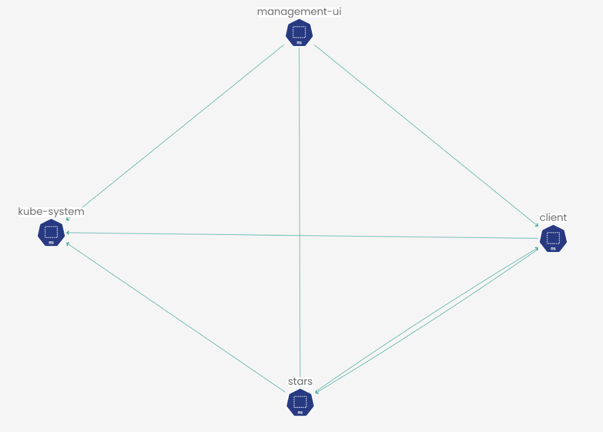
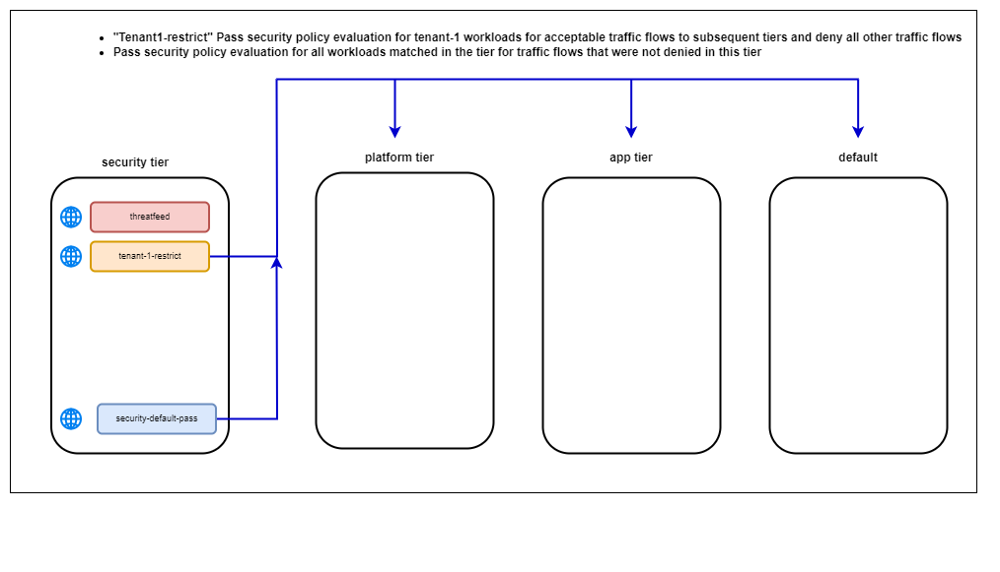
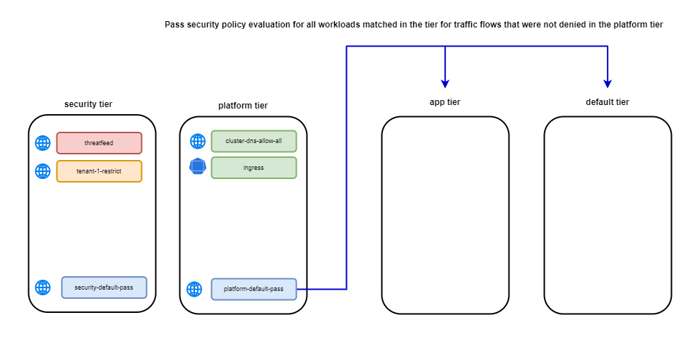
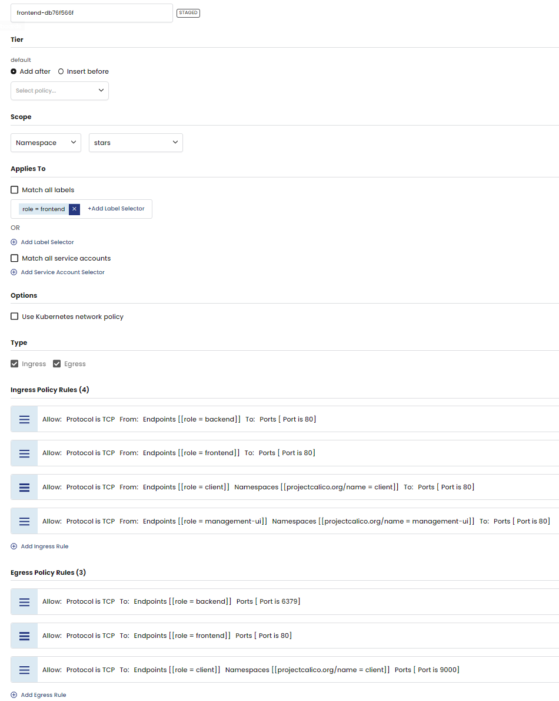

# In this lab

This lab provides the instructions to:

* [Overview](https://github.com/tigera-cs/Calico-Security-Observability-Troubleshooting-Training/blob/main/modules/2.Secure%20Pod%20Traffic%20Using%20Calico%20Security%20Policy/README.md#overview)
* [Deploy sample microservices and ingress resources](https://github.com/tigera-cs/Calico-Security-Observability-Troubleshooting-Training/blob/main/modules/2.Secure%20Pod%20Traffic%20Using%20Calico%20Security%20Policy/README.md#deploy-sample-microservices-and-ingress-resources)
* [Configure Tiers and RBAC](https://github.com/tigera-cs/Calico-Security-Observability-Troubleshooting-Training/blob/main/modules/2.Secure%20Pod%20Traffic%20Using%20Calico%20Security%20Policy/README.md#configure-tiers-and-rbac)
* [Secure pod traffic using Calico security policy](https://github.com/tigera-cs/Calico-Security-Observability-Troubleshooting-Training/blob/main/modules/2.Secure%20Pod%20Traffic%20Using%20Calico%20Security%20Policy/README.md#secure-pod-traffic-using-calico-security-policy)
* [Build your policies](https://github.com/tigera-cs/Calico-Security-Observability-Troubleshooting-Training/blob/main/modules/2.Secure%20Pod%20Traffic%20Using%20Calico%20Security%20Policy/README.md#build-your-policies)
* [Validate and enforce connectivity]()


### Overview

Kubernetes' network model is both flexible and dynamic, enabling applications to be deployed anywhere in the cluster without being tied to the underlying network infrastructure. However, this can present challenges for legacy network firewalls that struggle to keep up with Kubernetes' constantly changing workloads. Calico provides a robust security policy framework that defines and enforces policies, ensuring that only authorized traffic flows between pods and services. Calico's powerful policy engine enhances the security of microservices architectures without compromising the flexibility and agility of Kubernetes. In this lab, we'll demonstrate how to use Calico's policy engine to secure some example microservices that blong to different tenants. We will also use Calico `Tiers` along with Kubernetes RBAC to enable priority based policy processing and control various team's access to Calico security policies.


#### Documentation

- https://docs.tigera.io/calico-enterprise/latest/reference/resources/felixconfig
- https://docs.tigera.io/calico-enterprise/latest/network-policy/policy-tiers/rbac-tiered-policies#rbac-for-policies-and-tiers
- https://docs.tigera.io/calico-enterprise/latest/visibility/elastic/flow/

____________________________________________________________________________________________________________________________________________________________________________________


### Deploy sample microservices and ingress resources

#### Cluster applications and connectivity

This lab uses two applications that run across 4 application namespaces and belong to two tenants, `Tenant-1` and `Tenant-2`. Star app pods run in three namespaces `management-ui` `client` `stars` and belong to `Tenant-1`. Yaobank pods runs in a single namespace and belong to `Tenant-2`. The ingress-nginx namespace hosts an ingress controller, which will be used to connect to the applications through the respective frontend microservice for each application. The ingress-nginx and kube-system namespaces are owned by the platform team and are managed independently of the tenant namespaces.

##### `Tenant-1`
  - Star app
    -  `management-ui` namesapce
    -  `client` namesapce
    -  `stars` namesapce
  
##### `Tenant-2`
  - Yaobank app
    -  `yaobank` namespace

<p align="center">  </p>


#### Deploy `Star` App

1. To deploy the Star app, deploy the following manifest in the cluster.

```yaml
kubectl apply -f -<<EOF
kind: Namespace
apiVersion: v1
metadata:
  name: stars
---
apiVersion: v1
kind: Namespace
metadata:
  name: management-ui
  labels:
    role: management-ui
---
kind: Namespace
apiVersion: v1
metadata:
  name: client
  labels:
    role: client
---
apiVersion: v1
kind: Service
metadata:
  name: backend
  namespace: stars
spec:
  ports:
    - port: 6379
      targetPort: 6379
  selector:
    role: backend
---
apiVersion: apps/v1
kind: Deployment
metadata:
  name: backend
  namespace: stars
  labels:
    role: backend
spec:
  replicas: 1
  selector:
    matchLabels:
      role: backend
  template:
    metadata:
      labels:
        role: backend
    spec:
      containers:
        - name: backend
          image: calico/star-probe:multiarch
          imagePullPolicy: Always
          command:
            - probe
            - --http-port=6379
            - --urls=http://frontend.stars:80/status,http://backend.stars:6379/status,http://client.client:9000/status
          ports:
            - containerPort: 6379
---
apiVersion: v1
kind: Service
metadata:
  name: backend
  namespace: stars
spec:
  ports:
    - port: 6379
      targetPort: 6379
  selector:
    role: backend
---
apiVersion: apps/v1
kind: Deployment
metadata:
  name: backend
  namespace: stars
  labels:
    role: backend
spec:
  replicas: 1
  selector:
    matchLabels:
      role: backend
  template:
    metadata:
      labels:
        role: backend
    spec:
      containers:
        - name: backend
          image: calico/star-probe:multiarch
          imagePullPolicy: Always
          command:
            - probe
            - --http-port=6379
            - --urls=http://frontend.stars:80/status,http://backend.stars:6379/status,http://client.client:9000/status
          ports:
            - containerPort: 6379
---
apiVersion: v1
kind: Service
metadata:
  name: frontend
  namespace: stars
spec:
  ports:
    - port: 80
      targetPort: 80
  selector:
    role: frontend
---
apiVersion: apps/v1
kind: Deployment
metadata:
  name: frontend
  namespace: stars
  labels:
    role: frontend
spec:
  replicas: 1
  selector:
    matchLabels:
      role: frontend
  template:
    metadata:
      labels:
        role: frontend
    spec:
      containers:
        - name: frontend
          image: calico/star-probe:multiarch
          imagePullPolicy: Always
          command:
            - probe
            - --http-port=80
            - --urls=http://frontend.stars:80/status,http://backend.stars:6379/status,http://client.client:9000/status
          ports:
            - containerPort: 80
---
apiVersion: v1
kind: Service
metadata:
  name: management-ui
  namespace: management-ui
spec:
  ports:
    - port: 9001
      targetPort: 9001
  selector:
    role: management-ui
---
apiVersion: apps/v1
kind: Deployment
metadata:
  name: management-ui
  namespace: management-ui
  labels:
    role: management-ui
spec:
  replicas: 1
  selector:
    matchLabels:
      role: management-ui
  template:
    metadata:
      labels:
        role: management-ui
    spec:
      containers:
        - name: management-ui
          image: calico/star-collect:multiarch
          imagePullPolicy: Always
          ports:
            - containerPort: 9001
---
apiVersion: apps/v1
kind: Deployment
metadata:
  name: client
  namespace: client
  labels:
    role: client
spec:
  replicas: 1
  selector:
    matchLabels:
      role: client
  template:
    metadata:
      labels:
        role: client
    spec:
      containers:
        - name: client
          image: calico/star-probe:multiarch
          imagePullPolicy: Always
          command:
            - probe
            - --urls=http://frontend.stars:80/status,http://backend.stars:6379/status
          ports:
            - containerPort: 9000
---
apiVersion: v1
kind: Service
metadata:
  name: client
  namespace: client
spec:
  ports:
    - port: 9000
      targetPort: 9000
  selector:
    role: client
EOF

```

2. Validate the pods are deployed. You should see an output similar to the following for each one of the Star app namesapces.

```bash
kubectl get pods -n management-ui

```


```bash
NAME                             READY   STATUS    RESTARTS   AGE
management-ui-54d45bbb48-2jlxp   1/1     Running   0          42s
```

```bash
kubectl get pods -n client

```
```bash
NAME                     READY   STATUS    RESTARTS   AGE
client-c8f4cb7c6-4sl8r   1/1     Running   0          59s
```

```bash
kubectl get pods -n stars

```
```bash
NAME                        READY   STATUS    RESTARTS   AGE
backend-766dc69dd6-94x4c    1/1     Running   0          78s
frontend-5f89bccd96-7qmb5   1/1     Running   0          78s
```

#### Deploy `Yaobank` App

3. To deploy the Yaobank app, deploy the following manifest in the cluster.

```yaml
kubectl apply -f -<<EOF
apiVersion: v1
kind: Namespace
metadata:
  name: yaobank
  labels:
    istio-injection: disabled
---
apiVersion: v1
kind: Service
metadata:
  name: database
  namespace: yaobank
  labels:
    app: database
spec:
  ports:
  - port: 2379
    name: http
  selector:
    app: database
---
apiVersion: v1
kind: ServiceAccount
metadata:
  name: database
  namespace: yaobank
  labels:
    app: yaobank
---
apiVersion: apps/v1
kind: Deployment
metadata:
  name: database
  namespace: yaobank
spec:
  selector:
    matchLabels:
      app: database
      version: v1
  replicas: 1
  template:
    metadata:
      labels:
        app: database
        version: v1
    spec:
      serviceAccountName: database
      containers:
      - name: database
        image: calico/yaobank-database:certification
        imagePullPolicy: IfNotPresent
        ports:
        - containerPort: 2379
        command: ["etcd"]
        args:
          - "-advertise-client-urls"
          - "http://database:2379"
          - "-listen-client-urls"
          - "http://0.0.0.0:2379"
---
apiVersion: v1
kind: Service
metadata:
  name: summary
  namespace: yaobank
  labels:
    app: summary
spec:
  ports:
  - port: 80
    name: http
  selector:
    app: summary  
---
apiVersion: v1
kind: ServiceAccount
metadata:
  name: summary
  namespace: yaobank
  labels:
    app: yaobank
    database: reader
---
apiVersion: apps/v1
kind: Deployment
metadata:
  name: summary
  namespace: yaobank
spec:
  replicas: 2
  selector:
    matchLabels:
      app: summary
      version: v1
  template:
    metadata:
      labels:
        app: summary
        version: v1
    spec:
      serviceAccountName: summary
      containers:
      - name: summary
        image: calico/yaobank-summary:certification
        imagePullPolicy: Always
        ports:
        - containerPort: 80
---
apiVersion: v1
kind: Service
metadata:
  name: customer
  namespace: yaobank
  labels:
    app: customer
spec:
  type: NodePort
  ports:
  - port: 80
    nodePort: 30180
    name: http
  selector:
    app: customer 
---
apiVersion: v1
kind: ServiceAccount
metadata:
  name: customer
  namespace: yaobank
  labels:
    app: yaobank
    summary: reader 
---
apiVersion: apps/v1
kind: Deployment
metadata:
  name: customer
  namespace: yaobank
spec:
  replicas: 1
  selector:
    matchLabels:
      app: customer
      version: v1
  template:
    metadata:
      labels:
        app: customer
        version: v1
    spec:
      serviceAccountName: customer
      containers:
      - name: customer
        image: calico/yaobank-customer:certification
        imagePullPolicy: Always
        ports:
        - containerPort: 80
---
EOF

```

4. Validate the pods are deployed.

```bash
kubectl get pods -n yaobank

```

You should an output similar to the following for yaobank application.

```bash

NAME                        READY   STATUS    RESTARTS   AGE
customer-687b8d8f74-rh82x   1/1     Running   0          25s
database-545f6d6d95-l4h4n   1/1     Running   0          25s
summary-7579bd9566-d4kx7    1/1     Running   0          25s
summary-7579bd9566-wfcwx    1/1     Running   0          25s
```

#### Deploy Ingress resources

The ingress controller is already deployed for you in `ingress-nginx` namespace. However, you still need to configure Ingress resources for your applications. In this section, we will deploy Ingress resoureces for `Stars` and `Yaobank` apps.

##### Stars Ingress resource

5. Replace `<LABNAME>` with your lab instance and deploy the following manifest in the cluster.

```yaml
kubectl apply -f -<<EOF
apiVersion: networking.k8s.io/v1
kind: Ingress
metadata:
  annotations:
    kubernetes.io/ingress.class: "nginx"
  name: management-ui
  namespace: management-ui
spec:
  rules:
  - host: "stars.<LABNAME>.labs.tigera.fr"
    http:
      paths:
      - path: /
        pathType: Prefix
        backend:
          service:
            name: management-ui
            port:
              number: 9001
EOF

```

6. Validate the ingress resource is created.

```bash
kubectl get ingresses -n management-ui

```

You should see an output similar to the following.

```bash
NAME            CLASS    HOSTS                             ADDRESS               PORTS   AGE
management-ui   <none>   stars.tigeralab1.labs.tigera.fr   10.0.1.30,10.0.1.31   80      38s
```

7. Check the connectivity to the customer service `https:\\stars.<LabName>.labs.tigera.fr` via your browser.


##### Yaobank Ingress resource

8. Replace `<LABNAME>` with your lab instance and deploy the following manifest in the cluster.

```yaml
kubectl apply -f -<<EOF
apiVersion: networking.k8s.io/v1
kind: Ingress
metadata:
  annotations:
    kubernetes.io/ingress.class: "nginx"
  name: yaobank
  namespace: yaobank
spec:
  rules:
  - host: "yaobank.<LABNAME>.labs.tigera.fr"
    http:
      paths:
      - path: /
        pathType: Prefix
        backend:
          service:
            name: customer
            port:
              number: 80
EOF

```

9. Validate the ingress resource is created.

```bash
kubectl get ingresses -n yaobank

```

You should see an output similar to the following.

```bash
NAME      CLASS    HOSTS                               ADDRESS               PORTS   AGE
yaobank   <none>   yaobank.tigeralab1.labs.tigera.fr   10.0.1.30,10.0.1.31   80      12s
```

Check the connectivity to the customer service `https:\\yaobank.<LabName>.labs.tigera.fr` via your browser.


____________________________________________________________________________________________________________________________________________________________________________________

### Configure Tiers and RBAC

#### Tiers overview

Tiers are ordered and hierarchical Kubernetes custom resources that enable priority based policy processing. Tiers enable us to group policies and using Kubernetes built-in native RBAC, we can provide priority based and cluster-wide access or be as granular as limiting a team to a specific namespace for policy access and editing. Tiers are also a perfect tool to organize policies based on functions, teams, etc.

Following are some info about tiers and policies:

- Each tier has an order field, which specifies the priority of that tier compared to other tiers in the cluster.
- Policies in tiers are processed from left tier to right and from top of the tier to bottom.
- Policies in each tier can have negative order number. Two or more policies can also be assigned the same order number in the same tier. In such a case, you need to make sure there is no conflicting rules between policies having the same order.
- When a policy, such as an allow or deny rule, selects a workload/pod in a security policy, it triggers an implicit deny action for that pod. This means that for the pods/workloads selected by the policy, any network traffic that is not explicitly permitted in the corresponding tier will be denied at the end of that tier. `Pass` action can be used in a policy anywhere in a tier to pass the traffic to the subsequent tier for processing. `Pass` rule only allows further processing of the traffic, which can be allowed or denied in the next tier. However, it does not explicitly allow the traffic. Typically `Pass` rule is used at the end of each tier to let traffic processing to be continued in the following tier. However, this is a logical representation and implict default deny is attched to the last policy processing the traffic.

Following is an example of Calico policy tiering.


#### Tiers defintions

This lab uses the following tiers and Kubernetes RBAC to secure the workloads.

- `Security Tier` is used by the `Security Team` to implement the enterprise security controls. Only security team along with the platform team who manages the platform have cluster-wide write access to the globalNetworkPolicy, networkPolicy, globalthreatfeeds, globalnetworkset, and networkset in this tier. `security` service account in this cluster represent the security team and will be used to implement Kubernetes RBAC.
- `Platform Tier` is used by the `platform Team` to implement the platform related policies. The platform team has cluster-wide unlimited access to CE resources in this tier and all the other tiers. `platform` service account in this cluster represent the platform team and will be used to implement Kubernetes RBAC.
- `App Tier` is used by the application developers to implement the application specific policies at the namespace or deployment level. Application developer teams have namespace-evel write access to the networkPolicy in this tier. `tenant1` service account represents the `Tenant-1 Team` and will be used to implement Kubernetes RBAC.  `tenant2` service account represents the `Tenant-2 Team` and will be used to implement Kubernetes RBAC.
- `Default Tier` is used to implement the global default deny policy. Only platform team has unlimited access to this tier.
`Note:` In production environment, Calico Manager UI is typically integrated with the organization single sign-on solution and Kubernetes RBAC is implemented based on LDAP groups.

#### Tiers Configurations

1. To quickly observe flow logs and connection information in the Calico Manager UI, run the following commands in your cluster. It is recommended to leave the cluster default for the following configuration in production environemnt to avoid overloading your cluster node compute resources and generating excessive flow logs, which are storage hungry. For more information on the flow logs and flow logs aggregation level, visit the following links.

```
https://docs.tigera.io/calico-enterprise/latest/visibility/elastic/flow/
```

```bash
kubectl patch felixconfigurations.p default -p '{"spec":{"flowLogsFlushInterval":"10s"}}'
kubectl patch felixconfiguration.p default -p '{"spec":{"flowLogsFileAggregationKindForAllowed":1}}'
kubectl patch felixconfiguration.p default -p '{"spec":{"flowLogsFileAggregationKindForDenied":1}}'

```

2. Configure the following tiers in the cluster by deploying the following manifest. 

```yaml
kubectl apply -f -<<EOF
apiVersion: projectcalico.org/v3
kind: Tier
metadata:
  name: security
spec:
  order: 200
---
apiVersion: projectcalico.org/v3
kind: Tier
metadata:
  name: platform
spec:
  order: 300
---
apiVersion: projectcalico.org/v3
kind: Tier
metadata:
  name: app
spec:
  order: 400
EOF

```
Once the tiers are deployed, you should see an output similar to the following. You can also create the tiers using the Manager UI `Policies Board` page if you want to.

```bash
tier.projectcalico.org/security created
tier.projectcalico.org/platform created
tier.projectcalico.org/app created
```
#### RBAC Configurations

##### `Security Team` RBAC

3. `tigera-basic-ui` ClusterRole is a minimum ClusterRole required for access to Calico Manager UI and have read access to the Calico logs including flow logs, dns logs, audit logs, etc through the Manager UI. Access to the Calico logs can be removed from this role if the user/group should not have visibility to these logs. In this lab, `tigera-basic-ui` ClusterRole will be used for all the teams except the Platform Team who uses a Tigera admin ClusterRole. 

Deploy the following manifest in the cluster.


```yaml
kubectl apply -f -<<EOF
apiVersion: rbac.authorization.k8s.io/v1
kind: ClusterRole
metadata:
  name: tigera-basic-ui
rules:
### Permission to list namespace in the UI is recommended.
- apiGroups:
  - ""
  resources:
  - namespaces
  verbs:
  - watch
  - list
- apiGroups:
  - projectcalico.org
  resources:
  - managedclusters
  verbs:
  - watch
  - list
- apiGroups:
  - ""
  resourceNames:
  - https:tigera-api:8080
  - calico-node-prometheus:9090
  resources:
  - services/proxy
  verbs:
  - get
  - create
- apiGroups:
  - projectcalico.org
  resources:
  - clusterinformations
  verbs:
  - get
  - list
- apiGroups:
  - projectcalico.org
  resources:
  - authorizationreviews
  verbs:
  - create
- apiGroups:
  - projectcalico.org
  resourceNames:
  - cluster-settings
  - user-settings
  resources:
  - uisettingsgroups
  verbs:
  - get
- apiGroups:
  - projectcalico.org
  resourceNames:
  - cluster-settings
  resources:
  - uisettingsgroups/data
  verbs:
  - get
  - list
  - watch
- apiGroups:
  - projectcalico.org
  resourceNames:
  - user-settings
  resources:
  - uisettingsgroups/data
  verbs:
  - '*'
- apiGroups:
  - operator.tigera.io
  resourceNames:
  - tigera-secure
  resources:
  - applicationlayers
  verbs:
  - get
- apiGroups:
  - ""
  resources:
  - services
  verbs:
  - get
  - list
  - watch
## Management cluster permissions in the MCM setup.
- apiGroups:
  - lma.tigera.io
  resourceNames:
  - flows
  - audit*
  - l7
  - events  
  - dns
  - waf
  - kibana_login
  resources:
  - '*'
  verbs:
  - get
EOF

```

4. Deploy the following ClusterRole manifest to give the security team modify access for the security policy related resources included in the manifest.

```yaml
kubectl apply -f -<<EOF
apiVersion: rbac.authorization.k8s.io/v1
kind: ClusterRole
metadata:
  name: tigera-security-team
### tigera-globalthreatfeeds-modify-rules
rules:
- apiGroups:
  - projectcalico.org
  resources:
  - globalthreatfeeds
  - globalthreatfeeds/status
  verbs:
  - get
  - list
  - watch
  - create
  - update
  - patch
  - delete

### tigera-globalnetworkpolicy-modify
- apiGroups:
  - projectcalico.org
  resourceNames:
  - security
  resources:
  - tiers
  verbs:
  - get
  - list
  - watch
- apiGroups:
  - projectcalico.org
  resourceNames:
  - security.*
  resources:
  - tier.globalnetworkpolicies
  - tier.stagedglobalnetworkpolicies
  verbs:
  - get
  - list
  - watch
  - create
  - update
  - patch
  - delete

### tigera-globalnetworkset-modify
- apiGroups:
  - projectcalico.org
  resources:
  - globalnetworksets
  verbs:
  - get
  - list
  - watch
  - create
  - update
  - patch
  - delete

### tigera-networkset-modify
- apiGroups:
  - projectcalico.org
  resources:
  - networksets
  verbs:
  - get
  - list
  - watch
  - create
  - update
  - patch
  - delete

### tigera-networkpolicy-modify
- apiGroups:
  - projectcalico.org
  resourceNames:
  - security.*
  resources:
  - tier.networkpolicies
  - tier.stagednetworkpolicies
  verbs:
  - get
  - list
  - watch
  - create
  - update
  - patch
  - delete
### tigera-pod-reader
- apiGroups:
  - ""
  resources:
  - pods
  verbs:
  - list
EOF

```

5. Create the `security` service account and implement the following ClusterRoleBindings using this service account and the ClusterRoles created in the previous steps.

```bash
kubectl create sa security -n default

```

```bash
kubectl create clusterrolebinding tigera-basic-ui --clusterrole=tigera-basic-ui --serviceaccount=default:security
kubectl create clusterrolebinding tigera-security-team --clusterrole=tigera-security-team --serviceaccount=default:security

```

6. Log into the the Calico Manager UI and check your `Policies Board` page. You should only see the security tier as shown in the following screenshot.

```bash
kubectl create token security -n default --duration=24h

```


##### `Platform Team` RBAC

`tigera-network-admin` is a Calico admin ClusterRole that is created  by default in any cluster that Calico is deployed in. Platform team is the owner and admin of this cluster.


7. Create the `platform` service account and implement the ClusterRoleBindings using `tigera-network-admin` ClusterRole.

```bash
kubectl create sa platform -n default

```

```bash
kubectl create clusterrolebinding platform-tigera-network-admin --clusterrole tigera-network-admin --serviceaccount default:platform

```

8. Log into the the Calico Manager UI. Your `Policies Board` page should look like the following, which has admin access to all the tiers in the cluster.

```bash
kubectl create token platform -n default --duration=24h

```


##### `Tenant-1 Team` RBAC

9. Create the `tenant1` service account and generate a token for it.

```bash
kubectl create sa tenant1 -n stars
kubectl create token tenant1 -n stars --duration=24h

```
10. Log into the Calico Manager UI using `tenant1` token and check your permissions. Your login should be showing the following message because there is no permissions assigned to `tenant1` yet.


11. `tigera-basic-ui` will be used by both `Tenant-1 Team` and `Tenant-2 Team`. Run the following command to allow `tenant1` to log into the UI. Check your permissions again using Calico Manager UI.

```bash
kubectl create clusterrolebinding tenant1-tigera-basic-ui --clusterrole=tigera-basic-ui --serviceaccount=stars:tenant1

```

You should have basic permissions in the UI now. However, you should not see the `Policy Board` page since no relevant permissions is granted yet. ServiceGraph also should not show any connections in the UI as the `tigera-basic-ui` does not have permission to list pods. We will next assign these permissions.


12. Following ClusterRoles enable `Tenant-1 Team` and `Tenant-2 Team` to be able to deploy network policy in the app tier along with having read access to the included resources. Get yourself familiar with the configurations included in the following manifest. Some of these resources are not namespaced and require ClusterRoleBinding to grant permissions and some other resources like networkset and network policy are namespaced and we will use RoleBinding for namespace level permissions. Each ClusterRole below has a comment explaining if the resources is namespaced or not.

Deploy the following manifest to create the relevant clusterroles.

```yaml
kubectl replace -f -<<EOF
### This is a namespaced resource. Use rolebinding to limit the permission to a specific namespace.
apiVersion: rbac.authorization.k8s.io/v1
kind: ClusterRole
metadata:
  name: tigera-networkset-view
rules:
- apiGroups:
  - projectcalico.org
  resources:
  - networksets
  verbs:
  - get
  - list
  - watch
- apiGroups:
  - ""
  resources:
  - pods
  verbs:
  - list
---
### This is a namespaced resource. Use rolebinding to limit the permission to a specific namespace.
apiVersion: rbac.authorization.k8s.io/v1
kind: ClusterRole
metadata:
  name: tigera-networkpolicy-modify-app_tier
rules:
- apiGroups:
  - projectcalico.org
  resourceNames:
  - app
  resources:
  - tiers
  verbs:
  - get
  - list
  - watch
- apiGroups:
  - projectcalico.org
  resourceNames:
  - app.*
  resources:
  - tier.networkpolicies
  - tier.stagednetworkpolicies
  verbs:
  - get
  - list
  - watch
  - create
  - update
  - patch
  - delete
---
### This is a non-namespaced resource. Use clusterrolebinding.
apiVersion: rbac.authorization.k8s.io/v1
kind: ClusterRole
metadata:
  name: tigera-get-tier-app
rules:
- apiGroups:
  - projectcalico.org
  resourceNames:
  - app
  resources:
  - tiers
  verbs:
  - get
  - list
  - watch
---
### This is a non-namespaced resource. Use clusterrolebinding.
apiVersion: rbac.authorization.k8s.io/v1
kind: ClusterRole
metadata:
  name: tigera-globalthreatfeeds-view
rules:
- apiGroups:
  - projectcalico.org
  resources:
  - globalthreatfeeds
  - globalthreatfeeds/status
  verbs:
  - get
  - list
  - watch
---
### This is a non-namespaced resource. Use clusterrolebinding.
apiVersion: rbac.authorization.k8s.io/v1
kind: ClusterRole
metadata:
  name: tigera-globalnetworkset-view
rules:
- apiGroups:
  - projectcalico.org
  resources:
  - globalnetworksets
  verbs:
  - get
  - list
  - watch
---
### This is a non-namespaced resource. Use clusterrolebinding.
apiVersion: rbac.authorization.k8s.io/v1
kind: ClusterRole
metadata:
  name: tigera-globalalert-view
rules:
- apiGroups:
  - projectcalico.org
  resources:
  - alertexceptions
  - globalalerts
  - globalalerts/status
  - globalalerttemplates
  verbs:
  - get
  - list
  - watch
EOF

```

13. Grant `tenant1` service account access to these ClusterRoles by running the following commands.


```bash
kubectl create clusterrolebinding tenant1-tigera-get-tier-app --clusterrole=tigera-get-tier-app --serviceaccount=stars:tenant1

```
14. Before moving forward. Check Calico Manager UI again. At this point, you should see the `Policy Board` and the `app` tier, but you should not be able to create or view any policy in the tier. You should see an output similar to the following.


15. Run the following sets of ClusterRoleBinding and RoleBindings and after running each set, check the UI and see what permissions are added to `tenant1` service account.

```bash
kubectl create clusterrolebinding tenant1-tigera-globalthreatfeeds-view --clusterrole=tigera-globalthreatfeeds-view --serviceaccount=stars:tenant1
kubectl create clusterrolebinding tenant1-tigera-globalnetworkset-view --clusterrole=tigera-globalnetworkset-view --serviceaccount=stars:tenant1
kubectl create clusterrolebinding tenant1-tigera-globalalert-view --clusterrole=tigera-globalalert-view --serviceaccount=stars:tenant1

```

16. `tigera-networkset-view` provides read access to pods in `stars`, `management-ui`, `client` namespaces. At this point ServiceGraph should not provide any visibility into these namespaces traffic. However, after running the following commands you shoud see the relevant flow information in ServiceGraph. Before running the following commands, make sure to use use your browser and try to connect to `https://stars.<LABNAME>.labs.tigera.fr`. Wait for a minute or two and make sure you do not see any flow information in ServiceGraph. Then run the following comamnds and check ServiceGraph again to see the flows.

```bash
kubectl create rolebinding tenant1-tigera-networkset-view --clusterrole=tigera-networkset-view --namespace=stars --serviceaccount=stars:tenant1
kubectl create rolebinding tenant1-tigera-networkset-view --clusterrole=tigera-networkset-view --namespace=management-ui --serviceaccount=stars:tenant1
kubectl create rolebinding tenant1-tigera-networkset-view --clusterrole=tigera-networkset-view --namespace=client --serviceaccount=stars:tenant1

```

17. Your ServiceGraph show appear like the following screenshot after you add the above permissions to `tenant1`. 




18. Run the following command to grant network policy modify permission for `tenant1` for the three star app namespaces.

```bash
kubectl create rolebinding tenant1-tigera-networkpolicy-modify-app_tier --clusterrole=tigera-networkpolicy-modify-app_tier --namespace=stars --serviceaccount=stars:tenant1
kubectl create rolebinding tenant1-tigera-networkpolicy-modify-app_tier --clusterrole=tigera-networkpolicy-modify-app_tier --namespace=management-ui --serviceaccount=stars:tenant1
kubectl create rolebinding tenant1-tigera-networkpolicy-modify-app_tier --clusterrole=tigera-networkpolicy-modify-app_tier --namespace=client --serviceaccount=stars:tenant1

```


##### `Tenant-2 Team` RBAC

19. The permissions for `tenant2` are pretty similar to `tenant2`. Run the following commands.

```bash
kubectl create sa tenant2 -n yaobank

```

```bash
kubectl create clusterrolebinding tenant2-tigera-basic-ui --clusterrole=tigera-basic-ui --serviceaccount=yaobank:tenant2

```

```bash
kubectl create clusterrolebinding tenant2-tigera-get-tier-app --clusterrole=tigera-get-tier-app --serviceaccount=yaobank:tenant2
kubectl create clusterrolebinding tenant2-tigera-globalthreatfeeds-view --clusterrole=tigera-globalthreatfeeds-view --serviceaccount=yaobank:tenant2
kubectl create clusterrolebinding tenant2-tigera-globalnetworkset-view --clusterrole=tigera-globalnetworkset-view --serviceaccount=yaobank:tenant2
kubectl create clusterrolebinding tenant2-tigera-globalalert-view --clusterrole=tigera-globalalert-view --serviceaccount=yaobank:tenant2

```

```bash
kubectl create rolebinding tenant2-tigera-networkset-view --clusterrole=tigera-networkset-view --namespace=yaobank --serviceaccount=yaobank:tenant2
kubectl create rolebinding tenant2-tigera-networkpolicy-modify-app_tier --clusterrole=tigera-networkpolicy-modify-app_tier --namespace=yaobank --serviceaccount=yaobank:tenant2

```

20. Generate a token for `tenant2` and log into the Calico Manager UI and check your permissions.

```bash

kubectl create token tenant2 -n yaobank --duration=24h

```

### Secure pod traffic using Calico security policy

#### Security tier policies overview


The `security` tier will be used to implement high-level guardrails for the cluster. 
- A `threatfeed` security policy will be enforced for all cluster workloads. The policy will `deny` egress connectivity to malicious IPs in the `threatfeed`.
- Tenant1 isolation is achieved by enforcing `tenant-1-restrict`. This policy will ensure that the tenant1 workloads are isolated from the rest of the cluster workloads. It will also enable the app developer team to create the required policies to allow tenant1 application traffic.
- Finlly, `security-default-pass` policy will be used to pass any traffic that is not explicitly allowed or denied in this tier to the subsequent tier for policy processing. 

> Security Policies in the `security tier`



#### Platform tier policies overview


The `platform` tier implements security policies for platform components such as `kube-dns`, `ingress`, `Service Mesh`, and any other platform components. In this lab, we will use platform tier to implement security policies for the following platform components.
- The `cluster-dns-allow-all` security policy will have rules to permit ingress DNS traffic to the `kube-dns` endpoints on TCP and UDP port 53 from all endpoints in the cluster. The security policy will also have egress rules to permit all endpoints in the cluster to send DNS traffic to the `kube-dns` endpoints on the same ports.
- The `ingress` security policy has rules to permit inbound traffic to the ingress controller from public and private networks on TCP ports 80 and 443. The security policy also has egress rules permitting traffic to namespaces that host externally accessible services, which are exposed as ingress resources. Note that in this cluster, ingress controller pods are host networked. Calico security policy does not protect traffic to and from host/host networked pods using default configurations. In order to protect hosts/host networked pods, we will need to use Calico host endpoint protection. In this lab, we will also enable host endpoint protection to control traffic to and from host networked pods.
- The `platform-default-pass` security policy has the lowest precedence in the platform tier.  It is deployed to ensure that a `pass` action is applied to all endpoints matched in the tier and for flows not allowed or denied in this tier. It is required since the `cluster-dns-allow-all` security policy matched all cluster workloads. 


> Security Policies in the `platform tier`




#### App tier policies overview

The App tier is used by Star application team and Yaobank appication team to deploy policies for `Star` app and `Yaobank` app respectively.

- The Yaobank application team deploys coarse-grained security policies for `Yaobank` app per namespace. An allow policy for the namespace will ensure that all workloads inside the namespace can communicate with one another. However, security `rules` must permit traffic flows in and out of the namespace.    
- The Stars application team deploys fine-grained security policies for `Stars` app per each deployment in the namespaces. Egress and Ingress security policies are required to permit traffic flows in and out of each deployment. 
- The `app-default-pass` security policy has the lowest precedence in the app tier. It is deployed to ensure that a pass action is applied to all endpoints traffic matched in this tier, but the traffic was not explicitly allowed or denied. This rule causes the traffic matching it to be further processed in the default tier. We will implement global `default-deny` policy in the default tier blocking any traffic that was not explicitly allowed in the previous tiers.


> Security Policies in the `app tier`


#### Default tier policy overview

The default tier is used to implement global default deny policy.

- `default-deny` denies any traffic that is not explicitly allowed in `security`, `platform`, and `app` tiers.

> Security Policies in the `default tier`


### Build your policies

There are two three ways to build security policies:

  - Using `Policy recommender` empowered by Calico flow logs. 
  - Using flow logs (through Kibana, ServiceGraph, FlowVisualization) to understand the traffic connectivity requirements and build policies manually.
  - Using internal teams (security team, platform team, developers team) knowledge of application connectivity requirements.

Policy recommender is an automated, powerful, and easy way to quickly build security policies. However, policy recommender requires that appliaction connectivity is not denied by an already deployed policy like a default deny. Policy recommender only works based on the allowed traffic flows and not denied flows. 

As discussed before, following are the policies that we will build in this lab. 

- Security tier policies
  - threatfeed
  - tenant-1-restrict
  - security-default-pass

- Platform tier policies
  - cluster-dns-allow-all security solicy
  - ingress (for both Stars and Yaobank app)
  - platform-default-pass 

- App tier policies
  - yaobank-allow
  - stars-allow
  - app-default-pass

- Default tier policies
  - default-deny


#### Build policies using policy recommender

Out of the above policies, we will build the required policies for the `Star` application using policy recommeder. Since policy recommender only works when there are no deny policy in place, we will build these policies first using policy recommeder, but do not deploy them. To use policy recommender in a production environment, you should make sure all the policies for the application are first built before deploying any deny policies. If your lower environment replicate the higher environment and it is not denying the traffic, you could also build the policies in a lower environment and then deploy them in higher environment. All the other policies that are required as part of this lab are arleady built for you.
For the sake of simplicity and time, we will deploy all the required policies using kubectl and kubeconfig credentials. However, in production enviroment, various team such as security, DevOps, and developer team should be able to use their credentials to build and deploy policies as long as they have the correct credentials. 

1. As explained earlier, ingress controller pods are host networked in this cluster. In order to protect hosts/host networked pods, we will need to use Calico host endpoint protection. Run the following command to enable auto hep (host endpoint protection). Enabling hep in the cluster causes felix (policy engine) to treat cluster nodes like pods when it comes to policy enforcement. The difference in terms of policy enforcement is that pods are namespaced resources, but nodes are not namespaced resources.
`Note:` We will cover hep in details in the next lab. 

```bash
kubectl patch kubecontrollersconfiguration default --patch='{"spec": {"controllers": {"node": {"hostEndpoint": {"autoCreate": "Enabled"}}}}}'

```

```bash
kubecontrollersconfiguration.projectcalico.org/default patched
```

2. Validate that the hep is activated.

```bash
kubectl get heps -o wide

```

You should see an output similar to the following.

```bash
NAME                                               CREATED AT
ip-10-0-1-20.eu-west-1.compute.internal-auto-hep   2023-05-08T22:23:09Z
ip-10-0-1-30.eu-west-1.compute.internal-auto-hep   2023-05-08T22:23:09Z
ip-10-0-1-31.eu-west-1.compute.internal-auto-hep   2023-05-08T22:23:09Z
```

3. Ingress nginx contoller pods run on the worker nodes only. Label the two cluster worker nodes to have the following labels. We will use this label to control traffic to ingress nginx pods and from ingress nginx pods to the backend pods. 

```bash
kubectl label nodes $(kubectl get nodes -o name | cut -d/ -f2 | grep -v ip-10-0-1-20) app.kubernetes.io/name=nginx

```

You should see an output similar to the following.

```bash
node/ip-10-0-1-30.us-west-1.compute.internal labeled
node/ip-10-0-1-31.us-west-1.compute.internal labeled
```

4. Use your Internet browser and browse to `https://stars.<LABNAME>.labs.tigera.fr` and `https://yaobank.<LABNAME>.labs.tigera.fr` to connect to the Stars and Yaobank app and generate flow logs. Make sure you can see the following page.


5. Log into the Calico Manager UI using platform `platform` credentials. Browse to the `Policies Board` and click on `Recommend a Policy` from top right corner of the page.

```bash
kubectl create token platform -n default --duration=24h

```

6. From the `Namespace` drop-down menu, select `management-ui`, from `Advanced Options` page uncheck `Use only unprotected flows for this recommendation`, and select `management-ui-xxxxxxx-*` deployment. Then click `Recommend` from top right corner of the page.


From the `Ingress Policy Rules`, click the edit icon for the single ingress rule from the right side of the page.


7. From the `Ingress Policy Rules` section, click `Edit Rule` for the single ingress rule, and change the ingress rule to port 9001 to look like the following screenshot. You need to select `Advanced mode` to see the `From` section of the rule. This change is required to only allow ingress traffic from the the two ingress nginx pods.

8. From the `Ingress Policy Rules` section, click `Add Ingress Rule`, select `Pass` for the rule action and click Save Rule

9. From the `Egress Policy Rules`, delete the rule that allows UDP Port 53 traffic to kube-dns pods.

10. From the `Egress Policy Rules` section, click `Add Engress Rule`, select `Pass` for the rule action and click Save Rule.

Your ultimate policy should look like the following.


11. At the top of the page, click the download icon and download the policy. Name the policy `Management-ui-policy.yaml` so that we can later use it to deploy the policy.

`Note:` For the sake of time, this policy is included in the lab instructions below. Make sure your generated policy is the same as the policy included in the lab instructions below.

12. Go to the policy recommender again and build the policy for the `client` app.


13. Remove the DNS rule for the egress traffic and download the policy. Name the policy `client-policy.yaml` so that we can later use it to deploy the policy. Your policy should look like the following after you remove the DNS egress rule.

`Note:` For the sake of time, this policy is included in the lab instructions below. Make sure your generated policy is the same as the policy included in the lab instructions below.


14. Go to the policy recommender again and build the policy for the `stars` namespace. Make sure to use the policy recommender to build policies for both backend and fronend app. You will need to run the recommender once for each app.

`Note:` For the sake of time, this policy is included in the lab instructions below.Make sure your generated policy is the same as the policy included in the lab instructions below.


15. Your frontend app policy after cleanup should look like the following.




16. Your backend app policy after cleanup should look like the following.


When designing the policies, it is recommended to take a top down approach meaning start by policies that have the broadest scope in terms of the pods that they apply to and normally are implemented in tiers with highest priority. Then move to desigining policies that have more specific scope like a specific namespace or a deployment in a specific namespace. 
However, when implementing policies, we need to ensure our policies do not block legitimate traffic. As a result, as part of our policy deployment in this lab, we will implement fail-safe rules and pass rules first (bottom up) to make sure we will not inadvertently block traffic. Once we make sure, we have all the edges covered, we will turn the cluster into a global default-deny.


#### Default tier policies

1. Let start by implementing our `default-deny` policy. We will start by first implementing a `staged` default-deny policy and once we make sure we are allowing all the legitimate application traffic, we will turn the policy into an enforced default deny. Note that a staged default deny does not block any traffic, but it will show us that traffic that is hitting the rule and could get blocked if the required rules to allow the traffic is not implemented.
From the terminal, deploy the following policy in the cluster.

```yaml
kubectl apply -f -<<EOF
apiVersion: projectcalico.org/v3
kind: StagedGlobalNetworkPolicy
metadata:
  name: default.default-deny
spec:
  tier: default
  order: 10000
  ingress:
    - action: Deny
      source: {}
      destination: {}
  egress:
    - action: Deny
      source: {}
      destination: {}
  types:
    - Ingress
    - Egress
EOF

```


2. Log into the Calico Manager UI using platform user credentials and check on the policy implemented. 


#### Security tier policies

1. Once we deployed our fail-safe rule in the last step, we will move to the tier with highest priority, `security` tier, and start building the policies in this tier. Since our `threatfeed` policy implements egress deny traffic for all the cluster workloads, we will need to either allow all the required cluster workloads traffic in the security tier or `Pass` all the traffic to the next tier for processing before applying the `threatfeed` policy. This is because there is an implicit deny rule asscoaited with any security policy (allow or deny rules) that selects workloads in a cluster. Pass rule allows the traffic for those workloads to be further processed in the subsequent tiers.
To make sure our cluster egress traffic is not impacted by `threatfeed` policy, we will first implement our `security-default-pass`. Deploy the following manifest. 


```yaml
kubectl apply -f -<<EOF
apiVersion: projectcalico.org/v3
kind: GlobalNetworkPolicy
metadata:
  name: security.security-default-pass
spec:
  tier: security
  order: 10000
  ingress:
    - action: Pass
      source: {}
      destination: {}
  egress:
    - action: Pass
      source: {}
      destination: {}
  types:
    - Ingress
    - Egress
EOF

```
2. To make sure the policy is implemented for all the cluster workloads, click on the name of the policy in the `Policy Board` and then from the `View Polciy` page, click on the number link associated with `Endpoints`. You should see a similar output to the following.


3. Run the following commands to configure the `GlobalThreatFeed` and `threatfeed` policy. Click on the policy name in the UI and view the policy configurations.

```yaml
kubectl apply -f -<<EOF
kind: GlobalThreatFeed
apiVersion: projectcalico.org/v3
metadata:
  name: alienvault.ipthreatfeeds
spec:
  content: IPSet
  mode: Enabled
  description: AlienVault IP Block List
  feedType: Builtin
  globalNetworkSet:
    labels:
      feed: otx-ipthreatfeed
  pull:
    http:
      format: {}
      url: 'https://installer.calicocloud.io/feeds/v1/ips'
EOF

```

```yaml
kubectl apply -f -<<EOF
apiVersion: projectcalico.org/v3
kind: GlobalNetworkPolicy
metadata:
  name: security.block-alienvault-ipthreatfeed
spec:
  tier: security
  order: -90
  selector: all()
  namespaceSelector: ''
  serviceAccountSelector: ''
  egress:
    - action: Deny
      source: {}
      destination:
        selector: feed == "otx-ipthreatfeed"
  types:
    - Egress
EOF

```


4. Star application is subject to compliance requirement. Hence, the security team requires tight control in terms of the sources that can talk to this application and the destinations that this application can talk to. The following policy in the security tier specifies what connectivity can be allowed for this application and then denies every other traffic. The deny will be enforced later by converting the `Pass` any protocol rules highlighted in the following snapshot to a `Deny` rule. This rule is used as a temporary fail-safe measure to make sure we do not inadvertently deny any traffic.

```yaml
kubectl apply -f -<<EOF
apiVersion: projectcalico.org/v3
kind: GlobalNetworkPolicy
metadata:
  name: security.tenant-1-restrict
spec:
  tier: security
  order: 2
  selector: ''
  namespaceSelector: >-
    projectcalico.org/name == "management-ui" || projectcalico.org/name ==
    "client" || projectcalico.org/name == "stars"
  ingress:
    - action: Pass
      source:
        namespaceSelector: >-
          projectcalico.org/name == "management-ui" || projectcalico.org/name ==
          "client" || projectcalico.org/name == "stars"
      destination: {}
    - action: Pass
      protocol: TCP
      source:
        selector: app.kubernetes.io/name == "nginx"
        namespaceSelector: global()
      destination: {}
    - action: Pass
      source: {}
      destination: {}
  egress:
    - action: Pass
      source: {}
      destination:
        namespaceSelector: >-
          projectcalico.org/name == "management-ui" || projectcalico.org/name ==
          "client" || projectcalico.org/name == "stars"
    - action: Pass
      protocol: TCP
      source: {}
      destination:
        selector: app.kubernetes.io/name == "nginx"
        namespaceSelector: global()
        ports:
          - '80'
          - '443'
    - action: Pass
      protocol: TCP
      source: {}
      destination:
        selector: app == "kube-dns"
        namespaceSelector: projectcalico.org/name == "kube-system"
        ports:
          - '53'
    - action: Pass
      protocol: UDP
      source: {}
      destination:
        selector: app == "kube-dns"
        namespaceSelector: projectcalico.org/name == "kube-system"
        ports:
          - '53'
    - action: Pass
      source: {}
      destination: {}
  types:
    - Ingress
    - Egress
EOF

```


#### Platform tier policies

Platform tier typically include policies for the platform components. Policies to protect cluster nodes, service meshes (Linkerd, Istio), Ingress, DNS, and other platform components are typically implemented in this tier.

1. Start by deploying the pass rule for the tier to make sure we will not block any traffic by deploying the DNS policy.

```yaml
kubectl apply -f -<<EOF
apiVersion: projectcalico.org/v3
kind: GlobalNetworkPolicy
metadata:
  name: platform.platform-default-pass
spec:
  tier: platform
  order: 10000
  ingress:
    - action: Pass
      source: {}
      destination: {}
  egress:
    - action: Pass
      source: {}
      destination: {}
  types:
    - Ingress
    - Egress
EOF

```

2. Run the following command to configure the `cluster-dns-allow-all` policy. Note that this policy is also allowing host networked pods to make name resolution request to CoreDNS pods. While cluster nodes use name servers specified in `/etc/resolv.conf` for name resolution, host networked pods such as `tigera-operator` use Kubernetes CoreDNS for name resolution.

```yaml
kubectl apply -f -<<EOF
apiVersion: projectcalico.org/v3
kind: GlobalNetworkPolicy
metadata:
  name: platform.cluster-dns-allow-all
spec:
  tier: platform
  order: 1
  ingress:
    - action: Allow
      protocol: TCP
      source:
        namespaceSelector: all()
      destination:
        selector: k8s-app == "kube-dns"
        ports:
          - '53'
    - action: Allow
      protocol: UDP
      source:
        namespaceSelector: all()
      destination:
        selector: k8s-app == "kube-dns"
        ports:
          - '53'
    - action: Allow
      protocol: UDP
      source:
        selector: projectcalico.org/auto-hep == "true"
        namespaceSelector: global()
      destination:
        selector: k8s-app == "kube-dns"
        ports:
          - '53'
  egress:
    - action: Allow
      protocol: TCP
      source:
        namespaceSelector: all()
      destination:
        selector: k8s-app == "kube-dns"
        ports:
          - '53'
    - action: Allow
      protocol: UDP
      source:
        namespaceSelector: all()
      destination:
        selector: k8s-app == "kube-dns"
        ports:
          - '53'
  types:
    - Ingress
    - Egress
EOF

```

3. Deploy the following policy to allow ingress traffic to our nginx ingress controller and allow the required egress traffic from the nginx ingress controller.


```yaml
kubectl apply -f -<<EOF
apiVersion: projectcalico.org/v3
kind: GlobalNetworkPolicy
metadata:
  name: platform.ingress-nginx-controller
spec:
  tier: platform
  order: 1000
  selector: app.kubernetes.io/name == "nginx"
## allow ingress connections to ingress nginx host networked pods on port 80 and 443.
  ingress:
    - action: Allow
      protocol: TCP
      source: {}
      destination:
        ports:
          - '80'
          - '443'
## allow egress connection to kubernetes apiserver.
  egress:
    - action: Allow
      protocol: TCP
      source: {}
      destination:
        selector: component == "apiserver"
        namespaceSelector: projectcalico.org/name == "default"
        ports:
          - '6443'
## allow egress connection to managemenet-ui (the front end) for stars application.
    - action: Allow
      protocol: TCP
      source: {}
      destination:
        selector: role == "management-ui"
        namespaceSelector: projectcalico.org/name == "management-ui"
        ports:
          - '9001'
## allow egress connection to customer (the front end) for yaobank application.
    - action: Allow
      protocol: TCP
      source: {}
      destination:
        selector: app == "customer"
        namespaceSelector: projectcalico.org/name == "yaobank"
        ports:
          - '80'
## allow egress connection to tigera manager (Calico Manager UI) pusblished through the Internet.
    - action: Allow
      protocol: TCP
      source: {}
      destination:
        selector: app.kubernetes.io/name == "tigera-manager"
        namespaceSelector: projectcalico.org/name == "tigera-manager"
        ports:
          - '9443'
### This policy is implemented for the hipstershop app, which will be deployed in the following labs.
    - action: Allow
      protocol: TCP
      source: {}
      destination:
        selector: app == "frontend"
        namespaceSelector: projectcalico.org/name == "hipstershop"
        ports:
          - '8080'
  types:
    - Ingress
    - Egress
EOF

```

#### App tier policies

App tier policy is used by the application developer team to deploy per namespace or per deployment policies.

1. Start by deploying the pass rule for the tier.

```yaml
kubectl apply -f -<<EOF
apiVersion: projectcalico.org/v3
kind: GlobalNetworkPolicy
metadata:
  name: app.app-default-pass
spec:
  tier: app
  order: 10000
  ingress:
    - action: Pass
      source: {}
      destination: {}
  egress:
    - action: Pass
      source: {}
      destination: {}
  types:
    - Ingress
    - Egress
EOF

```

2. `yaobank-allow` policies implements the rules requird to allow communication between various microservices running in the yaobank namespace. It also implements the required rule so that traffic from nginx ingress is allowed to the customer microservice. Deploy the following manifests in the cluster.

`Note:` This policy allows all traffic between all the microservices within the namespace and only controls ingress and egress traffic to and from the namespace.


```yaml
kubectl apply -f -<<EOF
apiVersion: projectcalico.org/v3
kind: NetworkPolicy
metadata:
  name: app.yaobank
  namespace: yaobank
spec:
  tier: app
  order: 10
  ingress:
    - action: Allow
      source:
        selector: all()
      destination:
        selector: all()
    - action: Allow
      protocol: TCP
      source:
        selector: app.kubernetes.io/name == "nginx"
        namespaceSelector: global()
      destination:
        selector: app == "customer"
        ports:
          - '80'
  egress:
    - action: Allow
      source:
        selector: all()
      destination:
        selector: all()
  types:
    - Ingress
    - Egress
EOF

```


3. Deploy the following policies to implement fine-grained policy for every deployment across all the three `star` app namespaces.


```yaml
kubectl apply -f -<<EOF
apiVersion: projectcalico.org/v3
kind: NetworkPolicy
metadata:
  name: app.management-ui
  namespace: management-ui
spec:
  tier: app
  order: 20
  selector: role == "management-ui"
  ingress:
    - action: Allow
      protocol: TCP
      source:
        selector: app.kubernetes.io/name == "nginx"
        namespaceSelector: global()
      destination:
        ports:
          - '9001'
    - action: Pass
      source: {}
      destination: {}
  egress:
    - action: Allow
      protocol: TCP
      source: {}
      destination:
        selector: role == "client"
        namespaceSelector: projectcalico.org/name == "client"
        ports:
          - '9000'
    - action: Allow
      protocol: TCP
      source: {}
      destination:
        selector: role == "backend"
        namespaceSelector: projectcalico.org/name == "stars"
        ports:
          - '6379'
    - action: Allow
      protocol: TCP
      source: {}
      destination:
        selector: role == "frontend"
        namespaceSelector: projectcalico.org/name == "stars"
        ports:
          - '80'
    - action: Pass
      source: {}
      destination: {}
  types:
    - Ingress
    - Egress
EOF

```


```yaml
kubectl apply -f -<<EOF
apiVersion: projectcalico.org/v3
kind: NetworkPolicy
metadata:
  name: app.client
  namespace: client
spec:
  tier: app
  order: 20
  selector: role == "client"
  ingress:
    - action: Allow
      protocol: TCP
      source:
        selector: role == "management-ui"
        namespaceSelector: projectcalico.org/name == "management-ui"
      destination:
        ports:
          - '9000'
    - action: Allow
      protocol: TCP
      source:
        selector: role == "backend"
        namespaceSelector: projectcalico.org/name == "stars"
      destination:
        ports:
          - '9000'
    - action: Allow
      protocol: TCP
      source:
        selector: role == "frontend"
        namespaceSelector: projectcalico.org/name == "stars"
      destination:
        ports:
          - '9000'
  egress:
    - action: Allow
      protocol: TCP
      source: {}
      destination:
        selector: role == "backend"
        namespaceSelector: projectcalico.org/name == "stars"
        ports:
          - '6379'
    - action: Allow
      protocol: TCP
      source: {}
      destination:
        selector: role == "frontend"
        namespaceSelector: projectcalico.org/name == "stars"
        ports:
          - '80'
  types:
    - Ingress
    - Egress
EOF

```


```yaml
kubectl apply -f -<<EOF
apiVersion: projectcalico.org/v3
kind: NetworkPolicy
metadata:
  name: app.frontend
  namespace: stars
spec:
  tier: app
  order: 20
  selector: role == "frontend"
  ingress:
    - action: Allow
      protocol: TCP
      source:
        selector: role == "backend"
      destination:
        ports:
          - '80'
    - action: Allow
      protocol: TCP
      source:
        selector: role == "frontend"
      destination:
        ports:
          - '80'
    - action: Allow
      protocol: TCP
      source:
        selector: role == "client"
        namespaceSelector: projectcalico.org/name == "client"
      destination:
        ports:
          - '80'
    - action: Allow
      protocol: TCP
      source:
        selector: role == "management-ui"
        namespaceSelector: projectcalico.org/name == "management-ui"
      destination:
        ports:
          - '80'
  egress:
    - action: Allow
      protocol: TCP
      source: {}
      destination:
        selector: role == "backend"
        ports:
          - '6379'
    - action: Allow
      protocol: TCP
      source: {}
      destination:
        selector: role == "frontend"
        ports:
          - '80'
    - action: Allow
      protocol: TCP
      source: {}
      destination:
        selector: role == "client"
        namespaceSelector: projectcalico.org/name == "client"
        ports:
          - '9000'
  types:
    - Ingress
    - Egress
EOF

```


```yaml
kubectl apply -f -<<EOF
apiVersion: projectcalico.org/v3
kind: NetworkPolicy
metadata:
  name: app.backend
  namespace: stars
spec:
  tier: app
  order: 20
  selector: role == "backend"
  ingress:
    - action: Allow
      protocol: TCP
      source:
        selector: role == "frontend"
      destination:
        ports:
          - '6379'
    - action: Allow
      protocol: TCP
      source:
        selector: role == "backend"
      destination:
        ports:
          - '6379'
    - action: Allow
      protocol: TCP
      source:
        selector: role == "client"
        namespaceSelector: projectcalico.org/name == "client"
      destination:
        ports:
          - '6379'
    - action: Allow
      protocol: TCP
      source:
        selector: role == "management-ui"
        namespaceSelector: projectcalico.org/name == "management-ui"
      destination:
        ports:
          - '6379'
  egress:
    - action: Allow
      protocol: TCP
      source: {}
      destination:
        selector: role == "backend"
        ports:
          - '6379'
    - action: Allow
      protocol: TCP
      source: {}
      destination:
        selector: role == "frontend"
        ports:
          - '80'
    - action: Allow
      protocol: TCP
      source: {}
      destination:
        selector: role == "client"
        namespaceSelector: projectcalico.org/name == "client"
        ports:
          - '9000'
  types:
    - Ingress
    - Egress
EOF

```
____________________________________________________________________________________________________________________________________________________________________________________

### Validate and enforce connectivity

Now that we have deployed our policies, we need to make sure the rules that we have implemented are the correct rules before enforcing deny rules.

##### Flow logs policy processing order

Flow logs are the primary sources of getting visbility into the cluster traffic and figuring out what security policies process and action on the traffic flows. Each flow log has a mulitvalued `Policies` field, which shows which policies processed a specific flow. Multiple policy could match a traffic flow, but only one policy allow or deny the traffic and that is the policy last applied. Following output is a sample flow log `Policies` field and below it is the breakdown of each parameter.

```json
{
  "all_policies": [
    "0|security|security.tenant-1-restrict|pass|4",
    "1|platform|platform.cluster-dns-allow-all|allow|1"
  ]
}
```

```
 | Policy Processing Order | Policy Tier | Policy Name (prefixed by tier name) | Rule Action | Rule Index Number |
 | 0                       | security    | security.tenant-1-restrict          | pass        |  4                |
 | 1                       | platform    | platform.cluster-dns-allow-all      | allow       |  1                |
```


In the above case, the platform tier policy (the second policy) allowed the traffic. The rule was the second rule in the policy as specific by `Rule Index Number: 1` (rule index number starts with 0). Wheather this was an ingress or egress rule is specific by the `reporter` field in the flow logs. If the `reporter: src`, that means the egress rule in the policy processed the traffic. If the `reporter: dst`, that means the ingress rule in the policy processed the traffic. 


#### tenant-1-restrict rule validation

The following policy was used to implement the guardrails for tenant-1 app. This policy was implemented to deny any traffic that is not legitimate and also enable the developers to allow the traffic that is required for the applications to function.

In the following policy, the catch-all ingress pass rule with index number 2 and the catch-all egress pass rule with index number 4 were used as a temporary fail-safe rule to make sure we are not indvertently denying any legitimate traffic. We need to make sure no legitimate traffic is hitting this rule and then convert these rules from `Pass` to `Deny`. Let's validate that in the next steps. You do not need to redeploy the following policy. Move forward.

```yaml
apiVersion: projectcalico.org/v3
kind: GlobalNetworkPolicy
metadata:
  name: security.tenant-1-restrict
spec:
  tier: security
  order: 2
  selector: ''
  namespaceSelector: >-
    projectcalico.org/name == "management-ui" || projectcalico.org/name ==
    "client" || projectcalico.org/name == "stars"
  ingress:
    - action: Pass  ----------> index number 0
      source:
        namespaceSelector: >-
          projectcalico.org/name == "management-ui" || projectcalico.org/name ==
          "client" || projectcalico.org/name == "stars"
      destination: {}
    - action: Pass ----------> index number 1 
      protocol: TCP
      source:
        selector: app.kubernetes.io/name == "nginx"
        namespaceSelector: global()
      destination: {}
    - action: Pass ----------> index number 2
      source: {}
      destination: {}
  egress:
    - action: Pass ----------> index number 0
      source: {}
      destination:
        namespaceSelector: >-
          projectcalico.org/name == "management-ui" || projectcalico.org/name ==
          "client" || projectcalico.org/name == "stars"
    - action: Pass ----------> index number 1
      protocol: TCP
      source: {}
      destination:
        selector: app.kubernetes.io/name == "nginx"
        namespaceSelector: global()
        ports:
          - '80'
          - '443'
    - action: Pass ----------> index number 2
      protocol: TCP
      source: {}
      destination:
        selector: app == "kube-dns"
        namespaceSelector: projectcalico.org/name == "kube-system"
        ports:
          - '53'
    - action: Pass ----------> index number 3
      protocol: UDP
      source: {}
      destination:
        selector: app == "kube-dns"
        namespaceSelector: projectcalico.org/name == "kube-system"
        ports:
          - '53'
    - action: Pass  ----------> index number 4
      source: {}
      destination: {}
  types:
    - Ingress
    - Egress
```

1. From Calico Manager UI, click `Logs` in the left navidation bar to open `Kibana` page and login using the following credentials.

Username:

```bash
elastic
```

2. Run the following command to get the password.

Password:

```bash
kubectl -n tigera-elasticsearch get secret tigera-secure-es-elastic-user -o go-template='{{.data.elastic | base64decode}}' && echo

```

3. From the hamburger menu on the top left corner of the screen, click `Discover`.


4. From the left menu bar just below `Add filter`, ensure `tigera_secure_ee_flows*` index is selected and then click on the plus sign next to the following flow logs metadata to filter through the metadata. Make sure to filter as per the order listed below to have an organized and clear view of the filtered information. Change the filter time range to `last  minutes`.

- source_namespace
- source_name_aggr
- dest_namespace
- dest_name_aggr
- dest_port
- reporter
- policies


5. Once the above filter is implemented, you should see a page similar to the following.


6. Use the following filter for the traffic matching our temporary `Pass` fail-safe rules based on the `tier name`, `policy name`, `rule action`, and `rule index number`. Before running the following search, make sure to browse to `https://stars.<LABNAME>.labs.tigera.fr` to generate some flow logs.

7. Type the following in the search bar of `Discover` page. This will look for any traffic matching our ingress fail-safe rule.

```bash
policies:{ all_policies: *security|security.tenant-1-restrict|pass|2* }
```

No match means there is no undesired traffic hitting this rule. In production environments, make sure to do your due diligence that there is no denied traffic before enforcing your deny rules.


8. Type the following in the search bar of `Discover` page. This will look for any traffic matching our egress fail-safe rule.

```bash
policies:{ all_policies: *security|security.tenant-1-restrict|pass|4* }
```

9. The flow logs in the screenshot below indicate that we have not correctly implemented the required `Pass` rule to allow the legitimate traffic to be passed to the next tier. 


10. Similary, if you click on the `tenant-1-restrict` policy while you are also trying to browse to `https://stars.<LABNAME>.labs.tigera.fr` , you will see traffic hitting the egress `Pass: Any Protocol` rule. If we had our previous egress rules before this pass rule correctly configured, no traffic would have hit this rule.


11. In this case, our DNS policy is not using the correct labels for the destination CoreDNS pods. Let's fix the policy by applying the following manifest.

`Note:` The following manifest is replacing destination CoreDNS pods labeles from `app == "kube-dns"` to `k8s-app == "kube-dns"`.


```yaml
kubectl replace -f -<<EOF
apiVersion: projectcalico.org/v3
kind: GlobalNetworkPolicy
metadata:
  name: security.tenant-1-restrict
spec:
  tier: security
  order: 2
  namespaceSelector: >-
    projectcalico.org/name == "management-ui" || projectcalico.org/name ==
    "client" || projectcalico.org/name == "stars"
  ingress:
    - action: Pass
      source:
        namespaceSelector: >-
          projectcalico.org/name == "management-ui" || projectcalico.org/name ==
          "client" || projectcalico.org/name == "stars"
      destination: {}
    - action: Pass
      protocol: TCP
      source:
        selector: app.kubernetes.io/name == "nginx"
        namespaceSelector: global()
      destination: {}
    - action: Pass
      source: {}
      destination: {}
  egress:
    - action: Pass
      source: {}
      destination:
        namespaceSelector: >-
          projectcalico.org/name == "management-ui" || projectcalico.org/name ==
          "client" || projectcalico.org/name == "stars"
    - action: Pass
      protocol: TCP
      source: {}
      destination:
        selector: app.kubernetes.io/name == "nginx"
        namespaceSelector: global()
        ports:
          - '80'
          - '443'
    - action: Pass
      protocol: TCP
      source: {}
      destination:
        selector: k8s-app == "kube-dns"
        namespaceSelector: projectcalico.org/name == "kube-system"
        ports:
          - '53'
    - action: Pass
      protocol: UDP
      source: {}
      destination:
        selector: k8s-app == "kube-dns"
        namespaceSelector: projectcalico.org/name == "kube-system"
        ports:
          - '53'
    - action: Pass
      source: {}
      destination: {}
  types:
    - Ingress
    - Egress
EOF

```

12. Browse to `https://stars.<LABNAME>.labs.tigera.fr` to generate some flow logs again.
Change the filter time range to `last 5 minutes` in the `Discover` page.

13. Type the following in the search bar of `Discover` page. Make sure to run the following query within 5 minutes from the time you generated the flow logs.
Note: The time range should not include flow logs from the time the policy using wrong label processed the traffic. Otherwise, we will see the flow logs matching the traffic. If needed, adjust your search time period to filter out the traffic hitting your `Pass` fail-safe rule.

```bash
policies:{ all_policies: *security|security.tenant-1-restrict|pass|4* }
```

14. Once we make sure no legitimate traffic is hitting our fail-safe rule, we will need to convert our `Pass` rule to `Deny`. Deploy the following manifest to convert the `Pass` rule to `Deny`.

```yaml
kubectl replace -f -<<EOF
apiVersion: projectcalico.org/v3
kind: GlobalNetworkPolicy
metadata:
  name: security.tenant-1-restrict
spec:
  tier: security
  order: 2
  namespaceSelector: >-
    projectcalico.org/name == "management-ui" || projectcalico.org/name ==
    "client" || projectcalico.org/name == "stars"
  ingress:
    - action: Pass
      source:
        namespaceSelector: >-
          projectcalico.org/name == "management-ui" || projectcalico.org/name ==
          "client" || projectcalico.org/name == "stars"
      destination: {}
    - action: Pass
      protocol: TCP
      source:
        selector: app.kubernetes.io/name == "nginx"
        namespaceSelector: global()
      destination: {}
    - action: Deny
      source: {}
      destination: {}
  egress:
    - action: Pass
      source: {}
      destination:
        namespaceSelector: >-
          projectcalico.org/name == "management-ui" || projectcalico.org/name ==
          "client" || projectcalico.org/name == "stars"
    - action: Pass
      protocol: TCP
      source: {}
      destination:
        selector: app.kubernetes.io/name == "nginx"
        namespaceSelector: global()
        ports:
          - '80'
          - '443'
    - action: Pass
      protocol: TCP
      source: {}
      destination:
        selector: k8s-app == "kube-dns"
        namespaceSelector: projectcalico.org/name == "kube-system"
        ports:
          - '53'
    - action: Pass
      protocol: UDP
      source: {}
      destination:
        selector: k8s-app == "kube-dns"
        namespaceSelector: projectcalico.org/name == "kube-system"
        ports:
          - '53'
    - action: Deny
      source: {}
      destination: {}
  types:
    - Ingress
    - Egress
EOF

```

15. Browse to `https://stars.<LABNAME>.labs.tigera.fr` to generate some flow logs again.

16. Navigate to `Servicegraph` from Calico Manager UI.


17. Filter for the flow logs for the past two minutes and make sure there is no denied traffic for the `Star` application.


18. Log into the Calico Manager UI using each one of the following accounts and cross-check RBAC permissions with the permissions each one of these accounts should have. 

```bash
kubectl create token security -n default --duration=24h

```

```bash
kubectl create token platform -n default --duration=24h

```

19. As `tenant1` developer, try to use the Policy Board to create a policy in any namespace other than `management-ui`, `stars`, and `client`. You should not be able to since your permissions to create network policy is only limited to `management-ui`, `stars`, and `client` namespaces.

```bash
kubectl create token tenant1 -n stars --duration=24h

```
20. Try the same as the previous step for `tenant2`.

```bash
kubectl create token tenant2 -n yaobank --duration=24h

```


At this point, we have implementented the required policies to secure application connectivity for the applications we discussed in this lab. However, we have not enforced our global default deny policy yet. The reason is that we have enabled auto host endpoint protection to secure host traffic. Before we enforce global default deny, we will need to make sure we address any connectivity requirements for the cluster nodes and host networked pods. Otherwise, we could cause major outage for the cluster.

> ## You have completed `2.Secure Pod Traffic Using Calico Security Policy` lab. Next lab: [3.Secure Cluster Node Traffic Using Calico Auto HEP](https://github.com/tigera-cs/quickstart-self-service/blob/main/modules/analyze-networksets-external-services.md) 
