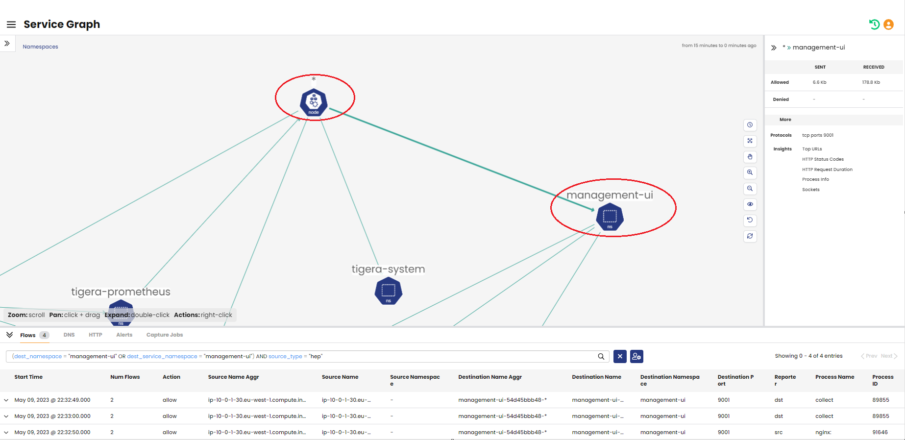

# In this lab

This lab provides the instructions to:

* [Overview](https://github.com/tigera-cs/Calico-Security-Observability-Troubleshooting-Training/blob/main/1.%20Install%20Calico%20Enterprise/README.md#overview)
* [Configure automatic host endpoint protection]()


### Overview


Calico Enterprise uses host endpoints to represent network interfaces on a host, which can be secured using Calico security policy. Host endpoints can have labels and be selected for policy rules alongside workload endpoints/pods. Even though host endpoint implementation can be automated by systems engineers, it is a manual approach to protect your cluster nodes. Calico also provides auto-host endpoint feature, which is an automated approach to create the host endpoints. 
Calico creates an auto (managed) host endpoint for each node that has the same labels and IP addresses as the node itself. These managed host endpoints are periodically synchronized to ensure they maintain the same labels and IP addresses as their corresponding nodes. Policies that target these auto host endpoints will continue to function correctly even if the underlying nodes' IPs or labels change over time. Automatic host endpoints secure all of the host's interfaces (i.e. in Linux, all the interfaces in the host network namespace) by setting host endpoint interfaceName: "*". Host endpoint protect traffic that is initiated or terminated at the host and does not apply to the forwarded traffic such as pod traffic. In this lab, we will explore how to enhance the security of your cluster nodes/host networked pods using Calico auto host endpoint feature with minimal amount of effort and configurations.

Note: Using host endpoint protection requires a lot of cautious and validation to ensure the required connectivity for the cluster nodes/host networked pods is allowed. Failing to implement the required rules to allow the host netwok traffic could cause sever impact on your cluster connectivity and operations. It is recommended to have fail-safe rules in place before enabling host end point protection and use Calico flow logs to ensure all the required connectivity is allowed before enforcing default deny in your cluster.


#### Documentation

- https://docs.tigera.io/calico-enterprise/latest/reference/resources/hostendpoint
- https://docs.tigera.io/calico-enterprise/latest/network-policy/hosts/kubernetes-nodes

____________________________________________________________________________________________________________________________________________________________________________________

### Configure automatic host endpoint protection

1. Before moving forward with implementing policies for cluster nodes and host networked pod, let's validate that the feature is already activated. Auto host endpoint is configured and managed by `calico-kube-controller-manager`, which is configured by `kubecontrollersconfigurations` resource. Run the following command and ensure `spec.controllers.node.hostEndpoint.autoCreate: Enabled`.

`Note:` We enabled this feature in the previous lab to protect nginx controller host networked pods traffic.

```bash
kubectl get kubecontrollersconfigurations default -o yaml

```

You shouls see an output similar to the following.

```yaml
apiVersion: projectcalico.org/v3
kind: KubeControllersConfiguration
metadata:
  creationTimestamp: "2023-05-09T19:19:01Z"
  name: default
  resourceVersion: "59239"
  uid: ac08f0de-aec1-441b-a715-6b966e6a319f
spec:
  controllers:
    namespace:
      reconcilerPeriod: 5m0s
    node:
      hostEndpoint:
        autoCreate: Enabled
      leakGracePeriod: 15m0s
      reconcilerPeriod: 5m0s
      syncLabels: Enabled
    policy:
      reconcilerPeriod: 5m0s
    serviceAccount:
      reconcilerPeriod: 5m0s
    workloadEndpoint:
      reconcilerPeriod: 5m0s
  etcdV3CompactionPeriod: 10m0s
  healthChecks: Enabled
  logSeverityScreen: Info
  prometheusMetricsPort: 9094

```
2. Run the following command and make sure you see a `hostendpoints` for each node in the cluster.

```bash
kubectl get hostendpoints.projectcalico.org

```

```bash
NAME                                               CREATED AT
ip-10-0-1-20.eu-west-1.compute.internal-auto-hep   2023-05-10T00:17:21Z
ip-10-0-1-30.eu-west-1.compute.internal-auto-hep   2023-05-10T00:17:21Z
ip-10-0-1-31.eu-west-1.compute.internal-auto-hep   2023-05-10T00:17:21Z
```

3. Once enabled, Calico auto host endpoint uses Calico `Profiles` to allow egress and ingress traffic from and to host/host networked pods. However, this is only true as long as no `globalnetworkpolicy` is selecting the host endpoint resources. As soon as a `globalnetworkpolicy` is selecting the host endpoint resource, any traffic that is not explicitly allowed by the `globalnetworkpolicy` is denied. Run the following command to see the profile allowing egress and ingress traffic for host endpoints.

```bash 
kubectl get profiles.projectcalico.org projectcalico-default-allow -o yaml

```

You shouls see an output similar to the following.

```yaml
apiVersion: projectcalico.org/v3
kind: Profile
metadata:
  creationTimestamp: null
  name: projectcalico-default-allow
  resourceVersion: "0"
spec:
  egress:
  - action: Allow
    destination: {}
    source: {}
  ingress:
  - action: Allow
    destination: {}
    source: {}
```

4. Run the following command and see how the above profile is referenced in the host endpoint for the control plane node. This profile is ,by default, attached to all the heps.

```bash
kubectl get hep $(kubectl get hep | egrep ip-10-0-1-20) -o yaml

```

5. Label your nodes with keys and values, which should be kept intact across the upgrades and cluster rebuilds. This label will be used to allow traffic to and from the host and host networked pods and must always stay assigned to hosts for connectivity. 

```bash
kubectl label nodes projectcalico.org/auto-hep=true --all

````

You shouls see an output similar to the following.

```bash
node/ip-10-0-1-20.eu-west-1.compute.internal labeled
node/ip-10-0-1-30.eu-west-1.compute.internal labeled
node/ip-10-0-1-31.eu-west-1.compute.internal labeled
```

6. `calico-kube-controllers` deployment has a node controller inside it that continuously ensures all the labels assigned to the cluster nodes are inherited by Calico host endpoints. Run the following command and compare the labels assigned to the Kubernetes nodes and Calico `node` resource. If needed, adjust your grep query to view all the labels.


```bash
kubectl get nodes -o yaml | grep -A15 labels

```

```yaml
    labels:
      beta.kubernetes.io/arch: amd64
      beta.kubernetes.io/instance-type: t3.medium
      beta.kubernetes.io/os: linux
      failure-domain.beta.kubernetes.io/region: eu-west-1
      failure-domain.beta.kubernetes.io/zone: eu-west-1a
      kubernetes.io/arch: amd64
      kubernetes.io/hostname: ip-10-0-1-20.eu-west-1.compute.internal
      kubernetes.io/os: linux
      node-role.kubernetes.io/control-plane: ""
      node-role.kubernetes.io/master: ""
      node.kubernetes.io/exclude-from-external-load-balancers: ""
      node.kubernetes.io/instance-type: t3.medium
      projectcalico.org/auto-hep: "true"
      topology.kubernetes.io/region: eu-west-1
      topology.kubernetes.io/zone: eu-west-1a
--
    labels:
      alpha.kubernetes.io/provided-node-ip: 10.0.1.30
      app.kubernetes.io/name: nginx
      beta.kubernetes.io/arch: amd64
      beta.kubernetes.io/instance-type: t3.large
      beta.kubernetes.io/os: linux
      failure-domain.beta.kubernetes.io/region: eu-west-1
      failure-domain.beta.kubernetes.io/zone: eu-west-1a
      kubernetes.io/arch: amd64
      kubernetes.io/hostname: ip-10-0-1-30.eu-west-1.compute.internal
      kubernetes.io/os: linux
      node-role.kubernetes.io/worker: ""
      node.kubernetes.io/instance-type: t3.large
      projectcalico.org/auto-hep: "true"
      topology.kubernetes.io/region: eu-west-1
      topology.kubernetes.io/zone: eu-west-1a
--
    labels:
      alpha.kubernetes.io/provided-node-ip: 10.0.1.31
      app.kubernetes.io/name: nginx
      beta.kubernetes.io/arch: amd64
      beta.kubernetes.io/instance-type: t3.large
      beta.kubernetes.io/os: linux
      failure-domain.beta.kubernetes.io/region: eu-west-1
      failure-domain.beta.kubernetes.io/zone: eu-west-1a
      kubernetes.io/arch: amd64
      kubernetes.io/hostname: ip-10-0-1-31.eu-west-1.compute.internal
      kubernetes.io/os: linux
      node-role.kubernetes.io/worker: ""
      node.kubernetes.io/instance-type: t3.large
      projectcalico.org/auto-hep: "true"
      topology.kubernetes.io/region: eu-west-1
      topology.kubernetes.io/zone: eu-west-1a
```

```bash
kubectl get hep -o yaml | grep -A15 labels

```

```yaml
    labels:
      beta.kubernetes.io/arch: amd64
      beta.kubernetes.io/instance-type: t3.medium
      beta.kubernetes.io/os: linux
      failure-domain.beta.kubernetes.io/region: eu-west-1
      failure-domain.beta.kubernetes.io/zone: eu-west-1a
      kubernetes.io/arch: amd64
      kubernetes.io/hostname: ip-10-0-1-20.eu-west-1.compute.internal
      kubernetes.io/os: linux
      node-role.kubernetes.io/control-plane: ""
      node-role.kubernetes.io/master: ""
      node.kubernetes.io/exclude-from-external-load-balancers: ""
      node.kubernetes.io/instance-type: t3.medium
      projectcalico.org/auto-hep: "true"
      projectcalico.org/created-by: calico-kube-controllers
      topology.kubernetes.io/region: eu-west-1
--
    labels:
      alpha.kubernetes.io/provided-node-ip: 10.0.1.30
      app.kubernetes.io/name: nginx
      beta.kubernetes.io/arch: amd64
      beta.kubernetes.io/instance-type: t3.large
      beta.kubernetes.io/os: linux
      failure-domain.beta.kubernetes.io/region: eu-west-1
      failure-domain.beta.kubernetes.io/zone: eu-west-1a
      kubernetes.io/arch: amd64
      kubernetes.io/hostname: ip-10-0-1-30.eu-west-1.compute.internal
      kubernetes.io/os: linux
      node-role.kubernetes.io/worker: ""
      node.kubernetes.io/instance-type: t3.large
      projectcalico.org/auto-hep: "true"
      projectcalico.org/created-by: calico-kube-controllers
      topology.kubernetes.io/region: eu-west-1
--
    labels:
      alpha.kubernetes.io/provided-node-ip: 10.0.1.31
      app.kubernetes.io/name: nginx
      beta.kubernetes.io/arch: amd64
      beta.kubernetes.io/instance-type: t3.large
      beta.kubernetes.io/os: linux
      failure-domain.beta.kubernetes.io/region: eu-west-1
      failure-domain.beta.kubernetes.io/zone: eu-west-1a
      kubernetes.io/arch: amd64
      kubernetes.io/hostname: ip-10-0-1-31.eu-west-1.compute.internal
      kubernetes.io/os: linux
      node-role.kubernetes.io/worker: ""
      node.kubernetes.io/instance-type: t3.large
      projectcalico.org/auto-hep: "true"
      projectcalico.org/created-by: calico-kube-controllers
      topology.kubernetes.io/region: eu-west-1
```


7. This lab uses dns policy, which requires dns servers used for the cluster nodes to be included in felixconfigurations `dnsTrustedServers`. If this configuration is not in place, felix will not trust the cluster nodes DNS server and does not listen for name resolution from this servers. As a result, DNS policy for cluster nodes/host networked pods does not work.

```yaml
kubectl replace -f -<<EOF
apiVersion: projectcalico.org/v3
kind: FelixConfiguration
metadata:
  name: default
spec:
  dnsTrustedServers:
  - k8s-service:kube-dns ### cluster dns server
  - 127.0.0.53  ### DNS server used on cluster nodes
  floatingIPs: Disabled
  flowLogsFileAggregationKindForAllowed: 1
  flowLogsFileAggregationKindForDenied: 1
  flowLogsFlushInterval: 10s
  healthPort: 9099
  logSeverityScreen: Info
  reportingInterval: 0s
EOF

```

8. Deploy the following  `globalnetworkpolicy` to allow the required communication for the hosts and host networked pods running in this cluster. Get yourself familiar with the rules included in the following manifest.

`Note:` If you plan to use host endpoint protection, you need to make sure to account for all the required connectivity for your hosts and host networked pods before enabling host endpoint protection. Otherwise, your cluster connectivity might get severly impacted or you might completely get locked out of the clustr. The other way to do this is to use a fail-safe staged global default deny policy making sure there is a policy allowing traffic before default deny is implemented. We have used the latter approach in this lab.

```yaml
kubectl apply -f -<<EOF
# This set of policies enacts a default deny for egress and ingress traffic on Auto HEPs.
# The flows below are required and are not protected by failsafes.
# - kube-apiserver to kubelet
# - kube-apiserver to tigera-apiserver
# - tigera-operator to es-gateway ### This is required if elasticsearch is deployed in the cluster.
# - prometheus to calico-node
# - localhost ('interface: *' policies localhost)
# - kubelet to image registry ### Replace this with your own image registry or remove it if you have a policy that allows this in your environment.
---
apiVersion: projectcalico.org/v3
kind: GlobalNetworkPolicy
metadata:
  name: platform.allowed-flows-all-heps
spec:
  tier: platform
  order: 1000
### selector selecting all the cluster nodes due to the below label selector.
  selector: projectcalico.org/auto-hep == "true"
### Ingress connections to localhost ('interface: *') of the nodes.
  ingress:
    - action: Allow
      source: {}
      destination:
        nets:
          - 127.0.0.0/8
### Ingress connections from control plane nodes to all cluster nodes on kubelet port 10250. Required for `kubectl logs`
    - action: Allow
      protocol: TCP
      source:
        selector: has(node-role.kubernetes.io/control-plane)
      destination:
        ports:
          - '10250'
### Ingress connections required by calico-node pods
    - action: Allow
      protocol: TCP
      source:
        selector: projectcalico.org/auto-hep == "true"
      destination:
        ports:
          - '9081'
          - '9900'
          - '9900'
### Ingress connections required by ingress nginx.
    - action: Allow
      protocol: TCP
      source:
        selector: projectcalico.org/auto-hep == "true"
        namespaceSelector: global()
      destination:
        ports:
          - '10254'
  egress:
### Egress connections to localhost ('interface: *') of the nodes.
    - action: Allow
      source: {}
      destination:
        nets:
          - 127.0.0.0/8
### Egress connections from tigera operator tigera-secure-es-gateway
    - action: Allow
      protocol: TCP
      source: {}
      destination:
        selector: k8s-app == "tigera-secure-es-gateway"
        namespaceSelector: projectcalico.org/name == "tigera-elasticsearch"
### Egress connections to destinations outside the cluster for image downloads, apt update, vault, database, etc. 
    - action: Allow
      source: {}
      destination:
        domains:
          - '*.quay.io'
          - storage.googleapis.com
          - gcr.io
          - '*.gcr.io'
          - '*.ubuntu.com'
          - '*.docker.io'
          - '*.docker.com'
### Egress connections required by ingress nginx.
    - action: Allow
      protocol: TCP
      source: {}
      destination:
        selector: projectcalico.org/auto-hep == "true"
        namespaceSelector: global()
        ports:
          - '10254'
  types:
    - Ingress
    - Egress
---
apiVersion: projectcalico.org/v3
kind: GlobalNetworkPolicy
metadata:
  name: platform.allowed-flows-control-plane-heps
spec:
  tier: platform
  order: 1000
  selector: has(node-role.kubernetes.io/control-plane)
  egress:
  # kube-apiserver to kubelet egress (selects all destinations to include self)
  - action: Allow
    destination:
      ports:
      - 10250
    protocol: TCP
  # kube-apiserver to tigera-apiserver egress
  - action: Allow
    protocol: TCP
    destination:
      namespaceSelector: projectcalico.org/name == 'tigera-system'
      selector: k8s-app == 'tigera-apiserver'
EOF

```

9. Validate your implemented policies are working as expected. Run the following query on the `Discover` page in `Kibana`. Once you make sure there is no legitimate traffic is hitting the staged default deny policy, go to the Calico Manager UI and convert you staged default deny policy to enforced.

`Note:` This lab runs kubeadm clusters in shared AWS infrastructure and you might see some traffic hitting the staged default deny policy. However, we identified these traffic shown in the screenshot below are not required by the cluster connectivity and decided to deny the traffic. One such traffic was from the cluster nodes to aws metadata IP address of `169.254.169.254`.

```bash
policies:{all_policies: *staged\:default-deny*} and action: "allow" 
```


10. Generate some flow logs by browsing to `https://stars.<LABNAME>.labs.tigera.fr` and `https://yaobank.<LABNAME>.labs.tigera.fr`. 

11. Now enable flow log reporting for host endpoint connections by running the following command. Note that by default flow log reporting is not enabled in the felixconfigurations.

```bash
 kubectl patch felixconfiguration.p default -p '{"spec":{"flowLogsEnableHostEndpoint":true}}'

```

12. Navigate to `ServiceGraph` and see how felix graphs connections from host networked ingress controllers to the `management-ui` pods. 

`Note:` To see the connections from the the host networked pods to the pods, in this case `management-ui`, you will to have loggined with an account that has access to the `Node` resource in `projectcalico.org/v3`. In this case, check ServiceGraph using `platform` service account.


 \


13. Calico implements fail-safe rules (ports) to ensure critical cluster services continue to function and you will not lock yourself outside the cluster. In this lab, we left these rules intact. If you need to remove failsafe rules, you could do so using felixconfigurations. However, before doing so you will need to be sure that all the required ports are implemented using globalnetworkpolicy. Fail-safe rules are eforced by felix and are the same across the cluster nodes. To see the fail-safe ports, ssh into one of the cluster nodes and run the following command. For further information about failsafe ports, see `failsafeInboundHostPorts` and `failsafeOutboundHostPorts` in the following link.

https://docs.tigera.io/calico-enterprise/latest/reference/resources/felixconfig

```bash
ssh worker1

```

```bash
sudo iptables-save | grep -i failsafe

```

You should see an output similar to the following.

```bash
:cali-failsafe-out - [0:0]
-A cali-failsafe-out -p udp -m comment --comment "cali:82hjfji-wChFhAqL" -m multiport --dports 53 -j ACCEPT
-A cali-failsafe-out -p udp -m comment --comment "cali:TNM3RfEjbNr72hgH" -m multiport --dports 67 -j ACCEPT
-A cali-failsafe-out -p tcp -m comment --comment "cali:ycxKitIl4u3dK0HR" -m multiport --dports 179 -j ACCEPT
-A cali-failsafe-out -p tcp -m comment --comment "cali:hxjEWyxdkXXkdvut" -m multiport --dports 2379 -j ACCEPT
-A cali-failsafe-out -p tcp -m comment --comment "cali:cA_GLtruuvG88KiO" -m multiport --dports 2380 -j ACCEPT
-A cali-failsafe-out -p tcp -m comment --comment "cali:ALz4foMyfue7vaqK" -m multiport --dports 5473 -j ACCEPT
-A cali-failsafe-out -p tcp -m comment --comment "cali:zvCXe1uOiQ8adzhn" -m multiport --dports 6443 -j ACCEPT
-A cali-failsafe-out -p tcp -m comment --comment "cali:Lppo9JuKR7AyZoWQ" -m multiport --dports 6666 -j ACCEPT
-A cali-failsafe-out -p tcp -m comment --comment "cali:EoOkKdH0fekirfk8" -m multiport --dports 6667 -j ACCEPT
-A cali-th-any-interface-at-all -m comment --comment "cali:isLh7I8mMajLdhSv" -j cali-failsafe-out
:cali-failsafe-in - [0:0]
:cali-failsafe-out - [0:0]
-A cali-failsafe-in -p tcp -m comment --comment "cali:wWFQM43tJU7wwnFZ" -m multiport --dports 22 -j ACCEPT
-A cali-failsafe-in -p udp -m comment --comment "cali:LwNV--R8MjeUYacw" -m multiport --dports 68 -j ACCEPT
-A cali-failsafe-in -p tcp -m comment --comment "cali:QOO5NUOqOSS1_Iw0" -m multiport --dports 179 -j ACCEPT
-A cali-failsafe-in -p tcp -m comment --comment "cali:cwZWoBSwVeIAZmVN" -m multiport --dports 2379 -j ACCEPT
-A cali-failsafe-in -p tcp -m comment --comment "cali:7FbNXT91kugE_upR" -m multiport --dports 2380 -j ACCEPT
-A cali-failsafe-in -p tcp -m comment --comment "cali:8Ftbkk2dRH2eEeq1" -m multiport --dports 5473 -j ACCEPT
-A cali-failsafe-in -p tcp -m comment --comment "cali:-JoRSaAQZPJAegMo" -m multiport --dports 6443 -j ACCEPT
-A cali-failsafe-in -p tcp -m comment --comment "cali:PUKij4Rn9njHfVTi" -m multiport --dports 6666 -j ACCEPT
-A cali-failsafe-in -p tcp -m comment --comment "cali:vSprVE-4rient0wc" -m multiport --dports 6667 -j ACCEPT
-A cali-failsafe-out -p udp -m comment --comment "cali:82hjfji-wChFhAqL" -m multiport --dports 53 -j ACCEPT
-A cali-failsafe-out -p udp -m comment --comment "cali:TNM3RfEjbNr72hgH" -m multiport --dports 67 -j ACCEPT
-A cali-failsafe-out -p tcp -m comment --comment "cali:ycxKitIl4u3dK0HR" -m multiport --dports 179 -j ACCEPT
-A cali-failsafe-out -p tcp -m comment --comment "cali:hxjEWyxdkXXkdvut" -m multiport --dports 2379 -j ACCEPT
-A cali-failsafe-out -p tcp -m comment --comment "cali:cA_GLtruuvG88KiO" -m multiport --dports 2380 -j ACCEPT
-A cali-failsafe-out -p tcp -m comment --comment "cali:ALz4foMyfue7vaqK" -m multiport --dports 5473 -j ACCEPT
-A cali-failsafe-out -p tcp -m comment --comment "cali:zvCXe1uOiQ8adzhn" -m multiport --dports 6443 -j ACCEPT
-A cali-failsafe-out -p tcp -m comment --comment "cali:Lppo9JuKR7AyZoWQ" -m multiport --dports 6666 -j ACCEPT
-A cali-failsafe-out -p tcp -m comment --comment "cali:EoOkKdH0fekirfk8" -m multiport --dports 6667 -j ACCEPT
-A cali-fh-any-interface-at-all -m comment --comment "cali:NnqjZhu9yccY4C7-" -j cali-failsafe-in
-A cali-th-any-interface-at-all -m comment --comment "cali:Pk4AU-xuUwtwrLN6" -j cali-failsafe-out
```

`Note:` Before finishing this lab, ensure that the default-deny policy is enforced mode and not staged mode. Following labs require enforced default deny to to be in place.

> ## You have completed `3.Secure Cluster Node Traffic Using Calico Auto HEP` lab. Next lab: [4.Secure Workload Egress Access Using Calico DNS Policy](https://github.com/tigera-cs/quickstart-self-service/blob/main/modules/analyze-networksets-external-services.md) 
