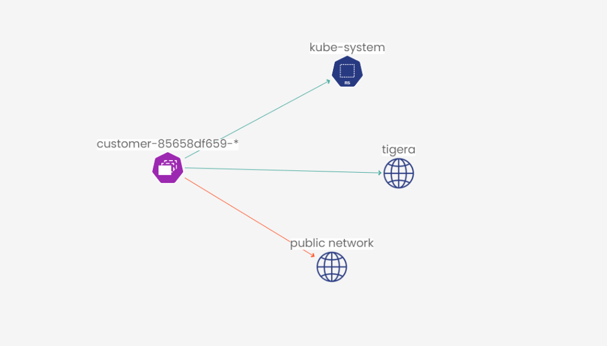

# In this lab

This lab provides the instructions to:

* [Overview](https://github.com/tigera-cs/Calico-Security-Observability-Troubleshooting-Training/blob/main/1.%20Install%20Calico%20Enterprise/README.md#overview)
* [Secure pod egress traffic using DNS policy]()


### Overview


DNS is a critical component of every network infrastructure as it provides a reliable and efficient means of communication. In certain scenarios, using DNS addresses as policy enforcement mechanisms proves to be more convenient than relying solely on IP addresses. Additionally, incorporating domain names in policies to identify services outside of the cluster offers operational simplicity and enhanced resilience compared to using IP addresses. This approach is particularly advantageous when dealing with external services that lack a well-defined set of static IP addresses. In this lab, we will learn how to use Calico DNS policy to implement egress access controls for services running outside the Kubernetes cluster.


#### Documentation

- https://docs.tigera.io/calico-cloud/network-policy/domain-based-policy
- https://docs.tigera.io/calico-enterprise/3.15/getting-started/install-on-clusters/windows-calico/dnspolicy

____________________________________________________________________________________________________________________________________________________________________________________

### Secure pod egress traffic using DNS policy

After some time, the yaobank `customer` application (deployed in lab1) connectivity requirements has changed and the application needs to connect to a service outside the cluster. In this section, we will use Calico `GlobalNetworkSet` resource along with `DNS Policy` to implement egress access control for `customer` microservice.

1. Currently, `customer` application can't make any connection to outside the cluster as Calico security policy is blocking the traffic. Let's validate that by the following. Exec into the `customer` pod.

```bash
kubectl exec -it -n yaobank $(kubectl get pods -n yaobank --show-labels | awk '{print $1}' | grep -v NAME) -- sh

```
curl into the destination domain name.

```bash
curl -vvv www.tigera.io

```

2. The connection should fail with a message similar to the following.


3. Deploy the following `GlobalNetworkSet` manifest in the cluster. We will use the following `GlobalNetworkSet` to allow egress connections to `www.ubuntu.com`

```yaml
kubectl apply -f -<<EOF
kind: GlobalNetworkSet
apiVersion: projectcalico.org/v3
metadata:
  name: tigera
  labels:
    eep.tigera.io/domain: tigera
spec:
  allowedEgressDomains:
    - 'www.tigera.io'
EOF

```


4. Deploy the following DNS policy referencing the previous GlobalNetworkSet to allow egress connections to `www.tigera.io`.


```yaml
kubectl apply -f -<<EOF
apiVersion: projectcalico.org/v3
kind: NetworkPolicy
metadata:
  name: app.customer-dns-policy
  namespace: yaobank
spec:
  tier: app
  order: 10
  selector: app == "customer"
  egress:
    - action: Allow
      protocol: TCP
      source: {}
      destination:
        selector: eep.tigera.io/domain == "tigera"
        namespaceSelector: global()
        ports:
          - '80'
          - '443'
  types:
    - Egress
EOF

```

5. Exec into the `customer` pod again.

```bash
kubectl exec -it -n yaobank $(kubectl get pods -n yaobank --show-labels | awk '{print $1}' | grep customer) -- sh

```
curl into the destination domain name.

```bash
curl -vvv www.tigera.io

```

6. The connection should go through this time.


7. Navigate to `Servicegraph` from Calico Manager UI and double-click on the yaobank namespace to go into the yaobank namespace in ServiceGraph. Filter the flow logs for the past 10 minutes of the traffic. See how ServiceGraph uses the GlobalNetworkSet name `tigera` to correlate the connection from `customer` pod to `www.tigera.io` domain name.
Note: When filtering flow logs based on time, if you go far back in time when we tried to connect to `www.tigera.io` and the connection failed, ServiceGraph will also show the old failed connection as a red line (connection) in the graph. You need to wait for 1-2 minutes for the connection to `tigera` globalnetworkset to appear in ServiceGraph.



> ## You have completed `4.Secure Workload Egress Access Using Calico DNS Policy` lab. Next lab: [5.Secure Kubernetes Network Using Wireguard Encryption](https://github.com/tigera-cs/quickstart-self-service/blob/main/modules/analyze-networksets-external-services.md) 