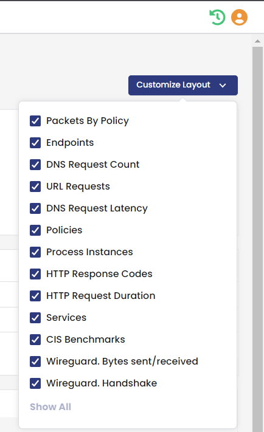
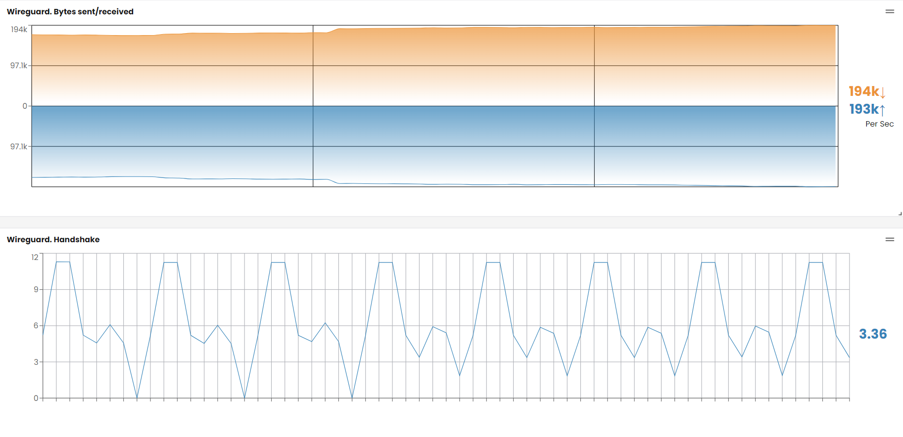

# In this lab

This lab provides the instructions to:

* [Overview](https://github.com/tigera-cs/Calico-Security-Observability-Troubleshooting-Training/blob/main/modules/5.Secure%20Kubernetes%20Network%20Using%20Wireguard%20Encryption/README.md#overview)
* [Enable Calico Wireguard encryption](https://github.com/tigera-cs/Calico-Security-Observability-Troubleshooting-Training/blob/main/modules/5.Secure%20Kubernetes%20Network%20Using%20Wireguard%20Encryption/README.md#enable-calico-wireguard-encryption)


### Overview

Network encryption is crucial for maintaining the security and privacy of data and communication within a Kubernetes cluster. It plays a significant role in ensuring that information remains confidential and protected. Network encryption provides protection against unauthorized access and eavesdropping. Additionally, it helps meet compliance regulations and safeguards against man-in-the-middle attacks. Implementing network encryption is vital for preserving the integrity and privacy of data, adhering to regulatory standards, and establishing secure Kubernetes deployments. Wireguard is a simple, lightweight, and performant tunneling protocol that enables us to establish secure connections. Calico leverages Wireguard to deliver streamlined and automated encryption for Kubernetes clusters, making the process of securing network connections easier and more efficient. In this lab, we will learn about how to use Calico Wireguard implementation to secure pod connectivity in a Kubernetes cluster. In addition to the pod traffic, Calico provides node-to-node communication encryption for managed clusters deployed on EKS (AWS CNI) and AKS (Azure CNI).


#### Documentation

- https://docs.tigera.io/calico-enterprise/latest/compliance/encrypt-cluster-pod-traffic


____________________________________________________________________________________________________________________________________________________________________________________


### Enable Calico Wireguard encryption

1. WireGuard is included in Linux 5.6+ kernels. Before enabling Wireguard in this cluster, ssh into each nodes (`control1`, `worker1`, `worker2`) in the cluster and run the following commands to make sure each node has the minimum Wireguard configuration requirements.

```bash
uname -sr

```

You should see an output similar to the following. Make sure the kernel is 5.6+.

```bash
Linux 5.15.0-1035-aws
```

```bash
sudo lsmod | grep wireguard

```

You should see an output similar to the following. 

```bash
wireguard              94208  0
curve25519_x86_64      49152  1 wireguard
libchacha20poly1305    16384  1 wireguard
ip6_udp_tunnel         16384  1 wireguard
udp_tunnel             20480  1 wireguard
libcurve25519_generic    49152  2 curve25519_x86_64,wireguard
```

2. Wireguard is configured and managed by felix. Run the following command to enable Wireguard for IPv4. If you need to enable Wireguard for IPv6, you will need to set `"wireguardEnabledV6":true`.

```bash
kubectl patch felixconfiguration default --type='merge' -p '{"spec":{"wireguardEnabled":true}}'

```

3. To validate Wireguard is enabled on the cluster nodes, we will need to check the node resource status for Wireguard entries with the following command. Note how Calico has assigned an IPv4 address from Calico IPPool to each node along with the `WireguardPublicKey` configurations.

```bash
kubectl get nodes -o yaml | grep 'kubernetes.io/hostname\|projectcalico.org/IPv4Address\|Wireguard'

```
You should see an output similar to the following. 

```bash

      projectcalico.org/IPv4Address: 10.0.1.20/24
      projectcalico.org/IPv4WireguardInterfaceAddr: 10.48.0.135
      projectcalico.org/WireguardPublicKey: 8nhC4VLuTHGWek6cW9LNf/kxflhQ8GXNII60nZsd9g0=
      kubernetes.io/hostname: ip-10-0-1-20.eu-west-1.compute.internal
      projectcalico.org/IPv4Address: 10.0.1.30/24
      projectcalico.org/IPv4WireguardInterfaceAddr: 10.48.0.205
      projectcalico.org/WireguardPublicKey: q04/wM0mwrxgGUgzRHDx8szUChNAU16XvtjFnPqJ2z8=
      kubernetes.io/hostname: ip-10-0-1-30.eu-west-1.compute.internal
      projectcalico.org/IPv4Address: 10.0.1.31/24
      projectcalico.org/IPv4WireguardInterfaceAddr: 10.48.0.54
      projectcalico.org/WireguardPublicKey: 6+ETYV2O9B26cfdM5xmhioyoeCstDHGjNrhDaYE9ZQo=
      kubernetes.io/hostname: ip-10-0-1-31.eu-west-1.compute.internal
```

4. ssh into one of the cluster nodes to further validate and look into Wireguard configurations.

```bash
ssh worker1

```

5. Install Wireguard `wg` tool.

```bash
sudo apt install wireguard-tools

```

You should see an output similar to the following. 

```bash
Reading package lists... Done
Building dependency tree
Reading state information... Done
Suggested packages:
  openresolv | resolvconf
The following NEW packages will be installed:
  wireguard-tools
0 upgraded, 1 newly installed, 0 to remove and 8 not upgraded.
Need to get 83.3 kB of archives.
After this operation, 327 kB of additional disk space will be used.
Get:1 http://eu-west-1.ec2.archive.ubuntu.com/ubuntu focal-updates/universe amd64 wireguard-tools amd64 1.0.20200513-1~20.04.2 [83.3 kB]
Fetched 83.3 kB in 0s (3459 kB/s)
Selecting previously unselected package wireguard-tools.
(Reading database ... 68954 files and directories currently installed.)
Preparing to unpack .../wireguard-tools_1.0.20200513-1~20.04.2_amd64.deb ...
Unpacking wireguard-tools (1.0.20200513-1~20.04.2) ...
Setting up wireguard-tools (1.0.20200513-1~20.04.2) ...
wg-quick.target is a disabled or a static unit, not starting it.
Processing triggers for man-db (2.9.1-1) ...
```

6. Run the following command to validate Wireguard configurations. Get yourself familar with the output. This cluster runs three nodes. Each Wireguard node has two peers as shown below. Felix configures `allowed ips` to implement granular access control in terms of what traffic is allowed through the tunnel.

```bash
sudo wg

```

You should see an output similar to the following. 

```bash
interface: wireguard.cali
  public key: q04/wM0mwrxgGUgzRHDx8szUChNAU16XvtjFnPqJ2z8=
  private key: (hidden)
  listening port: 51820
  fwmark: 0x200000

peer: 8nhC4VLuTHGWek6cW9LNf/kxflhQ8GXNII60nZsd9g0=
  endpoint: 10.0.1.20:51820
  allowed ips: 10.48.0.128/26, 10.48.0.135/32
  latest handshake: 1 minute, 33 seconds ago
  transfer: 27.83 MiB received, 13.51 MiB sent

peer: 6+ETYV2O9B26cfdM5xmhioyoeCstDHGjNrhDaYE9ZQo=
  endpoint: 10.0.1.31:51820
  allowed ips: 10.48.0.0/26, 10.48.0.54/32
  latest handshake: 1 minute, 39 seconds ago
  transfer: 183.29 MiB received, 331.35 MiB sent
```

7. Find your worker nodes name as we need to use them for the next step.

```bash
export node1=$(kubectl get nodes -o name | cut -d/ -f2 | grep ip-10-0-1-30)
echo $node1
export node2=$(kubectl get nodes -o name | cut -d/ -f2 | grep ip-10-0-1-31)
echo $node2

```
You should see an output similar to the following. 

```bash
tigera@bastion:~$ echo $node1
ip-10-0-1-30.eu-west-1.compute.internal
tigera@bastion:~$ export node2=$(kubectl get nodes -o name | cut -d/ -f2 | grep ip-10-0-1-31)
tigera@bastion:~$ echo $node2
ip-10-0-1-31.eu-west-1.compute.internal

```

8. To validate pod network encryption using Wireguard, we will deploy two pods (pod-1 in worker1 and pod-2 in worker2), initiate the traffic between the two pods and view the traffic by using the tcpdump command.

```bash
kubectl apply -f -<<EOF
apiVersion: v1
kind: Pod
metadata:
  labels:
    run: pod-1
  name: pod-1
spec:
  containers:
  - image: praqma/network-multitool
    name: pod-1
  nodeName: $node1
---
apiVersion: v1
kind: Pod
metadata:
  labels:
    run: pod-2
  name: pod-2
spec:
  containers:
  - image: praqma/network-multitool
    name: pod-2
  nodeName: $node2
---
EOF

```

8. Check that the two pods are deployed across the two different nodes. Record IP addresses of `pod-1` and `pod-2`. We will need them in the next step.

```bash
kubectl get pods -o wide

```

```bash
NAME    READY   STATUS    RESTARTS   AGE     IP            NODE                                      NOMINATED NODE   READINESS GATES
pod-1   1/1     Running   0          2m53s   10.48.0.209   ip-10-0-1-30.eu-west-1.compute.internal   <none>           <none>
pod-2   1/1     Running   0          2m53s   10.48.0.60    ip-10-0-1-31.eu-west-1.compute.internal   <none>           <none>
```

9. Open two new tabs in the browser (http://<LABNAME>.labs.tigera.fr) and use the bastion host to SSH into worker1 and worker2 nodes. Run the following commands on both worker1 and worker2 to see the flow of traffic on wiregaurd tunnel interface. Make sure to replace `<ip address of pod-2>` with the IP address of `pod-2` in the following command.

```bash
sudo tcpdump -i wireguard.cali host <ip address of pod-2>
```

10. At this point, we will need to establish connections from `pod-1` to `pod-2` to see traffic on Wireguard interface on the two nodes. However, since this cluster does not allow application connectivity that is not explicitly allowed, we will need to make sure we allow such connectivity through Calico security policy first. Deploy the following policy to allow connectivity between `pod-1` to `pod-2`.

`Note:` In production environment where default deny is implemented in the cluster, applications need to be deployed with their required and validated security policy to ensure application connectivity.

```yaml
kubectl apply -f -<<EOF
apiVersion: projectcalico.org/v3
kind: NetworkPolicy
metadata:
  name: app.pod1-to-pod2
  namespace: default
spec:
  tier: app
  order: 100
  ingress:
    - action: Allow
      protocol: ICMP
      source:
        selector: run == "pod-1"
      destination:
        selector: run == "pod-2"
  egress:
    - action: Allow
      protocol: ICMP
      source:
        selector: run == "pod-1"
      destination:
        selector: run == "pod-2"
  types:
    - Ingress
    - Egress
EOF

```

11. On the bastion host, exec into the `pod-1` and ping the `pod-2` IP address (10.48.0.60 - This IP might be different in your cluster).

```bash
kubectl exec -it pod-1 -- bash
```

```bash
bash-5.1# ping 10.48.0.60
PING 10.48.0.60 (10.48.0.60) 56(84) bytes of data.
64 bytes from 10.48.0.60: icmp_seq=147 ttl=62 time=1010 ms
64 bytes from 10.48.0.60: icmp_seq=148 ttl=62 time=0.339 ms
64 bytes from 10.48.0.60: icmp_seq=149 ttl=62 time=0.971 ms
64 bytes from 10.48.0.60: icmp_seq=150 ttl=62 time=0.374 ms
```

On worker1 and worker2, you should receive an output similar to the followings. If you do not see the following output, make sure the two pods are scheduled on the designated nodes. If the two pods are scheduled on the same node, you will not see any traffic in the output of tcpdump.

##### Worker1
```bash 
ubuntu@ip-10-0-1-30:~$ sudo tcpdump -i wireguard.cali host 10.48.0.209
tcpdump: verbose output suppressed, use -v or -vv for full protocol decode
listening on wireguard.cali, link-type RAW (Raw IP), capture size 262144 bytes
19:51:55.180172 IP ip-10-48-0-209.eu-west-1.compute.internal > ip-10-48-0-60.eu-west-1.compute.internal: ICMP echo request, id 49, seq 11, length 64
19:51:55.181115 IP ip-10-48-0-60.eu-west-1.compute.internal > ip-10-48-0-209.eu-west-1.compute.internal: ICMP echo reply, id 49, seq 11, length 64
19:51:56.181212 IP ip-10-48-0-209.eu-west-1.compute.internal > ip-10-48-0-60.eu-west-1.compute.internal: ICMP echo request, id 49, seq 12, length 64
19:51:56.181619 IP ip-10-48-0-60.eu-west-1.compute.internal > ip-10-48-0-209.eu-west-1.compute.internal: ICMP echo reply, id 49, seq 12, length 64
19:51:57.195901 IP ip-10-48-0-209.eu-west-1.compute.internal > ip-10-48-0-60.eu-west-1.compute.internal: ICMP echo request, id 49, seq 13, length 64
``` 

##### Worker2
```bash 
ubuntu@ip-10-0-1-31:~$ sudo tcpdump -i wireguard.cali host 10.48.0.209
tcpdump: verbose output suppressed, use -v or -vv for full protocol decode
listening on wireguard.cali, link-type RAW (Raw IP), capture size 262144 bytes
19:51:53.147979 IP ip-10-48-0-209.eu-west-1.compute.internal > ip-10-48-0-60.eu-west-1.compute.internal: ICMP echo request, id 49, seq 9, length 64
19:51:53.148031 IP ip-10-48-0-60.eu-west-1.compute.internal > ip-10-48-0-209.eu-west-1.compute.internal: ICMP echo reply, id 49, seq 9, length 64
19:51:54.163160 IP ip-10-48-0-209.eu-west-1.compute.internal > ip-10-48-0-60.eu-west-1.compute.internal: ICMP echo request, id 49, seq 10, length 64
19:51:54.163217 IP ip-10-48-0-60.eu-west-1.compute.internal > ip-10-48-0-209.eu-west-1.compute.internal: ICMP echo reply, id 49, seq 10, length 64
19:51:55.187810 IP ip-10-48-0-209.eu-west-1.compute.internal > ip-10-48-0-60.eu-west-1.compute.internal: ICMP echo request, id 49, seq 11, length 64
``` 


12. Browse to Calico Manager UI, select `Dashboard` from the left navigation pane, make sure Wireguard stats are enabled from the `Customize Layout` from the top right corner of `Dashboard` page. Then scroll to the bottom of the page and view Wireguard stats.






13. We have locked down our clusters using security policies in the previous labs. However, we did not need to configure any rules to allow Wireguard traffic to go through. This is because Felix configures the necessary iptables/ebpf rules to allow Wireguard traffic. Run the following command on one of the cluster nodes to see the iptables rules that felix has implemented on that node. You should see a similar output on any Wireguard enabled node in the cluster.

```bash
ssh control1
```


```bash
sudo iptables-save | grep -i wireguard

```

you should receive an output similar to the following.

```bash
-A cali-INPUT -p udp -m comment --comment "cali:Vnbo2QqyS1ffLI4P" -m comment --comment "Allow incoming IPv4 Wireguard packets" -m multiport --dports 51820 -m addrtype --dst-type LOCAL -j ACCEPT
-A cali-OUTPUT -p udp -m comment --comment "cali:o2S0bt1hL_KIBcHM" -m comment --comment "Allow outgoing IPv4 Wireguard packets" -m multiport --dports 51820 -m addrtype --src-type LOCAL -j ACCEPT
-A cali-POSTROUTING -o wireguard.cali -m comment --comment "cali:TRTYUg_Kf3b5HCgm" -m addrtype ! --src-type LOCAL --limit-iface-out -m addrtype --src-type LOCAL -j MASQUERADE --random-fully
```

> ## You have completed `5.Secure Kubernetes Network Using Wireguard Encryption` lab. Next lab:  [5.Secure Kubernetes Network Using Wireguard Encryption](https://github.com/tigera-cs/quickstart-self-service/blob/main/modules/analyze-networksets-external-services.md) 
