# In this lab

This lab provides the instructions to:

* [Overview](https://github.com/tigera-cs/Calico-Security-Observability-Troubleshooting-Training/blob/main/modules/6.Use%20Calico%20Observability%20to%20troubleshoot%20connectivity%20issues/README.md#overview)
* [Deploy Hipstershop application and the required security policy ](https://github.com/tigera-cs/Calico-Security-Observability-Troubleshooting-Training/blob/main/modules/6.Use%20Calico%20Observability%20to%20troubleshoot%20connectivity%20issues/README.md#deploy-hipstershop-application-and-the-required-security-policy)
* [Investigate denied flows using the Calico Enterprise Observability tools (ServiceGraph)](https://github.com/tigera-cs/Calico-Security-Observability-Troubleshooting-Training/blob/main/modules/6.Use%20Calico%20Observability%20to%20troubleshoot%20connectivity%20issues/README.md#investigate-denied-flows-using-the-calico-enterprise-observability-tools-servicegraph)
* [Investigate denied flows using the Calico Enterprise Observability tools (ServiceGraph) - Do it yourself](https://github.com/tigera-cs/Calico-Security-Observability-Troubleshooting-Training/blob/main/modules/6.Use%20Calico%20Observability%20to%20troubleshoot%20connectivity%20issues/README.md#investigate-denied-flows-using-the-calico-enterprise-observability-tools-servicegraph---do-it-yourself)
* [Identify denied flows using the Flow Visualizations](https://github.com/tigera-cs/Calico-Security-Observability-Troubleshooting-Training/blob/main/modules/6.Use%20Calico%20Observability%20to%20troubleshoot%20connectivity%20issues/README.md#identify-denied-flows-using-the-flow-visualizations)
* [Identify denied flows using the Flow Visualizations - Do it yourself](https://github.com/tigera-cs/Calico-Security-Observability-Troubleshooting-Training/blob/main/modules/6.Use%20Calico%20Observability%20to%20troubleshoot%20connectivity%20issues/README.md#identify-denied-flows-using-the-flow-visualizations---do-it-yourself)
* [Identify denied flows using Kibana]()


### Overview

Network encryption is crucial for maintaining the security and privacy of data and communication within a Kubernetes cluster. It plays a significant role in ensuring that information remains confidential and protected. Network encryption provides protection against unauthorized access and eavesdropping. Additionally, it helps meet compliance regulations and safeguards against man-in-the-middle attacks. Implementing network encryption is vital for preserving the integrity and privacy of data, adhering to regulatory standards, and establishing secure Kubernetes deployments. Wireguard is a simple, lightweight, and performant tunneling protocol that enables us to establish secure connections. Calico leverages Wireguard to deliver streamlined and automated encryption for Kubernetes clusters, making the process of securing network connections easier and more efficient. In this lab, we will learn about how to use Calico Wireguard implementation to secure pod connectivity in a Kubernetes cluster. In addition to the pod traffic, Calico provides node-to-node communication encryption for managed clusters deployed on EKS (AWS CNI) and AKS (Azure CNI).


#### Documentation

- https://docs.tigera.io/calico-enterprise/latest/compliance/encrypt-cluster-pod-traffic


____________________________________________________________________________________________________________________________________________________________________________________

### Deploy Hipstershop application and the required security policy 


##### Hipstershop application diagram is shown below. 

<p align="center">
  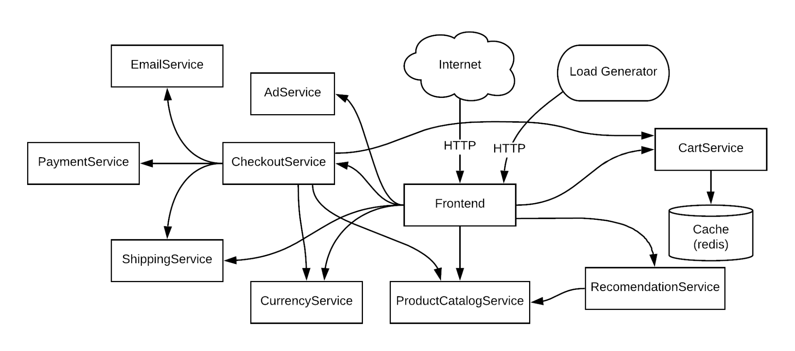
</p>

| Deployment Name         | Label                     | Service Port/Proto  |
| :-----------:           | :-------------:           | :-----------------: |
| adservice               | app=adservice             | 9555/TCP            |
| cartservice             | app=cartservice           | 7070/TCP            |
| checkoutservice         | app=checkoutservice       | 5050/TCP            |
| currencyservice         | app=currencyservice       | 7000/TCP            |
| emailservice            | app=emailservice          | 5000/TCP            |
| frontend                | app=frontend              | 80/TCP              |
| loadgenerator           | app=loadgenerator         |                     |
| paymentservice          | app=paymentservice        | 50051/TCP           |
| productcatalogservice   | app=productcatalogservice | 3550/TCP            |
| recommendationservice   | app=recommendationservice | 8080/TCP            |
| redis-cart              |app=redis-cart             | 6379/TCP            |
| shippingservice         | app=shippingservice       | 50051/TCP           |


2. Create a namespace `hipstershop`, which the hipstershop application will be deployed in.

```bash
kubectl create namespace hipstershop

```

2. Deploy the application Online Boutique (Hipstershop) to the namespace. This will install the application from the Google repository.

```bash
kubectl apply -n hipstershop -f https://raw.githubusercontent.com/GoogleCloudPlatform/microservices-demo/v0.3.9/release/kubernetes-manifests.yaml

```

3. Wait for all PODs to get into a running status.

```bash
watch kubectl get pods -n hipstershop

```
You should see an output similar to the following.

```bash
NAME                                     READY   STATUS    RESTARTS   AGE
adservice-6f498fc6c6-c5rhh               1/1     Running   0          2m40s
cartservice-bc9b949b-rgqpc               1/1     Running   0          2m40s
checkoutservice-598d5b586d-nxjck         1/1     Running   0          2m41s
currencyservice-6ddbdd4956-vjzs8         1/1     Running   0          2m40s
emailservice-68fc78478-qg8qp             1/1     Running   0          2m41s
frontend-5bd77dd84b-l8qqx                1/1     Running   0          2m41s
loadgenerator-8f7d5d8d8-d7gwj            1/1     Running   0          2m40s
paymentservice-584567958d-hr5vl          1/1     Running   0          2m41s
productcatalogservice-75f4877bf4-jvnlq   1/1     Running   0          2m40s
recommendationservice-646c88579b-2t55b   1/1     Running   0          2m41s
redis-cart-5b569cd47-l29tx               1/1     Running   0          2m40s
shippingservice-79849ddf8-nlfjv          1/1     Running   0          2m40s
```

4. Configure the ingress for hipstershop application. Make sure to replace `<LABNAME>` with your lab instance name.

```yaml
kubectl apply -f -<<EOF
apiVersion: networking.k8s.io/v1
kind: Ingress
metadata:
  annotations:
    kubernetes.io/ingress.class: "nginx"
  name: hipstershop-ingress
  namespace: hipstershop
spec:
  rules:
  - host: "hipstershop.<LABNAME>.labs.tigera.fr"
    http:
      paths:
      - path: /
        pathType: Prefix
        backend:
          service:
            name: frontend
            port:
              number: 80
EOF

```

5. Apply the following GlobalNetworkSets, which will be referenced in the hipstershop security policies.

```yaml
kubectl apply -f -<<EOF
# apiVersion: projectcalico.org/v3
# kind: GlobalNetworkSet
# metadata:
#   name: loopback-cidr
#   labels:
#     loopback-cidr: 'true'
# spec:
#   nets:
#     - 127.0.0.0/8
---
apiVersion: projectcalico.org/v3
kind: GlobalNetworkSet
metadata:
  name: bastion
  labels:
    bastion: 'true'
    type: 'bastion'
spec:
  nets:
    - 10.0.1.10/32
---
apiVersion: projectcalico.org/v3
kind: GlobalNetworkSet
metadata:
  name: kube-api
  labels:
    kube-api: 'true'
spec:
  allowedEgressDomains:
    - '*.labs.tigera.fr'
---
apiVersion: projectcalico.org/v3
kind: GlobalNetworkSet
metadata:
  name: trusted-repos
  labels:
    external-ep: trusted-repos
spec:
  allowedEgressDomains:
    - '*.docker.com'
    - '*.quay.io'
    - '*.ubuntu.com'
    - '*.docker.io'
    - gcr.io
EOF
```

The globalnetworksets applied:
* loopback: to account for the communication with loopback interface once we enable host endpoint protection (typical behavior of some linux kernel and a common trap to avoid)
* bastion: to account for communication with bastion host, namely ssh and kube api tcp 6443 port
* kube-api (*.lynx.tigera.ca): to account for kube-api fqdn, wildcard used for simplicity
* trusted-repos: to be able to pull the images for our pods


6. Apply the following security policies for the Hipstershop application.

```yaml
kubectl apply -f -<<EOF
apiVersion: projectcalico.org/v3
kind: NetworkPolicy
metadata:
  name: app.checkoutservice
  namespace: hipstershop
spec:
  tier: app
  order: 650
  selector: app == "checkoutservice"
  ingress:
    - action: Allow
      protocol: TCP
      source:
        selector: app == "frontend"
      destination:
        ports:
          - "5050"
  egress:
    - action: Allow
      protocol: TCP
      source: {}
      destination:
        selector: app == "cartservice"
        ports:
          - "7070"
    - action: Allow
      protocol: TCP
      source: {}
      destination:
        selector: app == "emailservice"
        ports:
          - "8080"
    - action: Allow
      protocol: TCP
      source: {}
      destination:
        selector: app == "paymentservice"
        ports:
          - "50051"
    - action: Allow
      protocol: TCP
      source: {}
      destination:
        selector: app == "productcatalogservice"
        ports:
          - "3550"
    - action: Allow
      protocol: TCP
      source: {}
      destination:
        selector: app == "shippingservice"
        ports:
          - "50051"
    - action: Allow
      protocol: TCP
      source: {}
      destination:
        selector: app == "currencyservice"
        ports:
          - "7000"
  types:
    - Ingress
    - Egress
---
apiVersion: projectcalico.org/v3
kind: NetworkPolicy
metadata:
  name: app.cartservice
  namespace: hipstershop
spec:
  tier: app
  order: 875
  selector: app == "cartservice"
  ingress:
    - action: Allow
      protocol: TCP
      source:
        selector: app == "checkoutservice"||app == "frontend"
      destination:
        ports:
          - "7070"
  egress:
    - action: Allow
      protocol: TCP
      source: {}
      destination:
        selector: app == "redis-cart"
        ports:
          - "6379"
  types:
    - Ingress
    - Egress
---
apiVersion: projectcalico.org/v3
kind: NetworkPolicy
metadata:
  name: app.frontend
  namespace: hipstershop
spec:
  tier: app
  order: 1100
  selector: app == "frontend"
  ingress:
    - action: Allow
      protocol: TCP
      source: {}
      destination:
        ports:
          - "8080"
  egress:
    - action: Allow
      protocol: TCP
      source: {}
      destination:
        selector: app == "cartservice"
        ports:
          - "7070"
    - action: Allow
      protocol: TCP
      source: {}
      destination:
        selector: app == "productcatalogservice"
        ports:
          - "3550"
    - action: Allow
      protocol: TCP
      source: {}
      destination:
        selector: app == "recommendationservice"
        ports:
          - "8080"
    - action: Allow
      protocol: TCP
      source: {}
      destination:
        selector: app == "currencyservice"
        ports:
          - "7000"
    - action: Allow
      protocol: TCP
      source: {}
      destination:
        selector: app == "checkoutservice"
        ports:
          - "5050"
    - action: Allow
      protocol: TCP
      source: {}
      destination:
        selector: app == "shippingservice"
        ports:
          - "50051"
    - action: Allow
      protocol: TCP
      source: {}
      destination:
        selector: app == "adservice"
        ports:
          - "9555"
  types:
    - Ingress
    - Egress
---
apiVersion: projectcalico.org/v3
kind: NetworkPolicy
metadata:
  name: app.redis-cart
  namespace: hipstershop
spec:
  tier: app
  order: 1300
  selector: app == "redis-cart"
  ingress:
    - action: Allow
      protocol: TCP
      source:
        selector: app == "cartservice"
      destination:
        ports:
          - "6379"
  types:
    - Ingress
---
apiVersion: projectcalico.org/v3
kind: NetworkPolicy
metadata:
  name: app.productcatalogservice
  namespace: hipstershop
spec:
  tier: app
  order: 1400
  selector: app == "productcatalogservice"
  ingress:
    - action: Allow
      protocol: TCP
      source:
        selector: >-
          app == "checkoutservice"||app == "frontend"||app ==
          "recommendationservice"
      destination:
        ports:
          - "3550"
  types:
    - Ingress
---
apiVersion: projectcalico.org/v3
kind: NetworkPolicy
metadata:
  name: app.emailservice
  namespace: hipstershop
spec:
  tier: app
  order: 1500
  selector: app == "emailservice"
  ingress:
    - action: Allow
      protocol: TCP
      source:
        selector: app == "checkoutservice"
      destination:
        ports:
          - "8080"
  types:
    - Ingress
---
apiVersion: projectcalico.org/v3
kind: NetworkPolicy
metadata:
  name: app.paymentservice
  namespace: hipstershop
spec:
  tier: app
  order: 1600
  selector: app == "paymentservice"
  ingress:
    - action: Allow
      protocol: TCP
      source:
        selector: app == "checkoutservice"
      destination:
        ports:
          - "50051"
  types:
    - Ingress
---
apiVersion: projectcalico.org/v3
kind: NetworkPolicy
metadata:
  name: app.currencyservice
  namespace: hipstershop
spec:
  tier: app
  order: 1650
  selector: app == "currencyservice"
  ingress:
    - action: Allow
      protocol: TCP
      source:
        selector: app == "checkoutservice"||app == "frontend"
      destination:
        ports:
          - "7000"
  types:
    - Ingress
---
apiVersion: projectcalico.org/v3
kind: NetworkPolicy
metadata:
  name: app.shippingservice
  namespace: hipstershop
spec:
  tier: app
  order: 1700
  selector: app == "shippingservice"
  ingress:
    - action: Allow
      protocol: TCP
      source:
        selector: app == "checkoutservice"||app == "frontend"
      destination:
        ports:
          - "50051"
  types:
    - Ingress
---
apiVersion: projectcalico.org/v3
kind: NetworkPolicy
metadata:
  name: app.recommendationservice
  namespace: hipstershop
spec:
  tier: app
  order: 1800
  selector: app == "recommendationservice"
  ingress:
    - action: Allow
      protocol: TCP
      source:
        selector: app == "frontend"
      destination:
        ports:
          - "8080"
  egress:
    - action: Allow
      protocol: TCP
      source: {}
      destination:
        selector: app == "productcatalogservice"
        ports:
          - "3550"
  types:
    - Ingress
    - Egress
---
apiVersion: projectcalico.org/v3
kind: NetworkPolicy
metadata:
  name: app.adservice
  namespace: hipstershop
spec:
  tier: app
  order: 1900
  selector: app == "adservice"
  ingress:
    - action: Allow
      protocol: TCP
      source:
        selector: app == "frontend"
      destination:
        ports:
          - "9555"
  types:
    - Ingress
---
apiVersion: projectcalico.org/v3
kind: NetworkPolicy
metadata:
  name: app.allow-loadgenerator
  namespace: hipstershop
spec:
  tier: app
  order: 2000
  selector: app == "loadgenerator"
  egress:
    - action: Allow
      protocol: TCP
      source: {}
      destination:
        selector: app == "frontend"
        ports:
          - "8080"
  types:
    - Egress
EOF

```

6. Check the connectivity to hipstershop application. `https:\\hipstershop.<LabName>.labs.tigera.fr` via your browser.


### Investigate denied flows using the Calico Enterprise Observability tools (ServiceGraph)

1. Clone the Observability Clinic Repo and grant the executable permission for the lab's script.

```bash
git clone https://github.com/tigera-cs/Calico-Security-Observability-Troubleshooting-Training.git

```

```bash
chmod +x Calico-Security-Observability-Troubleshooting-Training/tsworkshop/workshop1/lab-script.sh

```

2. Identify denied flows using the Dynamic Service and Threat Graph. Open the lab and run the script below.

```bash
Calico-Security-Observability-Troubleshooting-Training/tsworkshop/workshop1/lab-script.sh

```

3. Type “1” (Demo Break Online Boutique - Dynamic Service and Threat Graph) and press Enter. Then type "99" and hit Enter to exit.

4. Using the following URL, browse to the Online Boutique select any product.

```bash
https://hipstershop.<LabName>.labs.tigera.fr
```

<p align="center">
  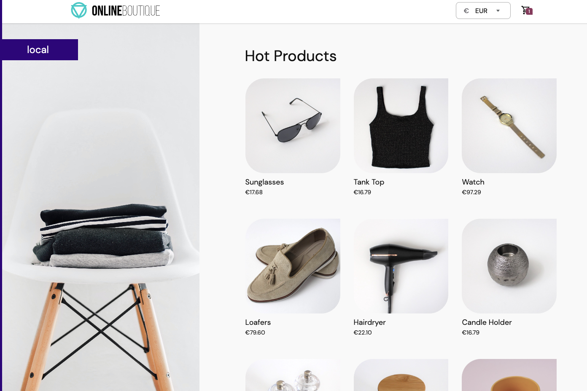
</p>

5. Add the product to the Cart:

<p align="center">
  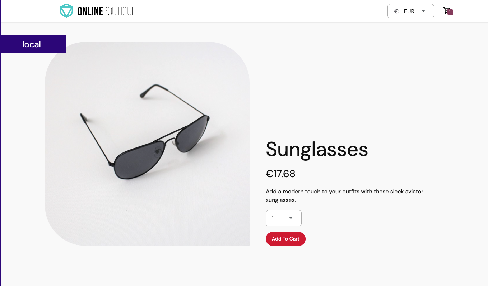
</p>

6. Click place order. 

<p align="center">
  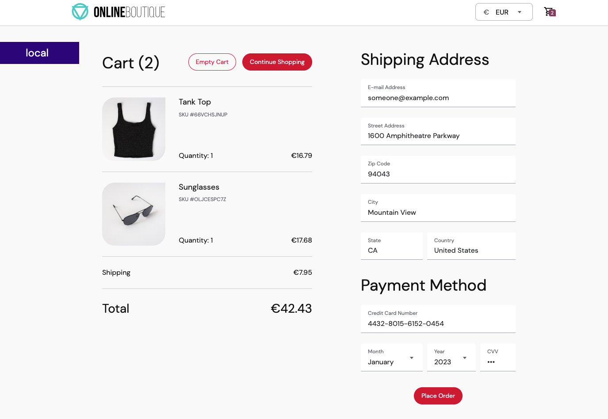
</p>

7. The request should not complete and return HTTP 500 Internal error. 

```nano
HTTP Status: 500 Internal Server Error

rpc error: code = Internal desc = failed to charge card: could not charge the card: rpc error: code = Unavailable desc = connection error: desc = "transport: Error while dialing dial tcp 10.49.11.61:50051: i/o timeout"
failed to complete the order
```
<p align="center">
  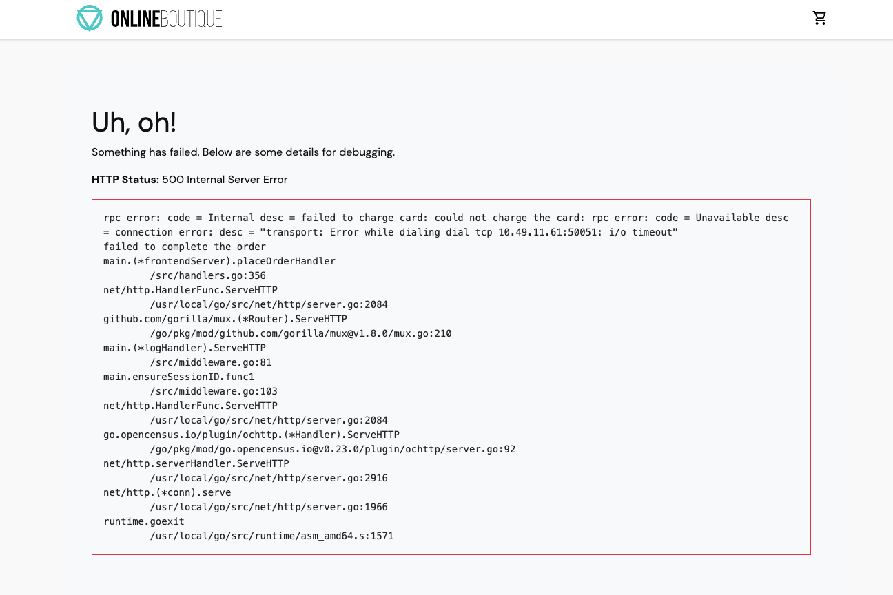
</p>

8. As indiciated in the screenshot above, the order placement failed due to connectivity issue. Let us use Calico ServiceGraph to find the root cause of the connectivity issue. Go into the hipstershop namespace in ServiceGraph, where the Online Boutique application is running.

<p align="center">
  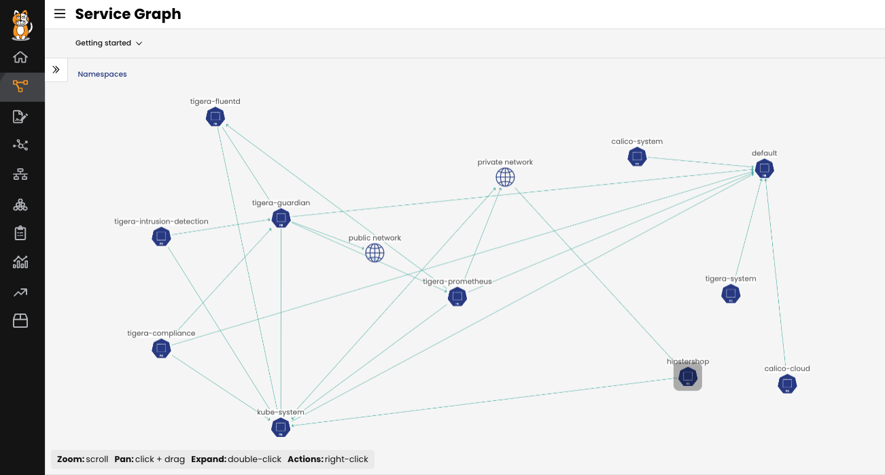
</p>

9. From the Online Boutique Diagram, we can see that the CheckoutService will send the request to PaymentService.

<p align="center">
  
</p>

10. You should see a red arrow (incidicating denied traffic) between the checkoutservice and paymentservice. Hover your mouse over the red/orange line between checkoutservice to see more information about the connection.

<p align="center">
  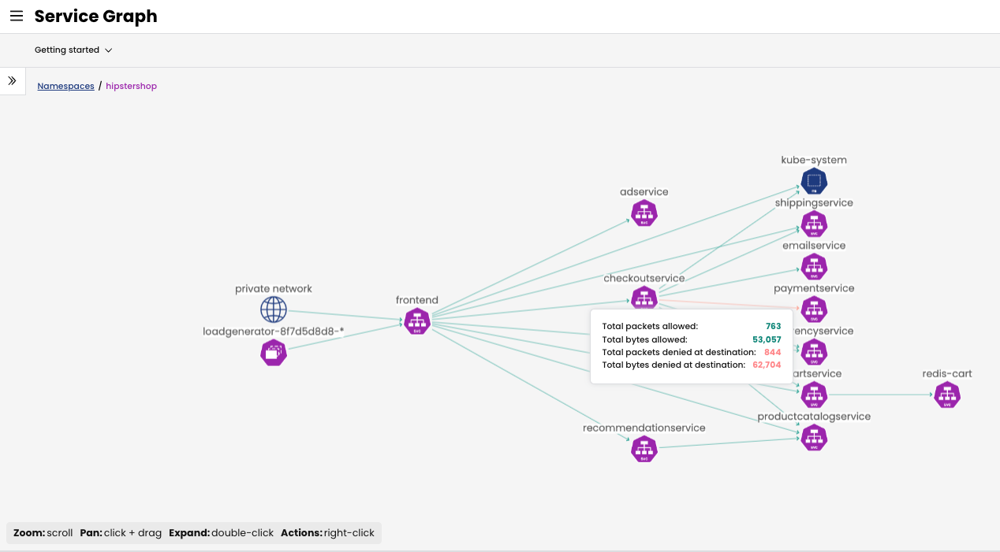
</p>

11. By selecting the red arrow, it will show the flows related to that arrow on the bottom of the screen:

<p align="center">
  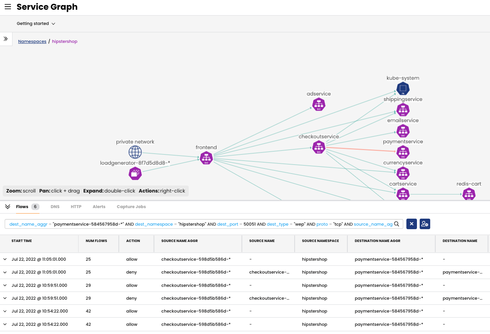
</p>

12. Expand one of denied flows from checkoutservice to paymentservice. It will show a comprehensive list of metadata about the connection parties. Scrol down to see the `Action =  Deny` and the `Policies = *“0|security|security.tenant-histershop|pass|0, 1|default|default.default-deny|deny|-1”*`. This policy entry means that the flow did not match with any security policy rule configured and it ended up on an implicit default deny.

<p align="center">
  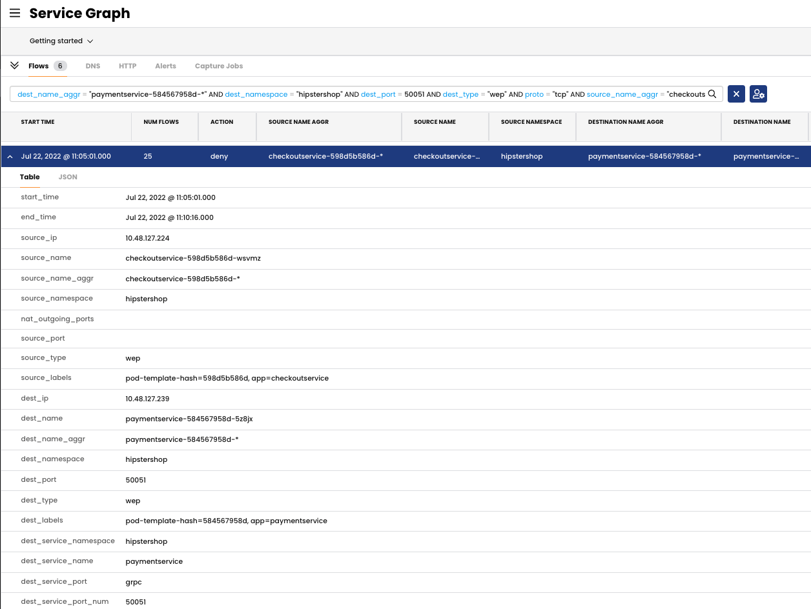
</p>

<p align="center">
  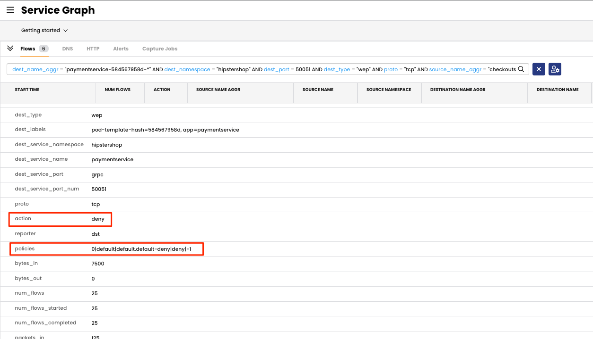
</p>

13. As the flow did not match with security policy, let’s review the Security Policy created for the paymentservice. Open `paymentservice` security policy. You see "0" Endpoints is associated with that policy.

<p align="center">
  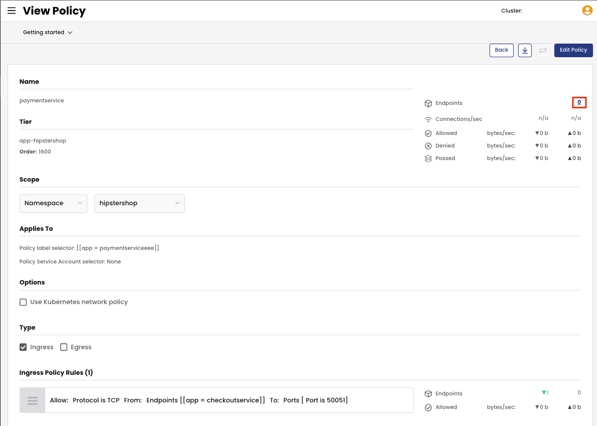
</p>

14. Labels are the primary means of deploying security policies. Let’s check the labels from the paymentservice pod using the command below (the label can also be checked through the Tigera UI in Endpoint tab).

```bash
kubectl get po -n hipstershop --show-labels | grep payment

```
```bash
paymentservice-584567958d-5z8jx          1/1     Running   1 (38h ago)   7d    app=paymentservice,pod-template-hash=584567958d
```

15. We can see the label of the payment pod is `app=paymentservice` and the label configured in the security policy is `app=paymentserviceee`. Therefore there is a typo on the security policy label.

<p align="center">
  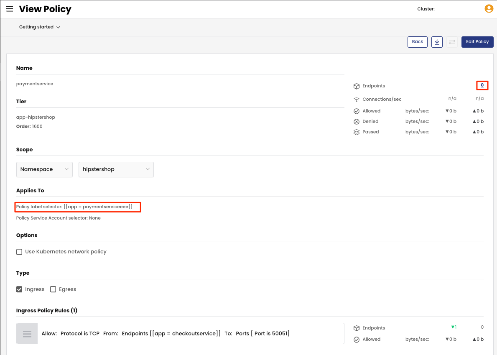
</p>

16. Use the Policy Board UI to fix the wrong label. Make sure the configured label is `app=paymentservice`. You should see the Endpoints in the Security Policy shows “1”.

<p align="center">
  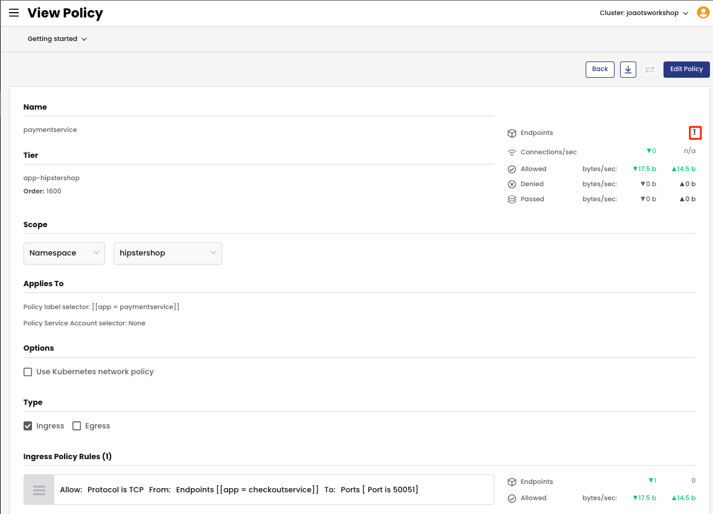
</p>

17. If we click on the “1”, it will show the endpoint secured by the security policy (in this case the paymentservice pod).

<p align="center">
  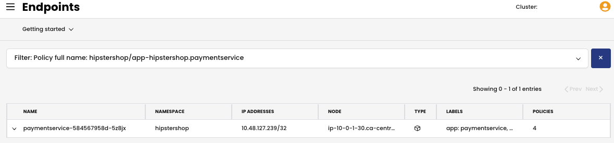
</p>

18. After fixing the paymentservice label, we should be able to place the order by clicking on “Place Order”.
<p align="center">
  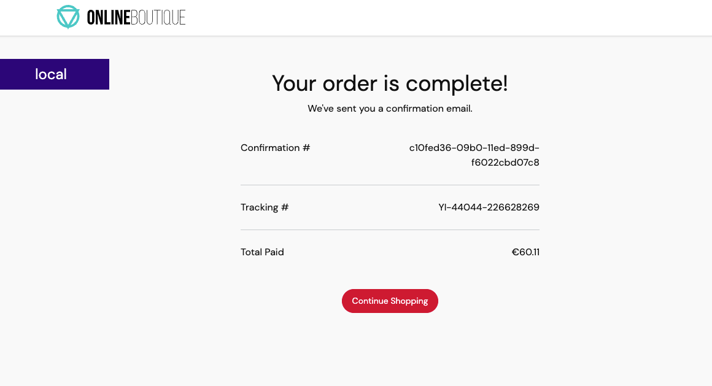
</p>

### Investigate denied flows using the Calico Enterprise Observability tools (ServiceGraph) - Do it yourself

1. Run the script below again.

```bash
Calico-Security-Observability-Troubleshooting-Training/tsworkshop/workshop1/lab-script.sh

```

2. Type “2” (LAB Break Online Boutique - Dynamic Service and Threat Graph) and press Enter. Then type "99" and hit Enter to exit.


3. Using the following URL, browse to the Online Boutique select any product.

```bash
https://hipstershop.<LabName>.labs.tigera.fr
```

4. Change the `Currency: EUR` and select any product.

<p align="center">
  
</p>

5. Add the product to Cart.

<p align="center">
  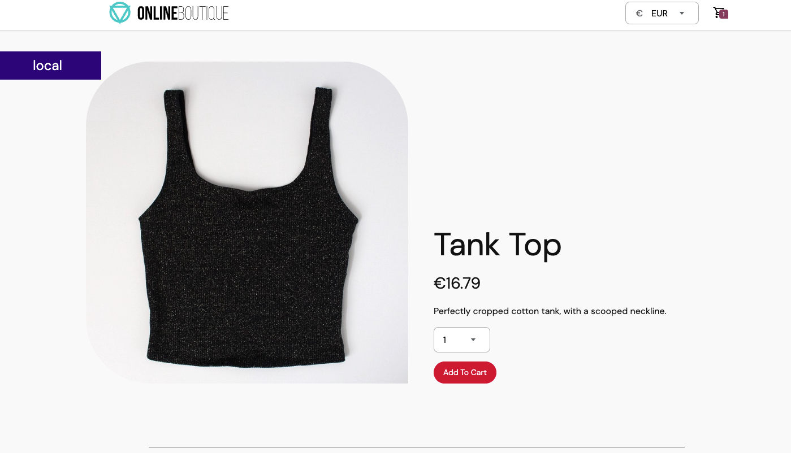
</p>

6. Place the Order:

<p align="center">
  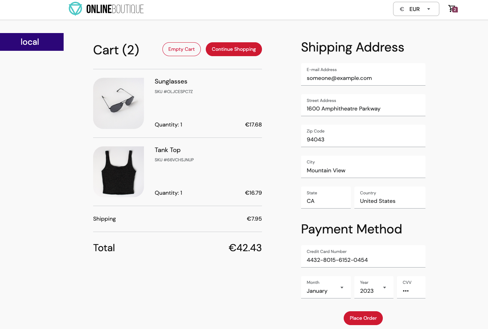
</p>

7. The internal error below will be returned on converting the price to EUR.

```nano
HTTP Status: 500 Internal Server Error

rpc error: code = Internal desc = failed to prepare order: failed to convert price of "XXXXXXXXXX" to EUR
failed to complete the order
```

<p align="center">
  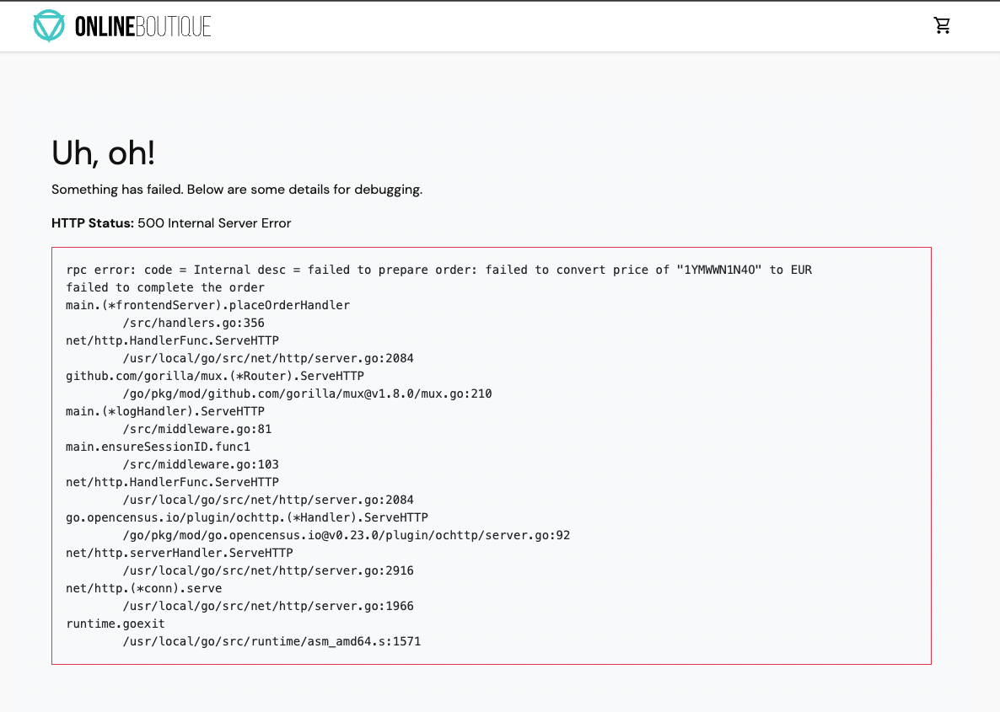
</p>

8. Investigate through the Dynamic Service and Threat Graph, which flows have been denied and the security policy related to it. Figure out how to fix this issue. Use the hipstershop application information provided at the start of this module. 

9. To revert back the misconfiguration applied, run the script and type “21” (LAB Fix Online Boutique - Dynamic Service and Threat Graph) and press Enter. To exit type "99" and press “Enter”.

### Identify denied flows using the Flow Visualizations


1. Run the script below again.

```bash
Calico-Security-Observability-Troubleshooting-Training/tsworkshop/workshop1/lab-script.sh

```

2. Type “3” (Demo Break Online Boutique - Flow Visualizations) and press Enter. Then type "99" and hit Enter to exit.


3. Using the following URL, browse to the Online Boutique select any product. You should receive an error: *“504 Gateway Time-out”*

```bash
https://hipstershop.<LabName>.labs.tigera.fr
```

3. On the Manager UI, browse to Flow Visualizations so that we can select the Denied flows in the Status field.

<p align="center">
  
</p>

4. When selecting the Denied flow in the Flow Visualizations, the details about this flow shows in the right side of the screen. If we click on the “All Flows” dropdown, we can see the Denied flow from one of the cluster nodes (connection from ingress controller) to frontend illustrated with a red arrow.  Select this flow to see more information about it. Now we can see that the Security Policy that is denying this flow is global.default.default-deny

<p align="center">
  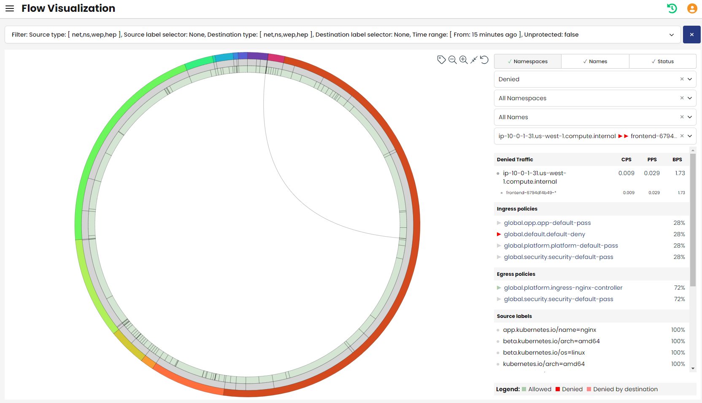
</p>

5. This means that the flow skipped over the policy that should have allowed the flow (hipstershop.app.fronted).  If we navigate to this policy, edit the configuration and when looking into the ingress rules, it is configured to Log the flow and not Allow it.

<p align="center">
  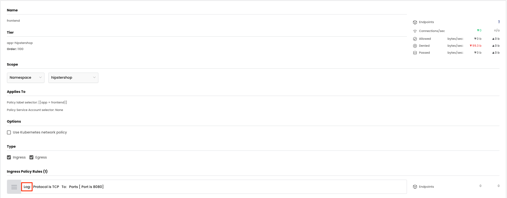
</p>

6. Edit the security policy and change the ingress rule to `Allow` instead of `Log`. The Online Boutique is accessible again.

`Note:` There are two `frontend` policy in the `app` tier. Make sure to make the change in the `frontend` policy in the app tier. 

So what happened here?  The traffic would have flowed through the hipstershop.app.fronted, checked the ingress rule and matched with the Log rule.  That rule would have logged the traffic (syslog) and then the matching would have continued since the traffic was not Allowed, Denied or Passed.  The next policy that scoped the traffic would have been the app.app-default-pass policy that would have passed the traffic to the default tier for it to be denied by the default-deny policy

###  Identify denied flows using the Flow Visualizations - Do it yourself

1. Run the script below again.

```bash
Calico-Security-Observability-Troubleshooting-Training/tsworkshop/workshop1/lab-script.sh

```

2. Type “4” (LAB Break Online Boutique - Flow Visualizations) and press Enter. Then type "99" and hit Enter to exit.


3. Using the following URL, browse to the Online Boutique select any product. You should receive an error: *“504 Gateway Time-out”*

```bash
https://hipstershop.<LabName>.labs.tigera.fr
```

4. Select any product(s), add to the Cart and click on “Place Order”.


5. An internal server error will return saying *“failed to get product #"OLJCESPC7Z"“*:

```nano
HTTP Status: 500 Internal Server Error
rpc error: code = Internal desc = failed to prepare order: failed to get product #"OLJCESPC7Z"
failed to complete the order
```

<p align="center">
  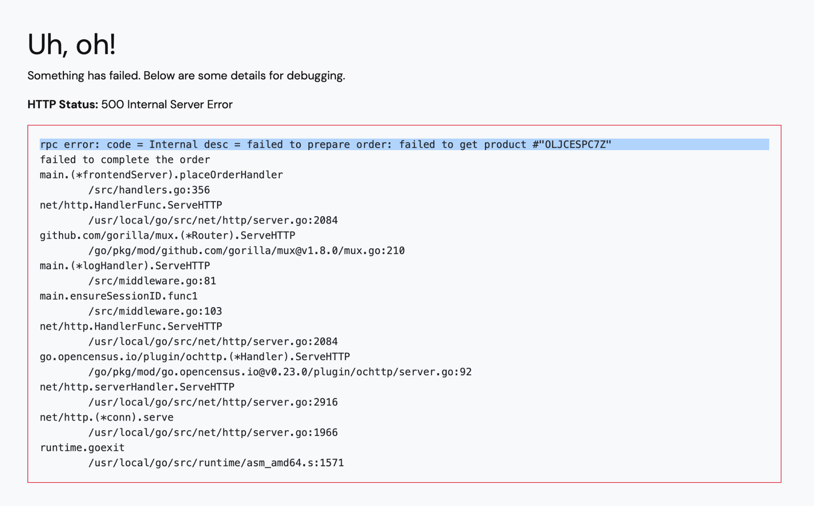
</p>

6. Investigate through the Flow Visualizations which flows have been denied and the Security Policy related to it, and how to fix this issue. Use the hipstershop application information provided at the start of this module.

In this case, you see show a denied flow similar to the following.

<p align="center">
  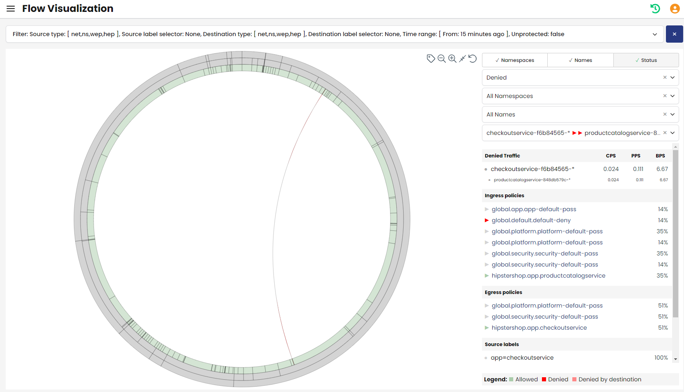
</p>

7. To revert back the misconfiguration applied, run the script and type “41” (LAB Fix Online Boutique - Flow Visualizations) and press Enter. To exit type "99" and press “Enter”.

### Identify denied flows using Kibana

1. Run the script below again.

```bash
Calico-Security-Observability-Troubleshooting-Training/tsworkshop/workshop1/lab-script.sh

```

2. Type “5” (Demo Break Online Boutique - Kibana) and press Enter.

`Note:` that this can take a few minutes and you may need to open a new browser or in-private window

3. Then type "99" and hit Enter to exit.
4. Using the following URL, browse to the Online Boutique select any product. You should receive an error: *“504 Gateway Time-out”*

```bash
https://hipstershop.<LabName>.labs.tigera.fr
```

5. Open the Calico Enterprise UI and go to Kibana by clicking in the icon . Log into kibana using the following credentials.

Username:

```bash
elastic
```
Password:

```bash
kubectl -n tigera-elasticsearch get secret tigera-secure-es-elastic-user -o go-template='{{.data.elastic | base64decode}}' && echo

```

6. From Kibana, there are multiple ways to track the flow and we will use a predefined dashboard. Hence go to Home > Analytics > Dashboard.

<p align="center">
  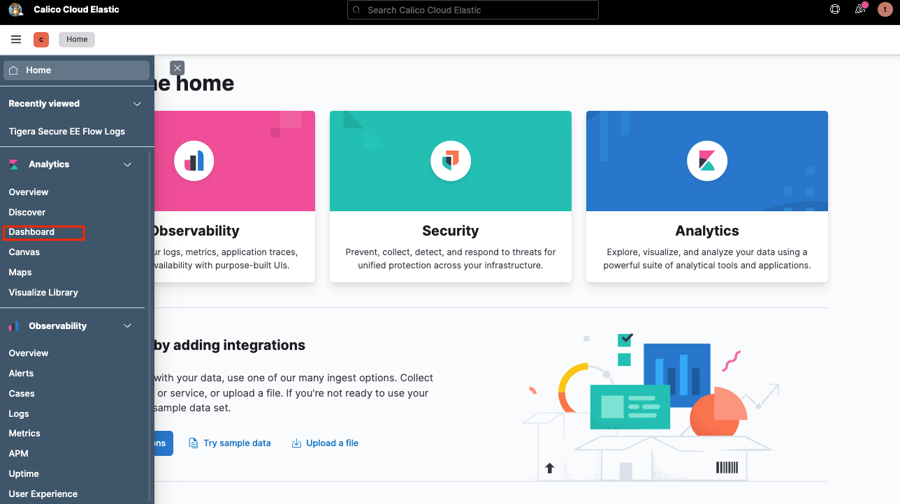
</p>

7. Click on “Tigera Secure EE Flow Logs” dashboard.

<p align="center">
  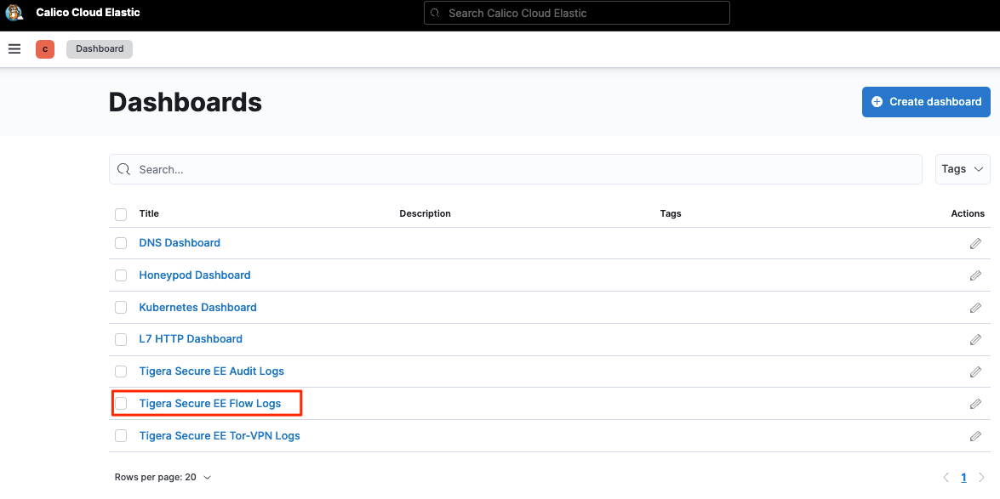
</p>

8. Add the filters *“action"* is *"deny"*, *"dest_namespace"* is *"hipstershop"*.

<p align="center">
  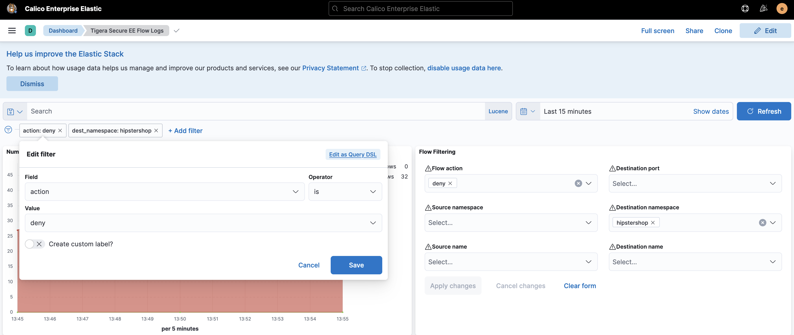
</p>

9. We can see the denied flows. 

<p align="center">
  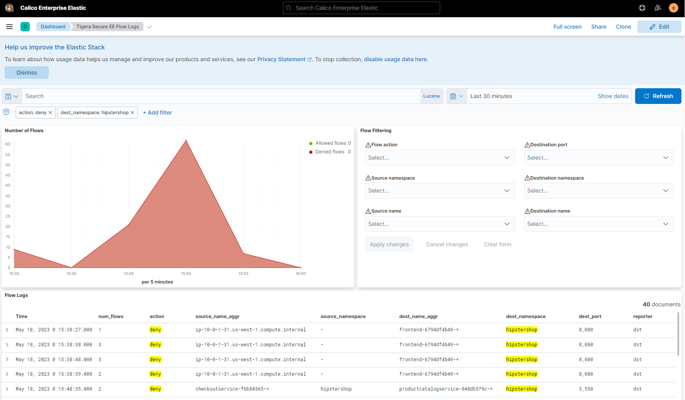
</p>

10. Expand the flow logs to `frontend` service as it is not accessible. You should see the Security Policy `"3|default|default.default-deny|deny|0"` has denied this flow.

<p align="center">
  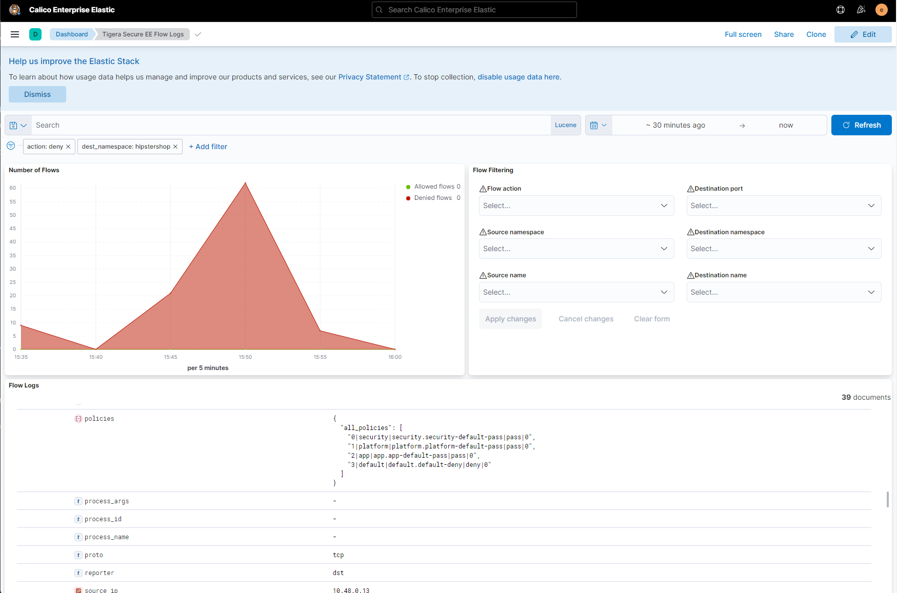
</p>

11. When checking on the Security Policy “tenant-hipstershop”, we can see the Ingress rule set to Deny and it should be Pass as configured in the topic **[Configure the Security and DNS Policies in the cluster](https://github.com/tigera-cs/observability-clinic/blob/main/1.%20Overview/readme.md#6-configure-the-security-and-dns-policies-in-the-cluster)**.

<p align="center">
  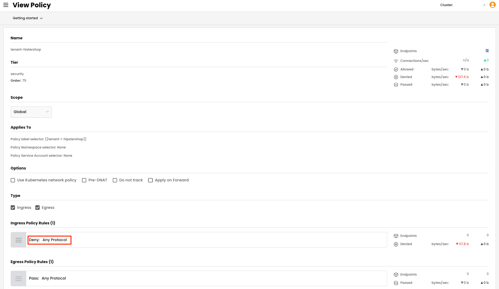
</p>

12. After changing the Ingress rule to ***Pass*** in the “tenant-hipstershop” Security Policy, the Online Boutique should be accessible again.


> ## You have completed `5.Secure Kubernetes Network Using Wireguard Encryption` lab. Next lab:  [5.Secure Kubernetes Network Using Wireguard Encryption](https://github.com/tigera-cs/quickstart-self-service/blob/main/modules/analyze-networksets-external-services.md)  
