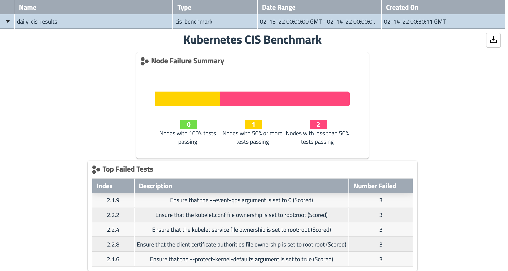
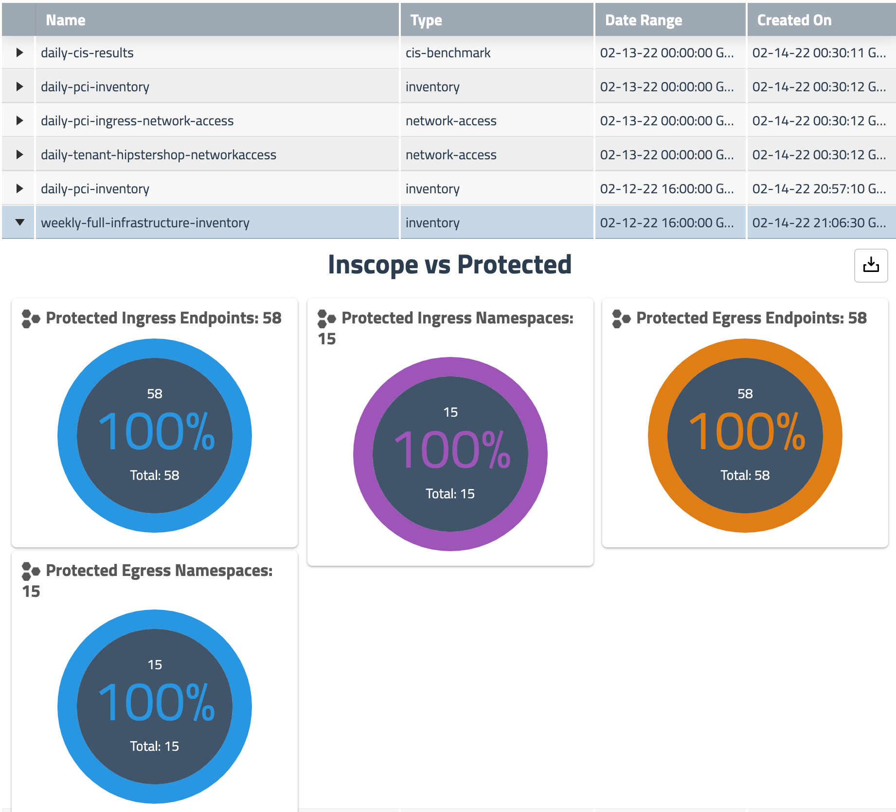
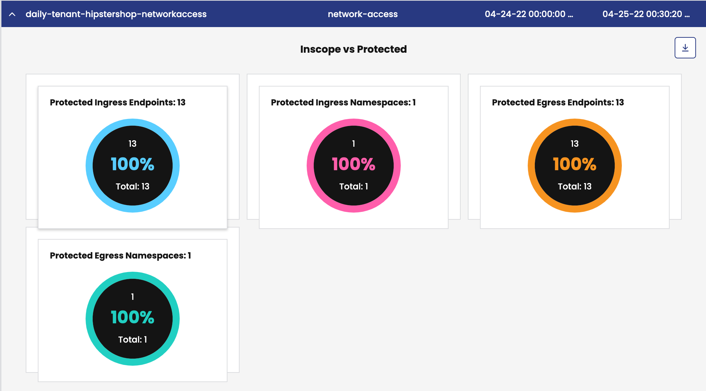

# In this lab

This lab provides the instructions to:

* [Overview](https://github.com/tigera-cs/Calico-Security-Observability-Troubleshooting-Training/blob/main/modules/7.%20Configure%20Calico%20Compliance%20Reporting/README.md#overview)
* [Configure Compliance Reporting](https://github.com/tigera-cs/Calico-Security-Observability-Troubleshooting-Training/blob/main/modules/7.%20Configure%20Calico%20Compliance%20Reporting/README.md#configure-compliance-reporting)


### Overview

Kubernetes compliance reporting involves evaluating and documenting how well a Kubernetes cluster adheres to specific compliance standards or regulations. It includes identifying applicable standards, defining policies, assessing cluster configuration, auditing security controls, generating compliance reports, remediating non-compliance, and establishing ongoing monitoring. Compliance reporting ensures that containerized applications are deployed securely and in accordance with industry regulations, reducing the risk of breaches and regulatory violations. Calico compliannce reporting helps us create a number of reports to satisfy the various PCI DSS and SOC 2 reporting requirements. These reports can be customized to report against a certain set of endpoints (for example PCI endpoints). Calico supports the following built-in report types:

- Inventory
- Network Access
- Policy-Audit
- CIS Benchmark


#### Documentation

- https://docs.tigera.io/calico-enterprise/latest/compliance/overview
- https://docs.tigera.io/calico-enterprise/latest/compliance/compliance-reports-cis


____________________________________________________________________________________________________________________________________________________________________________________


### Configure Compliance Reporting

Compliance reports provide the following high-level information:

- **Protection**

  - Endpoints explicitly protected using ingress or egress policy
  - Endpoints with Envoy enabled

- **Policies and services**

  - Policies and services associated with endpoints
  - Policy audit logs

- **Traffic**

  - Allowed ingress/egress traffic to/from namespaces
  - Allowed ingress/egress traffic to/from the internet


#### CIS Benchmark Reports

*CIS Benchmarks are best practices for the secure configuration of a target system.* - [Center for Internet Security](https://www.cisecurity.org/cis-benchmarks/cis-benchmarks-faq)

Being able to assess your Kubernetes clusters against CIS benchmarks is a standard requirement for a lot of organization’s security and compliance posture. Calico CIS benchmark compliance reports provide this view into your Kubernetes clusters. 

## Example Reports

### Hourly CIS Benchmark

<p align="center">
  
</p>


```yaml
kubectl apply -f - << EOF
apiVersion: projectcalico.org/v3
kind: GlobalReport
metadata:
  name: hourly-cis-benchmark-report
spec:
  reportType: cis-benchmark
  schedule: 0 * * * *
EOF
```


### Hourly Report - Full Infrastructure Inventory

The following report schedules weekly inventory reports for all endpoints. The jobs that create the reports will run on the infrastructure nodes

<p align="center">
  
</p>


```yaml
kubectl apply -f -<<EOF
apiVersion: projectcalico.org/v3
kind: GlobalReport
metadata:
  name: hourly-inventory-report
spec:
  reportType: inventory
  schedule: 0 * * * *
EOF
```

### Hourly Report - Network Access

The following report schedules hourly network-access reports on all endpoints in the cluster. 

<p align="center">
  
</p>


```yaml
kubectl apply -f - << EOF
apiVersion: projectcalico.org/v3
kind: GlobalReport
metadata:
  name: hourly-network-access-report
spec:
  reportType: network-access
  schedule: 0 * * * *
EOF
```
  reportType: inventory
  schedule: 0 * * * *
EOF
before
```
after
